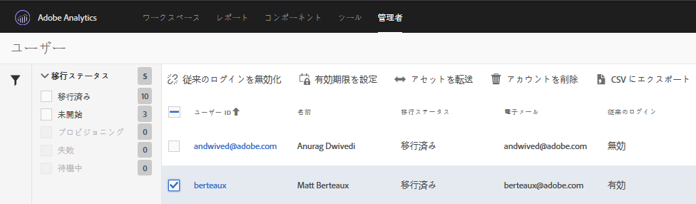

# 従来のログインの無効化 {#disable-legacy-logins}

Analytics ユーザーの従来のログインを無効化する方法を学習します。

ユーザーを従来の Analytics ユーザー管理システムから Adobe Admin Console に移行した後は、従来のログインを無効にすることができます。従来のログインを無効化した場合、従来の方法でログインしようとするユーザーは Experience Cloud ログインにリダイレクトされます。

1. **[!UICONTROL Analytics]**／**[!UICONTROL 管理者]**／**[!UICONTROL ユーザー ID の移行]**&#x200B;を選択して移行ツールを起動します。
1. [!DNL User Information] セクションで、従来のログインを無効にするユーザーを含むドメインを探し、「**[!UICONTROL ユーザーを選択]**」をクリックします。
1. 無効にする従来のログインを持つユーザーを選択します。

   

   有効なユーザーのステータスは、「移行ステータス」列の下に「*`Migrated`*」と表示されます。ユーザーが移行されるまで、従来のログインを無効にすることはできません。
1. 「**[!UICONTROL 従来のログインを無効化]**」をクリックしてから、「**[!UICONTROL 完了]**」をクリックします。

   「従来のログインを無効化」には、従来の [!DNL my.omniture.com] ユーザー名とパスワードを引き続き使用できるユーザーが表示されます。

   まだ移行されていないユーザーの従来のログインを無効化することはできません。無効化されると、ユーザーは Experience Cloud ID を使用して Analytics へログインおよびアクセスする必要があります。

