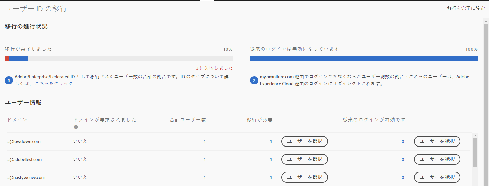

# Adobe ID 用に Analytics ユーザーアカウントを移行する {#migrate-analytics-user-accounts-for-adobe-ids}

従来の Analytics ユーザー管理システムから Admin Console へユーザーを移行します。

## Adobe ID 用に Analytics ユーザーアカウントを移行する {#task-f3355f3b14a340feae58cfa04c0ba1c9}

従来の Analytics ユーザー管理システムから Admin Console へユーザーを移行します。

>[!NOTE]
>
>Experience Cloud でログインしていない管理者がユーザー ID 移行ツールにアクセスしようとすると、Experience Cloud のログインページにリダイレクトされます。

**Analytics ユーザーを移行するには**

1. **[!UICONTROL Analytics]**／**[!UICONTROL 管理者]**／**[!UICONTROL ユーザー ID の移行]**&#x200B;に移動します。

   

   ユーザー ID の移行ページには、*移行の進行状況*&#x200B;および&#x200B;*ユーザー情報*&#x200B;の 2 つのセクションがあります。

   **移行の進行状況**

   <table id="table_F9F1CFF762C745E198CB075A02BA2DDA"> 
   <thead> 
   <tr> 
      <th colname="col1" class="entry"> フェーズ </th> 
      <th colname="col2" class="entry"> 説明 </th> 
   </tr>
   </thead>
   <tbody> 
   <tr> 
      <td colname="col1"> 
移行完了 
 </td> 
      <td colname="col2"> 
ユーザーが招待を受け入れました。 
 </td> 
   </tr> 
   <tr> 
      <td colname="col1"> 
従来のログインの無効化 
 </td> 
      <td colname="col2"> 
会社 ID を使用している従来のログインが無効化されます。ユーザーは、Adobe ID または Enterprise ID を使用して、Experience Cloud にアクセスするようになります。すべてのユーザーがこのフェーズに達すると、移行が完了します。 
 
移行時には、従来のログインは無効になります。ユーザーは  experiencecloud.adobe.com にリダイレクトされ、Adobe IDまたは Enterprise ID を使用してログインする必要があります。 
 </td> 
   </tr> 
   </tbody> 
   </table>

   **ユーザー情報**

   ユーザー情報は、組織内のユーザーの概要を、ドメイン名で区切って表示します。

   <table id="table_3822E27AF81E4A188562FEB5131548A5"> 
   <thead> 
   <tr> 
      <th colname="col1" class="entry"> 要素 </th> 
      <th colname="col2" class="entry"> 説明 </th> 
   </tr>
   </thead>
   <tbody> 
   <tr> 
      <td colname="col1"> 
ドメイン 
 </td> 
      <td colname="col2"> 
ドメインは、現在の Analytics ユーザーベースの電子メール ID に固有のものとなります。1 つのドメインを複数の組織がクレームすることはできません。また、ドメインをクレームできるのはシステム管理者のみです。詳しくは、<a href="https://helpx.adobe.com/jp/enterprise/help/request-access-to-claimed-domain.html">クレームされたドメインへのアクセスを要求する</a>を参照してください。 
 </td> 
   </tr> 
   <tr> 
      <td colname="col1"> 
申請されたドメイン 
 </td> 
      <td colname="col2"> 
ユーザーを Enterprise または Federated ID として移行する場合はシステム管理者であり、かつ、ユーザーを移行する前に Admin Console から利用可能なドメインを申請する必要があります。詳しくは<a href="https://helpx.adobe.com/jp/enterprise/help/identity.html">こちら</a>。 
 
Enterprise またはr Federated ID のドメインを申請する場合は、この手順をスキップして、ユーザーを Adobe ID として移行します。ID タイプの詳細については<a href="https://helpx.adobe.com/enterprise/help/identity.html">ここ</a>をクリックしてください。 
 </td> 
   </tr> 
   </tbody> 
   </table>

1. 移行するユーザー ID を含むドメインを探し、「**[!UICONTROL 移行が必要]**」の下で「**[!UICONTROL ユーザーを選択]**」をクリックします。
1. [!DNL Users] ページで、移行するユーザーを選択し、「**[!UICONTROL 移行]**」をクリックします。

   「**[!UICONTROL 移行]**」をクリックすると、ユーザーに招待が送信されます（移行開始）。ユーザーは招待を受け入れる必要があります。このアクションにより、ユーザー ID が「移行完了」に変わります。その後、`[!DNL my.omniture.com].` への従来のアクセスをオフにすることができます。

   

1. ユーザーを移行する ID タイプを Adobe ID または Enterprise ID として指定します。

   ユーザー移行後、「移行ステータス」列のステータスが「*`Not Initiated`*」から「*`Migrated`*」に変わります。

   「*`Failed`*」が表示された場合は、アイコンの上にマウスポインターを合わせると、移行失敗の理由に関する説明が表示されます。
