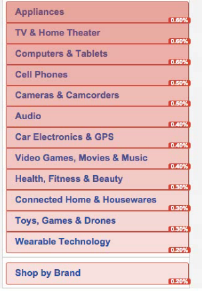
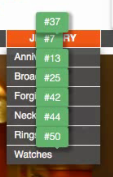

# カスタマイズ可能なオーバーレイ

オーバーレイを使用すると、複数の方法でデータの視覚化を設定できるので、ページ上のリンクの人気度を簡単に確認して把握できます。

オーバーレイを使用すると、クリックデータをページ上で直接視覚化できます。これが、Activity Map のような視覚的分析ツールと Reports &amp; Analytics のような主に表やグラフィックを使用するツールとの違いです。

Activity Map では次の 3 つのタイプのオーバーレイが提供されています。

* グラデーションオーバーレイ（ヒートマップ）
* バブルオーバーレイ
* 勝者および敗者のオーバーレイ

[動的コンテンツ用のオーバーレイレンダリング](/help/analyze/activity-map/activitymap-link-tracking/activitymap-stl-track-custom-elements.md)も設定できます。

オーバーレイを変更するには、[オーバーレイ設定パネル](/help/analyze/activity-map/activitymap-overlay-settings.md)を開いてオプションを編集します。

オーバーレイにカーソルを合わせると、その[詳細](/help/analyze/activity-map/activitymap-overlay-details.md)が表示されます。

## グラデーションオーバーレイ（ヒートマップ） {#section_06AF13DE05A1454D960176CD0DA921A6}

グラデーションオーバーレイでは、色の強度はリンクの人気度に基づきます。この強度は、上位 30 件、または指標絶対値の関数に合わせて標準化できます。

これらの指標は「ヒートマップ」の一種としてページのリンク上に重ねて表示され、次のような質問に対する答えを示します。

* 個々のページにどのような価値があるか
*  ページ上の個々の要素にはどのような価値があるか
* ページ上で最も価値のある領域はどこか

## バブルオーバーレイ {#section_A657AB3F64CB47F881BBFFD72B37D9D4}

バブルオーバーレイは、オーバーレイの内容（指標、割合またはランク）を、小さい引き出し線のバブルで表示します。

バブルオーバーレイは、ツールバーの「オーバーレイのタイプ」でこのオーバーレイを選択したときに表示されます。バブルオーバーレイは、[Activity Map Settings](/help/analyze/activity-map/activitymap-overlay-settings.md) の選択（上位 30 件、上位 50 件、すべて、など）に一致するすべてのリンクに関して表示されます。グラデーションオーバーレイは、このオプションが選択されていない場合に表示されます。

>[!NOTE]
>
>サブメニューのバブルオーバーレイは、サブメニューを表示したときにのみ表示されます。
>
>>

## 勝者および敗者のオーバーレイ {#section_EE80278E20C14824869BF5A27A4634C8}

**[!UICONTROL 勝者および敗者のオーバーレイ]**&#x200B;は、ライブモードでのみ利用可能です。現在の期間の指標を直前の期間の指標と比較することにより、リンクアクティビティのリアルタイムの変化を報告します。これにより、視覚的に説得力のある方法で、トレンドをリアルタイムで表示できます。

このリアルタイムのオーバーレイでは、前回の期間と現在の期間の間の指標値の変化に基づいてクリック数をランク付けします。

