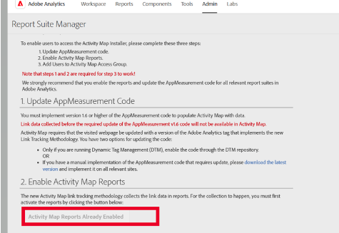

# 「アクティブ化して有効化」Activity Map

Activity Map のリンクコレクションおよびユーザーダウンロードを有効にするために Analytics 管理者がおこなう必要がある手順について説明します。

## 手順 1.有効化Activity Map {#update_code}

Activity Mapモジュールは、AppMeasurement.js、Adobe Experience Platformタグおよび Web SDK(alloy.js) の一部です。 Activity Mapデータは、 **Web SDK バージョン2.15.0** 以上、または **Adobe Analytics tags 拡張機能 v1.90** 以上、または **AppMeasurementバージョン 1.6** 以上

+++Web SDK(Adobe Experience Platform Tags Extension)

1. Adobe Experience Platformタグで、Analytics を実装するプロパティに移動します。 の下 [!UICONTROL 拡張機能] -> [!UICONTROL Adobe Experience Platform Web SDK]を選択します。 **[!UICONTROL クリックデータの収集を有効にする]** 以下に示すように。
1. 変更を加えてライブラリを構築します。
1. ライブラリを実稼動環境に公開します。

**検証**

開発者コンソールの「ネットワーク」タブを使用して呼び出しを操作します。

1. サイトに開発用 Launch スクリプトを読み込みます。
1. 要素のクリック時に、「ネットワーク」タブで「/ee」を検索します。

   

Adobe Experience Platform デバッガー:

1. をダウンロードしてインストールする [Adobe Experience Platform debugger](https://chrome.google.com/webstore/detail/adobe-experience-platform/bfnnokhpnncpkdmbokanobigaccjkpob).
1. に移動します。 [!UICONTROL ログ] > [!UICONTROL Edge] > [!UICONTROL Edge に接続].

   

**よくある質問（FAQ）**

* **「ネットワーク」タブでは、インタラクション呼び出しが実行されません。**
収集呼び出しでのクリックデータ収集は、「/ee」または「collect?」でフィルタリングする必要があります。

* **コレクト呼び出しのペイロード表示がありません。**
収集呼び出しは、トラッキングが他のサイトへのナビゲーションに影響を与えないように設計されているので、ドキュメントのアンロード機能は収集呼び出しに適用できます。 これはデータ収集には影響しませんが、ページで検証する必要がある場合は、それぞれの要素に target = &quot;_blank&quot;を追加します。 リンクが新しいタブで開きます。

* **PII のコレクションを無視する方法を教えてください。**
&lt;&lt; on before link click callback>> にそれぞれの条件を追加し、false を返してこれらの値を無視します。 [詳細情報](https://experienceleague.adobe.com/docs/experience-platform/edge/fundamentals/configuring-the-sdk.html?lang=ja)

  サンプルコード:

  

+++

+++手動での Web SDK の実装

詳しくは、 [リンクを追跡](https://experienceleague.adobe.com/docs/experience-platform/edge/data-collection/track-links.html?lang=ja) リンクトラッキングの実装方法と、 `region` クリックされたHTML要素の

>[!NOTE]
>
>現在、顧客がページ間を移動すると、Web SDK でのリンクトラッキングを有効にすると、リンクイベントが送信されます。 AppMeasurement の動作方法とは異なり、このイベントはアドビに送信される追加の課金対象ヒットとされる可能性があります。

+++

+++Analytics 拡張機能 (Adobe Experience Platformタグ )

Adobe Experience Platformタグで、Analytics を実装するプロパティに移動します。 Adobe Analytics の [!UICONTROL 拡張機能のインストール] ダイアログ、選択 **[!UICONTROL 使用Activity Map]**.

+++

+++AppMeasurement

1. AppMeasurement用の最新の JavaScript ライブラリをダウンロードします。
に移動します。 **[!UICONTROL Analytics]** > **[!UICONTROL 管理者]** > **[!UICONTROL すべての管理者]** > **[!UICONTROL コードマネージャー]**.
1. 次の手順で実装します。 [これらの手順](https://experienceleague.adobe.com/docs/analytics/implementation/js/overview.html?lang=ja).

+++

## 手順 2.Activity Map レポートを有効にする {#enable}

レポートスイートレベルでActivity Mapレポートを有効にする必要があります。

1. Adobe Analytics にログインし、**[!UICONTROL Analytics]**／**[!UICONTROL 管理者]**／**[!UICONTROL レポートスイート]**&#x200B;に移動してレポートスイートを選択し、**[!UICONTROL 設定を編集]**／**[!UICONTROL Activity Map]**／**[!UICONTROL Activity Map レポート]** に移動します。

1. リンクデータが Activity Map レポートに収集されます。有効化をおこなうには、まず「**[!UICONTROL Activity Map レポートを有効にする]**」をクリックして変数を有効にする必要があります。

   この手順により、データの収集が必要な Analytics のディメンションがすべて追加されます。

   

1. 約 1 時間後に、[Activity Map ページレポート](/help/analyze/activity-map/activitymap-reporting-analytics.md)を確認すると、ユーザーがリンクをクリックしたページがすべて表示されます。

## 手順 3.ユーザーの追加先 [!UICONTROL Activity Mapアクセス] 製品プロファイル {#add_users}

1. 「**[!UICONTROL ユーザーをグループに追加]**」をクリックします。

   これにより、 [Adobe Admin Console](https://adminconsole.adobe.com/E2F05B3B52F54D2E0A490D44@AdobeOrg/overview).

1. まだ [!UICONTROL Activity Mapアクセス] 製品プロファイルに移動します。 このプロファイルに必要な権限項目は次のとおりです [!UICONTROL Analytics ツール] > [!UICONTROL Activity Map] および [!UICONTROL Analytics ツール] > [!UICONTROL セグメント公開].

1. 製品プロファイルにユーザーを追加します。 これにより、ユーザーは、  **[!UICONTROL Adobe Analytics]** > **[!UICONTROL ツール]** > **[!UICONTROL ActivityMap]** .

