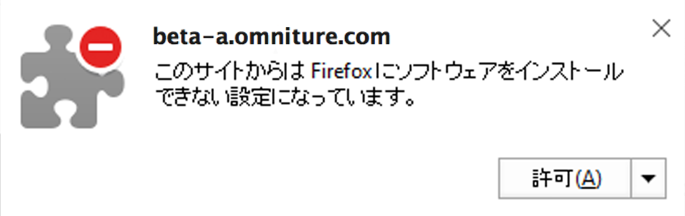
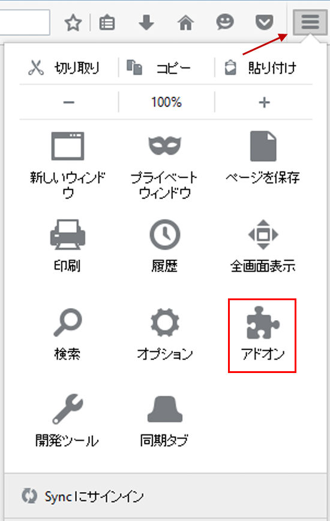

# Install Activity Map browser plug-ins{#install-activity-map-browser-plug-ins}

インストールプロセスは、使用しているブラウザーによって異なります。

Activity Map ブラウザープラグインには次の特徴があります。

* Analytics ページタグとして手動で挿入されます。
* ブラウザーのツールバーでボタンまたはメニュー項目によって起動します。
* Internet Explorer、Firefox、Chrome および Safari の最新バージョンとのみ互換性があります。
* **[!UICONTROL ログイン情報を記憶]機能をサポートします。**
* Analytics ページコードを含まない Web ページに Activity Map ツールバーを挿入&#x200B;**できます**。ページに Analytics ページコードが含まれていない場合は、エラーメッセージを表示します。
* ブラウザープラグインのインストールプロセスを実行する必要があります。

## Install Activity Map plug-in on Chrome {#section_6907253D5D5E4422967E6439207A013F}

1. **[!UICONTROL Adobe Analytics]** / **[!UICONTROL ツール]** / **[!UICONTROL Activity Mapに移動]**&#x200B;します。 

1. Click **[!UICONTROL Download Activity Map]**.
1. Click **[!UICONTROL Install the Activity Map Plug-in]**.
1. Activity Map ブラウザープラグインをダウンロードするかどうか確認するセキュリティ警告が表示されたら、「**[!UICONTROL はい]」をクリックします。**
1. ダウンロードが完了したら、.zip ファイルの場所を見つけて、内容を解凍します。
1. Return to Chrome's address bar and enter `chrome://extensions`.
1. 「デベロッパーモード」ボックスをチェックします。
1. 「パッケージ化されていない拡張機能を読み込む」をクリックして、解凍したフォルダーをポップアップから選択します。
1. If you see an Adobe Analytics icon  {width="70px"} added to your tool bar, your download was successful. You can now [launch Activity Map](launch-Activity Map.md#concept_2392036DB1AF4B05BEA3E9F4EE9B46B8) from your page.

## Install Activity Map plug-in on Firefox {#section_1F69D3D22DB34D6992747B1A62C1D2DA}

1. **[!UICONTROL Analytics]** / **[!UICONTROL Activity Mapに移動]**&#x200B;します。

1. Click **[!UICONTROL Download Activity Map]**.
1. Click **[!UICONTROL Install the Activity Map Plug-in]**.
1. Click **[!UICONTROL Allow]** when this message appears: 

1. Click **[!UICONTROL Install Now]**.
1. Click the **[!UICONTROL Open Menu]** icon at the top right and select **[!UICONTROL Add-Ons]**. {width="250px"}

1. Firefox アドオンの 1 つとして Activity Map が表示されます。
1. Adobe Analytics アイコン You can now [launch Activity Map](launch-Activity Map.md#concept_2392036DB1AF4B05BEA3E9F4EE9B46B8) from your page.

## Install Activity Map plug-in on Internet Explorer {#section_1A33705D7F784C4A88C9026ADC860FB8}

1. **[!UICONTROL Analytics]** / **[!UICONTROL Activity Mapに移動]**&#x200B;します。

1. Click **[!UICONTROL Download Activity Map]**.
1. Click **[!UICONTROL Install the Activity Map Plug-in]**.
1. 「**[!UICONTROL 実行]」をクリックして Activity Map のインストールを開始します。**
1. ポップアップで「**[!UICONTROL はい]」をクリックして、プログラムによるコンピューターへの変更を許可します。**
1. インストールウィザードの指示に従います。
1. Activity Map が正常にインストールされている場合は、Activity Map ツールバーの使用準備ができていることを伝える通知が Internet Explorer に表示されます。有効にしてアプリケーションの使用を開始します。You can now [launch Activity Map](launch-Activity Map.md#concept_2392036DB1AF4B05BEA3E9F4EE9B46B8) from your page.

## Install Activity Map plug-in on Safari {#section_4F306BDDFBC04D4CA48B7C37B0AACC48}

1. **[!UICONTROL Analytics]** / **[!UICONTROL Activity Mapに移動]**&#x200B;します。

1. Navigate to <https://safari-extensions.apple.com/>.
1. Search for "activity" or "activitymap" and click through the Adobe Activity Map installation.  
1. If you see an Adobe Analytics icon  {width="70px"} added to your tool bar, your download was successful. You can now [launch Activity Map](launch-Activity Map.md#concept_2392036DB1AF4B05BEA3E9F4EE9B46B8) from your page.