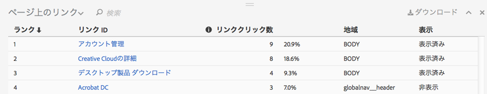
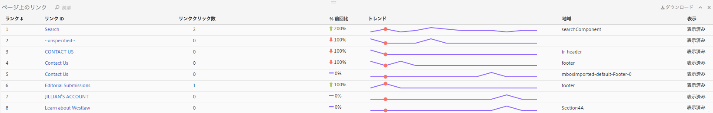

# リンクレポート

リンクレポートは、現在のページで見つかったリンクについて報告します。そのページ用に収集されたすべてのリンクについて報告するわけではありません。

ページ上のリンクレポートリンクのクリック数（またはその他の指標）のランクを 1 つのビューで表示したい場合があります。こうすると、リンク同士を比較しやすくなります。ページ上のすべてのリンクのランクリスト（リンク ID 別）、クリック情報（回数と割合）、ページ内の領域を含むページ上のリンクレポートを作成します。Activity Map ツールバーの「ページ上のリンク」レポートボタンをクリックします。

ブラウザーフレームの下の Activity Map ダッシュボードに、**[!UICONTROL ページ上のリンク]レポートが開きます。**

## Standard mode {#section_C8D2A1C07A2A4E3A8F84AC9240603FA7}

標準モードでは、「ページ上のリンク」レポートに、1 日から複数日に及ぶリンクデータが、日付範囲全体に渡って集計して表示されます。リンクごとに次の情報が表示されます。

<table id="table_3DE41B2CFA644B70AF802A3123CE51D9"> 
 <thead> 
  <tr> 
   <th colname="col1" class="entry"> 列 </th> 
   <th colname="col2" class="entry"> 説明 </th> 
  </tr> 
 </thead>
 <tbody> 
  <tr> 
   <td colname="col1"> ランク </td> 
   <td colname="col2"> ページ内のランク。標準モードでは、どの列をクリックしても、ランクの値は同じままです。 </td> 
  </tr> 
  <tr> 
   <td colname="col1"> リンク ID </td> 
   <td colname="col2">リンクのプライマリID </td> 
  </tr> 
  <tr> 
   <td colname="col1"> クリック数 </td> 
   <td colname="col2"> 指定したリンクの生のクリック数と、ページ上の総クリック数に対する割合。ツールバーで別の指標を選択している場合は、その指標に関する報告はリンクレポートが行います。 </td> 
  </tr> 
  <tr> 
   <td colname="col1"> 地域 </td> 
   <td colname="col2"> ページ内のリンクの場所を表します。 </td> 
  </tr> 
  <tr> 
   <td colname="col1"> 表示 </td> 
   <td colname="col2">リンクの表示ステータスに関連します。次の 2 つの値を使用できます。 
    <ul id="ul_BABCC0F64145407C9D439150A6898E6D">
     <li id="li_9AF0479BDCEB4A44A37292FAABFA83A5"><b>非表示</b>：リンクは現在ページ内にありますが、エンドユーザーには表示されません（親メニューの上にカーソルを合わせた場合にのみ表示されるナビゲーションメニューのサブメニューなど）。 </li>
     <li id="li_C6FA4EC27EDD4341AB9821E2B4BC9E60"><b>表示済み</b>：リンクは現在ページ上に表示されています。ただし、ページをスクロールしないと表示されない場合もあります。 </li>
    </ul>
注意：「非表示」に設定されているリンクのオーバーレイは表示されません。 
</td> 
  </tr> 
 </tbody> 
</table>

**データをフィルター**

特定のリンクに的を絞る場合は、「**[!UICONTROL データをフィルター]」フィールドで関連する用語を検索できます。**&#x200B;検索条件に一致するリンクのみがオーバーレイを持ちます。フィルターがない場合は、「[Activity Map Settings](/help/analyze/activity-map/activitymap-overlay-settings.md)」で指定されているオーバーレイが表示されます。

## Live mode {#section_AC1967217B5A4532ACB01D33636F6770}

ライブモードでは、ページ上のリンクレポートに、数分にわたるトレンドデータが表示されます。

<table id="table_61D1FB0F02894055A1AB394DE4FE4742"> 
 <thead> 
  <tr> 
   <th colname="col1" class="entry"> 列 </th> 
   <th colname="col2" class="entry"> 説明 </th> 
  </tr> 
 </thead>
 <tbody> 
  <tr> 
   <td colname="col1"> ランク </td> 
   <td colname="col2"> ページ内のランク。グラデーションまたはバブルのオーバーレイの場合は、どの列をクリックしても、ランクの値は同じままです。勝者／敗者のオーバーレイの場合は、どのリンクの獲得数／損失数が最大かに基づいてランクの値が変化します。 </td> 
  </tr> 
  <tr> 
   <td colname="col1"> リンク ID </td> 
   <td colname="col2">リンクのプライマリ ID。新しい[リンクトラッキング手法]（/help/analyze/activity- map/activitymap- link- tracking/activitymap- md）によってプライマリIDがどのように定義されているかについて詳しくは、「リンクトラッキング方法」を参照してください。 </td> 
  </tr> 
  <tr> 
   <td colname="col1"> リンククリック数 </td> 
   <td colname="col2"> 選択した期間の総クリック数。 </td> 
  </tr> 
  <tr> 
   <td colname="col1"> % 前回比 </td> 
   <td colname="col2"> 現期間のリンク指標と前期間のリンク指標の変化の割合。マイナスに変化した割合は赤で、プラスは緑で表示されます。 </td> 
  </tr> 
  <tr> 
   <td colname="col1"> トレンド </td> 
   <td colname="col2"> 全収集期間の折れ線グラフ。現在選択されている期間は緑のマーカーで示されます。現在カーソルを合わせている期間は赤のマーカーで示されます。 </td> 
  </tr> 
  <tr> 
   <td colname="col1"> 地域 </td> 
   <td colname="col2"> ページ内のリンクの場所を表します。 </td> 
  </tr> 
  <tr> 
   <td colname="col1"> 表示 </td> 
   <td colname="col2">リンクの表示ステータスに関連します。次の 2 つの値を使用できます。 
    <ul id="ul_B10C55ED4D3C4CF99506DC467E2E7CFB">
     <li id="li_EA646722A51041CC9E62C56DEF92C81F">非表示：リンクは現在ページ内にありますが、表示されていません（ページの読み込み後に表示されるリンクなど）。 </li>
     <li id="li_F9543614C2894003AC9984A7404E2785">表示済み：リンクは現在ページ上に表示されています。ただし、ページをスクロールしないと表示されない場合もあります。 </li>
    </ul></td> 
  </tr> 
 </tbody> 
</table>

## Sorting and filtering {#section_4B8E8233C21247CAA70DAEC2156548AD}

特定のページ領域（左パネルなど）の結果のみを分析して、Web ページのその領域のコンテンツをどのように構成するか判断することが必要になる場合があります。

この目的で、ページ上のリンクレポートのリンク用に並べ替えとフィルターの機能を作成しました。フィルターはフィルターフィールドで使用でき、検索用語が「リンク ID」列と「地域」列に適用されます。並べ替えは基準となる項目（「ランク」、「リンク ID」、「クリック数」、「時間経過に伴う変更」、「地域」、「表示」）をクリックして使用します。昇順と降順のいずれも可能です。ページ上のリンクレポートからリンクがフィルターで除外されると、オーバーレイは Web サイトに表示されなくなります。
