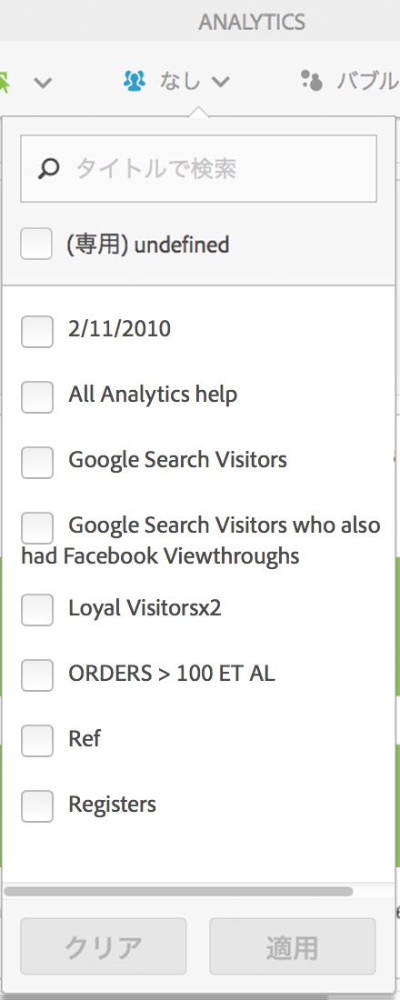
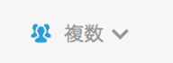

# 顧客セグメント

Activity Map 内で複数セグメントフィルターを適用できます。

>[!NOTE]
>
>Adobe Analytics プラットフォームではリアルタイムデータのセグメント化をサポートしていないので、セグメントコントロールは標準モードでのみ使用できます。

次に示す&#x200B;**[!UICONTROL セグメント]**&#x200B;ドロップダウンメニューから、1 つまたは複数のセグメントを選択できます。リストに表示されるセグメントは、所有しているセグメント、または選択したレポートスイートに関して Reports &amp; Analytics 経由で共有されているセグメントと同じです。

セグメントの選択が変更されると、セグメントセレクターを閉じた後に、アプリケーションに表示されているすべての指標に関して、Analytics データ取得プロセスが新規に開始されます。選択されたセグメントは、ページからページへ移動しても保存されます。

複数のセグメントを選択した場合、セグメント選択ラベル（折りたたまれた状態）に「複数」と表示されます。コントロールをクリックすると、選択したセグメントの完全なリストが表示されます。

選択したセグメントは、Activity Map で提示されているすべての Analytics レポート（つまり、オーバーレイ、**[!UICONTROL ページ上のリンク]**&#x200B;レポート、**[!UICONTROL ページの詳細]**&#x200B;レポート）に適用されます。
