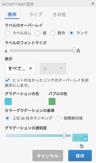
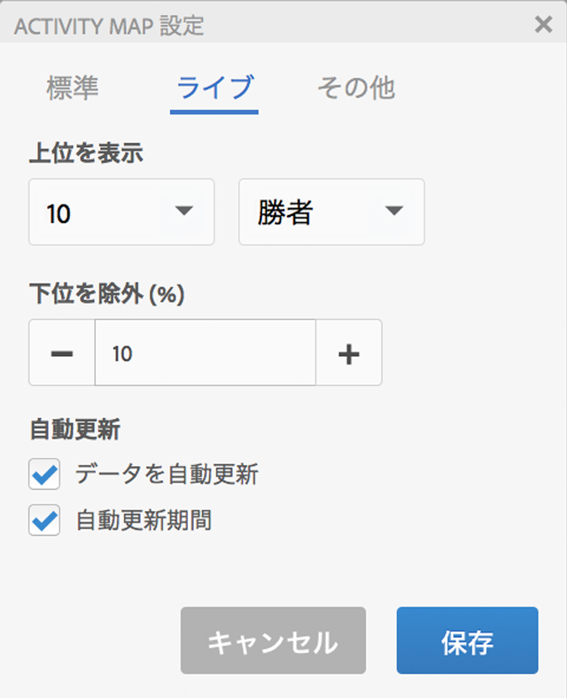
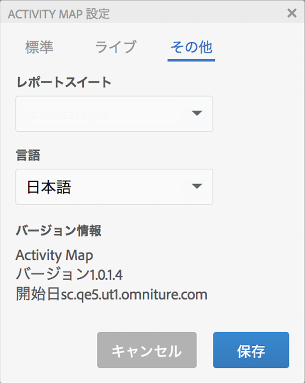

# Activity Mapの設定

Activity Map Settings パネルを使用すると、すべてのタイプのオーバーレイ視覚化の設定およびプロパティを変更できます。

Activity Map Settings パネルにアクセスするには、Activity Map ツールバーの歯車アイコンをクリックします。

設定パネルの表示内容は、選択したアプリケーションモードによって異なります。「その他」タブには一般的な設定が含まれています。

| 標準 | **[!UICONTROL グラデーション]**&#x200B;オーバーレイまたは&#x200B;**[!UICONTROL バブル]オーバーレイ** |
|---|---|
| ライブ | **[!UICONTROL 勝者&amp;敗者]**、 **[!UICONTROL グラデーション]**、 **[!UICONTROL バブル]** オーバーレイ |
| その他 | レポートスイートの選択と言語の選択 |

## Settings for standard mode overlay {#section_24DB95376E1A448494ECF3F57743FC19}

<table id="table_0244107DE6D142F2A1DA4882E0ED9826"> 
 <thead> 
  <tr> 
   <th colname="col2" class="entry"> 設定 </th> 
   <th colname="col3" class="entry"> 説明 </th> 
  </tr> 
 </thead>
 <tbody> 
  <tr> 
   <td colname="col2">  ラベルのオーバーレイ </td> 
   <td colname="col3"> 
    <ul id="ul_13AD02789F2D4904A35215A8FA230F3E"> 
     <li id="li_8DB71636D2074C69B0D94D3FB0CAFE28"> <b>ラベルなし</b>：グラデーションオーバーレイのみに該当します。この場合、オーバーレイの色が、リンクのランクの意味を表します。 </li> 
     <li id="li_39C98D7EA9514C1D8731B9D21C0E73A6"> <b>値</b>：そのリンクの生の指標合計。 </li> 
     <li id="li_A5F583E45BCD4F2399398F9DCC7FE382"> <b>割合</b>：ページの合計指標に対するこのリンクの指標の割合。 </li> 
     <li id="li_E4BF7D3B863E4B6C8E737CF29ADA9D67"> <b>ランク</b>：レンダリングされたページに存在するすべてのリンクの中でのこのリンクのランク。 </li> 
    </ul> </td> 
  </tr> 
  <tr> 
   <td colname="col2">  ラベルのフォントサイズ </td> 
   <td colname="col3"> スライダーを使用して、オーバーレイラベルのフォントサイズを読みやすいように拡大、縮小します。 </td> 
  </tr> 
  <tr> 
   <td colname="col2">  表示 </td> 
   <td colname="col3">オーバーレイに表示するものとして「上位」、「下位」または「すべてのリンク」を選択します。「上位」または「下位」を選択する場合は、表示するリンクの数も選択する必要があります。 </td> 
  </tr> 
  <tr> 
   <td colname="col2"> ヒットのなかったリンクのオーバーレイを非表示にします。 </td> 
   <td colname="col3"> このチェックボックスでは、ヒットのなかったリンクのオーバーレイを非表示にして、インターフェイスを整理できます。 </td> 
  </tr> 
  <tr> 
   <td colname="col2">  グラデーションの色／バブルの色 </td> 
   <td colname="col3">グラデーションまたはバブルのオーバーレイ視覚化に関して、オーバーレイリンクランクを表示する色を選択します。 </td> 
  </tr> 
  <tr> 
   <td colname="col2">  カラーグラデーションの基準 </td> 
   <td colname="col3"> 
    <ul id="ul_1B5C2A44A9EB465D8B8E9AD91AF79D69"> 
     <li id="li_C983CB68B90B492BB0774254292B5961"> 上位 30 位のランキング：色の強度が上位 30 件の値に対して標準化されます。 </li> 
     <li id="li_1E83431C8C734AB0BC82B5A66AED1189"> 指標絶対値：色の強度は指標絶対値の関数です。 </li> 
    </ul> </td> 
  </tr> 
  <tr> 
   <td colname="col2">  グラデーションの透明度 </td> 
   <td colname="col3">グラデーションオーバーレイの透明度のレベルを選択します。 
この設定は、バブルオーバーレイには影響しません。 
 </td> 
  </tr> 
 </tbody> 
</table>

## Settings for live mode overlays {#section_D30F6E62FB5D404090B588F396A460AF}

| 設定 | 説明 |
|---|---|
| **[!UICONTROL 上位を表示]** | Select number of links to display (or all) and the **[!UICONTROL Gainers]** or **[!UICONTROL Losers]** (or both) to display as overlays. |
| **[!UICONTROL 下位を除外（％）]** | データの少ない勝者と敗者のリンクを排除します。下位のほうから指定した割合のリンク変更をフィルターで除外して、意味のある増減を示すデータが十分に含まれているリンクのみを表示します。割合は、ページ上のリンク数に基づいて計算されます。例えば、200 リンクのリストの下位 10% をフィルターで除外すると、最後の 20 リンクが除外されます。 |
| **[!UICONTROL データを自動更新]** | 新しい期間を計算するときに、インターフェイスに表示されている Analytics データを自動的に更新するかどうかを指定できます。 |
| **[!UICONTROL 自動更新期間]** | チェックすると、新しいデータを取得するたびに Web ページが更新され、ページ上のリンクを収集されたデータとより密接に同期できます。 |

## Other settings {#section_697A12F099494D699A4BF498598178C5}

<table id="table_0F560236F8844FA0928CBB9C50D5ABEF"> 
 <tbody> 
  <tr> 
   <td colname="col1"> レポートスイート </td> 
   <td colname="col2"> 
アクセス可能なレポートスイートリストはウェブページタグで定義されるレポートスイートに制限されなくなりました。選択したレポートスイート（ページ上のタグのいずれかに対応）を別のレポートスイートで置き換えることができるようになりました。この新しいレポートスイートは、ページ上のタグにリンクされる必要はありません。Activity Map の設定で選択されているレポートスイートを変更した場合、保存処理を行うと、影響を受ける Analytics レポートがすべて更新されます。 
 
 
重要：仮想レポートスイートは、ライブモードとは互換性がなく、標準モードのみと互換性があります。標準レポートスイートのライブモードのときに、このダイアログで仮想レポートスイートを選択した場合、ここで「OK」をクリックすると、標準モードが表示されます。 
 
 
さらに、レポートスイートのカレンダータイプ（グレゴリオ暦、小売、カスタムなど）に一致するように、カレンダーコントロールが再初期化されます。 
 </td> 
  </tr> 
  <tr> 
   <td colname="col1"> 言語 </td> 
   <td colname="col2"> この選択は、Adobe Analytics に提供される言語に対応します。 </td> 
  </tr> 
  <tr> 
   <td colname="col1"> バージョン情報 </td> 
   <td colname="col2"> アプリケーションの名前とバージョン番号を示します。 </td> 
  </tr> 
 </tbody> 
</table>

