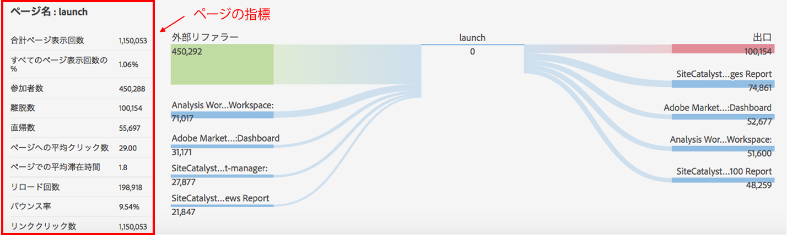

# ページの詳細

「ページの詳細」タブには、ページレポートは表で表示され、ページフローレポートは蝶ネクタイ型のレポートで表示されます。

## ページレポート {#section_2335A9EFE57B4A7687B397DF2098CC6B}

このパネルは、訪問があった Web ページに関連するトラフィック指標を表示します。Analytics ページタグが実装されていない Web ページを訪問した場合は、このパネルは表示されません。

## ページフローレポート {#section_D6EDE78CF7124758BF846E57ADABA234}

左側には「前のページ」と「外部リファラー」が表示され、これを交互に展開して各カテゴリの上位 4 つのエントリを表示できます。

右側には上位 4 つの「次のページ」と、離脱数が表示されます。

このセクションに表示されている内部ページに関して URL が追跡された場合、そのページはリンクとして表示されます。したがって、そのページをクリックすると、親和性が最も高いページのパスをたどることができます。このように、このレポートを使用すると、Web 分析の観点から Web プロパティをインタラクティブにナビゲートできます。

ページフローレポートは標準モードでのみ利用できます。

| **ページフロー** | **説明** |
|---|---|
| 外部リファラー | 現在のページを参照している他のサイトの URL。 |
| 前のページ | レポートスイートの中の、現在のページより前にある内部ページの名前。 |
| 次のページ | 現在のページの後に訪問されるページ。 |
| サイトからの離脱 | ページを閲覧後にサイトを完全に離脱した人数。 |

