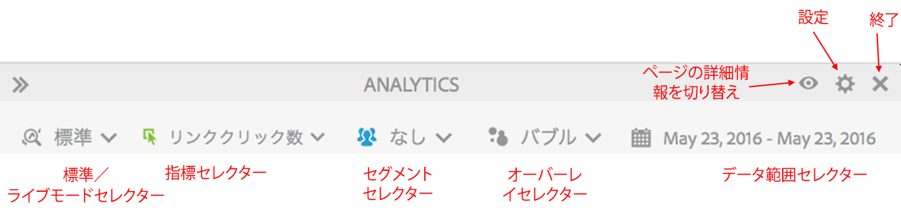
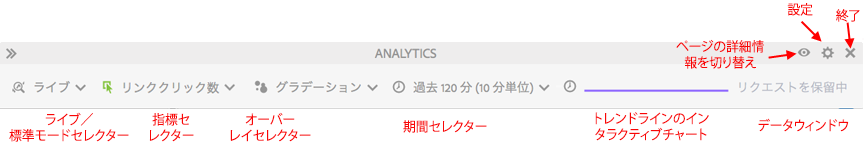

# 標準モードとライブモード

Activity Map は 2 つの基本モードを備えており、ページアクティビティの補完的なレポートを提供します。

* 標準モードでは、[ページ上のリンクレポート](/help/analyze/activity-map/activitymap-links-report.md)に、1 日から複数日に及ぶリンクデータが、日付範囲全体に渡って集計して表示されます。
* ライブモードでは、アクティビティのトレンドをリアルタイムで表示します。

この 2 つのモードは、ツールバーの「モード」ボタンをクリックすることによって切り替えできます。

## 標準モード {#section_0C755F30B7EC4A13A62AB9A391AF51E6}

**標準モード**&#x200B;では、次のようにツールバーで日付範囲を選択できます。

このモードでは、「パーティシペーション」が有効でないコマース指標は、線形的に割り当てられます。例えば、ユーザーがホームページの「IPod mini」リンクをクリックし、さらに 3 ページを移動したとします。4 番目のページで、IPod mini を 200 ドルで購入します。「IPod mini」リンクは、200 ドルのパーティシペーション売上と、50 ドル（200 ドル/4）の売上高（線形的に割り当てられた売上高）を受け取ります。

質問：あるページの別の地域に同じリンク名を持つリンクがある場合、どうなりますか。あるページに別の地域があるが同じリンク名を持つので、2 つのリンクが別々にクレジットを受け取りますか。

回答：リンクデータの集計方法によって異なります。Activity Map では、割り当てられたデータが「リンク ID|地域」の組み合わせに対するものになるように、所定のページのリンク ID|地域を調べます。この場合、地域が異なるので、リンク|地域は明らかに異なり、その結果、最初の「リンク|地域」に割り合てられた売上高は、2 番目のリンクに割り当てられたすべての売上高とは別のものになります。ただし、Adobe Analytics UI では、所定のページの（リンク|地域レポートではなく）リンク ID レポートのみを調べます（ページはリンクで分類されます）。その場合、売上高では、両方の地域が集計されます。

## ライブモード {#section_D619B77D89A840F0B1C2DEA2715A516A}

**ライブモード**&#x200B;では、Analytics データが 1 分から 15 分刻みで、トレンド方式で表示されます。このモードは、Web ページ上の短期のトレンドを分析および監視することが目的です。

ライブモードは出版業のニーズに対応しています。出版業界では、少数の重要ページ内にあるリンクの人気度のマイクロトレンドを監視する必要があります。採算性の悪いリンクや人気が上昇しているリンクを迅速に見極めることは、出版業にとって非常に重要です。

>[!IMPORTANT]
>
>仮想レポートスイートは、ライブモードとは互換性がなく、標準モードでのみ使用できます。

