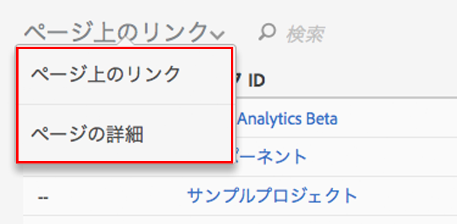

# Activity Mapユーザーインターフェイス

Activity Map の UI は、次の 2 つの部分で構成されています。

* Web ページと、挿入されたオーバーレイおよびツールバーを表示する上部ウィンドウ
* レポートを表示する下部パネル

## Top panel {#section_2DA8ACD35D4C4ACBA32C13EFB5317E7C}

上部には、Web ページと、[挿入されたツールバー](/help/analyze/activity-map/activitymap-standard-live.md)および[リンクオーバーレイ](/help/analyze/activity-map/activitymap-gainerslosers.md)が表示されます。バブルのランクがリンク上に表示され、合計クリック数を確認できます。

リンクの追加の詳細は、それぞれのリンクオーバーレイにカーソルを合わせるとアクセスできます。

## Bottom reports panel {#section_21B129D69B7A4F918E975E8E66DB02EE}

ページの下部には、[ページ上のリンク](/help/analyze/activity-map/activitymap-links-report.md)レポートと[ページの詳細](/help/analyze/activity-map/activitymap-page-flow.md)レポートが表示され、現在の Web ページの概要およびページフローの情報を確認できます。

ページ上のリンクレポートは、追加のクリック情報を含めて、現在のページのリンクをスプレッドシートで表示します。ページの詳細レポートは、現在表示されているページの前後に訪問されたページに関連する分析データを提示します。

