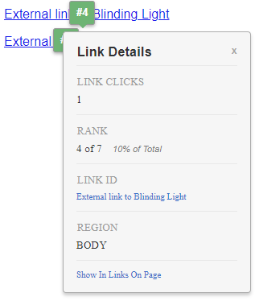
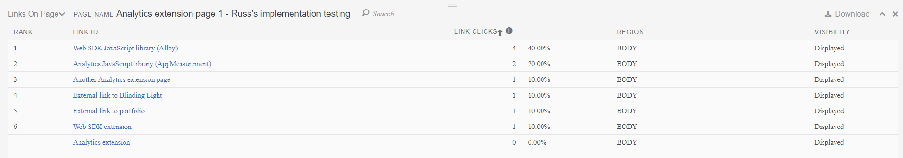

# Activity Map拡張機能インターフェイス

Activity Map拡張機能を使用すると、web サイトにオーバーレイされたクリックデータを表示できます。 次のページ（web ストアへのリンクを含む）に移動して、拡張機能をダウンロードできます。

**[!UICONTROL ツール]** > **[!UICONTROL Activity Map]** > **[!UICONTROL Activity Mapのダウンロード]**

インストールが完了して有効になると、インターフェイスは、次のいくつかの部分で構成されます。

* 拡張機能とレポートを設定できる上部パネル
* 一番人気のあるリンクを表示するオーバーレイ
* 最頻使用リンクの指標を表示する下部パネル

## 上部パネル

上部のパネルには、Activity Map オーバーレイの基本的なコントロールが含まれています。

次の設定があります。

* **標準/ライブビュー**：標準ビューとライブビューを切り替えます。
   * 標準ビュー：履歴データに基づいてオーバーレイを表示します。
   * ライブビュー：ライブデータに基づいてオーバーレイを表示します。 日付セレクターが、ライブデータの精度を変更できるドロップダウンメニューに変わります。
* **指標セレクター**：オーバーレイでレポートする指標を変更できます。 ライブ表示を選択している場合は、[!UICONTROL &#x200B; リンククリック数 &#x200B;] のみ使用できます。
* **セグメントセレクター**:[ セグメント ](/help/components/segmentation/seg-overview.md) を選択し、オーバーレイ内のデータのサブセットを表示できます。 セグメントは、ライブ表示では使用できません。
* **オーバーレイビジュアライゼーションタイプ**：オーバーレイでリンクのランキングを視覚化する方法を変更できます。
   * **[!UICONTROL バブル]**：トップリンクには、レポート期間中の数値ランクを示す緑のバブルが表示されます。 バブルの色は [ 設定 ](settings.md) で変更できます。
   * **[!UICONTROL グラデーション]**：上部のリンクが赤の透明色で網掛けに表示されます。 最も人気のあるリンクは最も暗い赤です。 グラデーションカラーは [ 設定 ](settings.md) で変更できます。
   * **[!UICONTROL オフ]**：リンクオーバーレイを無効にします。
* **日付セレクター**：レポート期間を変更できます。

このパネルのヘッダーには、次の設定が含まれます。

* **上部パネルを展開/折りたたむ**：上部パネルの設定を水平方向または垂直方向に表示するように切り替えます（二重矢印アイコン）。
* **[!UICONTROL ページ詳細を切り替え]**：下部パネル（目のアイコン）の表示と非表示を切り替えます。
* **[!UICONTROL 設定を表示]**：変更可能な設定のメニューが開きます（歯車アイコン）。
   * **[!UICONTROL 設定]**：拡張機能の [ 設定 ](settings.md) を開きます。
   * **[!UICONTROL ヘルプ]**:Experience Leagueのドキュメントを開きます（このページ）。
   * **[!UICONTROL Adobe コミュニティ]**: [Experience League コミュニティ ](https://experienceleaguecommunities.adobe.com/?profile.language=ja) を開きます。
   * **[!UICONTROL バージョン情報]**：拡張機能のバージョンを表示します。
   * **[!UICONTROL ログアウト]**：拡張機能からログアウトし、再度ログインする必要があります。
* **[!UICONTROL Activity Mapを終了]**：拡張機能のすべてのオーバーレイを閉じます（「X」アイコン）。

## ページオーバーレイ

ページオーバーレイには、レポート期間中にクリックされた最も人気のあるリンクの場所を示すオーバーレイとサイトコンテンツが含まれています。 これらのリンクオーバーレイは、上部パネルの **[!UICONTROL オーバーレイビジュアライゼーションタイプ]** でバブルまたはグラデーションとして表示されるように設定できます。

バブルまたはグラデーションをクリックすると、その特定のリンクの詳細を表示できます。

## 下部パネル

下部のパネルには、オーバーレイに表示されたリンクの集計ビューが表示されます。

* **レポートタイプ**：下部パネルを切り替えて、**[!UICONTROL ページ上のリンク]** レポートまたは **[!UICONTROL ページの詳細]** レポートを表示します。
* **[!UICONTROL ページ名]**：現在の [ ページ ](/help/components/dimensions/page.md) ディメンション名。
* **[!UICONTROL 検索]**：入力したテキストに一致するリンク名のみを表示するように、レポートをフィルタリングします。
* **[!UICONTROL ダウンロード]**：レポートを CSV に書き出します。 [!UICONTROL &#x200B; ページ上のリンク &#x200B;] レポート、[!UICONTROL &#x200B; ページ &#x200B;] レポートおよび [!UICONTROL &#x200B; ページフロー &#x200B;] レポートを同じダウンロードファイルに含めることができます。
* **[!UICONTROL レポートのドッキング位置を変更]**：このパネルの位置を切り替えて、ブラウザーウィンドウの下部または上部に表示します。
* **[!UICONTROL レポートを閉じる]**：このパネルを閉じます。 上部パネルの **[!UICONTROL ページの詳細を切り替え]** ボタン（目のアイコン）を使用して、パネルを再度開くことができます。

**[!UICONTROL ページ上のリンク]** レポートは、次の設定を含む基本的なワークスペースレポートを表示します。

* [Activity Map リンク ](/help/components/dimensions/activity-map-link.md) ディメンション
* [ 発生件数 ](/help/components/metrics/occurrences.md) 指標（「**[!UICONTROL リンククリック数]** というラベルが付いています）
* セグメントとして適用される現在の [ ページ ](/help/components/dimensions/page.md) 値

**[!UICONTROL ページの詳細]** レポートでは、現在のページに焦点を当て、[ ページ ](/help/analyze/analysis-workspace/visualizations/c-flow/flow.md) ディメンションを使用して [ フロー ](/help/components/dimensions/page.md) ビジュアライゼーションを表示します。 現在のページの次の指標が左側に表示されます。

* 合計 [ ページビュー数 ](/help/components/metrics/page-views.md)
* 全ページビューの [!UICONTROL &#x200B; %]
* [ 入口 ](/help/components/metrics/entries.md) 数
* [ 出口 ](/help/components/metrics/exits.md) 数
* [直帰数](/help/components/metrics/single-page-visits.md)
* [!UICONTROL &#x200B; ページへの平均クリック数 &#x200B;]
* 平均 [ ページでの滞在時間 ](/help/components/metrics/time-spent.md)
* [ リロード ](/help/components/metrics/reloads.md) 数
* [バウンス率](/help/components/metrics/bounce-rate.md)
* [!UICONTROL &#x200B; リンククリック数 &#x200B;]

