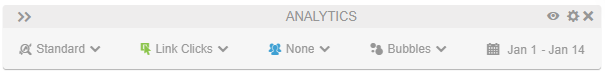
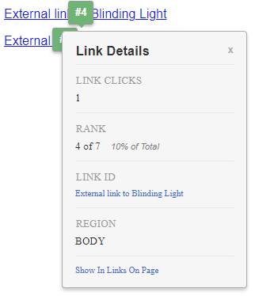
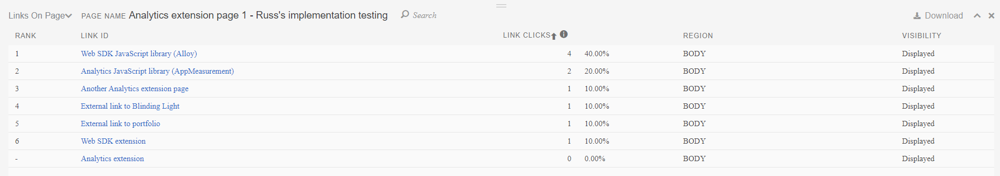
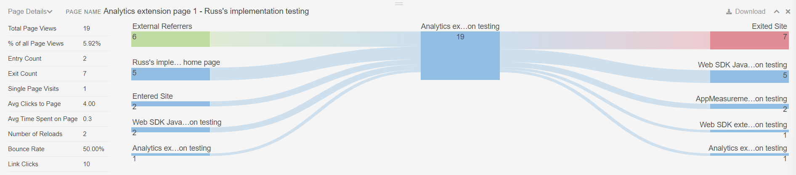

# Activity Map拡張機能インターフェイス

Activity Mapの拡張機能を使用すると、web サイト上に重ねられたクリックデータを表示できます。 拡張機能をダウンロードするには、次のページに移動します。このページには、web ストアへのリンクが表示されます。

**[!UICONTROL ツール]**／**[!UICONTROL Activity Map]**／**[!UICONTROL Activity Map をダウンロード]**

インストールして有効にすると、インターフェイスはいくつかの部分で構成されます。

* 拡張機能とレポートを設定できる上部パネル
* 一番人気のあるリンクを表示するオーバーレイ
* 最も人気のあるリンクの指標を表示する下部パネル

## トップパネル

上部パネルには、Activity Map オーバーレイの基本的なコントロールが含まれています。

次の設定が用意されています。

* **標準/ライブビュー**：標準ビューとライブビューを切り替えます。
   * 標準ビュー：履歴データに基づいてオーバーレイを表示します。
   * ライブビュー：ライブデータに基づいてオーバーレイを表示します。 日付セレクターは、ライブデータの精度を変更できるドロップダウンメニューに変わります。
* **指標セレクター**: オーバーレイがレポートする指標を変更できます。 ライブビューを選択している場合は、[!UICONTROL &#x200B; リンククリック &#x200B;]のみが使用できます。
* **セグメントセレクター**: [&#x200B; セグメント &#x200B;](/help/components/segmentation/seg-overview.md)を選択し、オーバーレイ内のデータのサブセットを表示できます。 セグメントはライブビューでは使用できません。
* **オーバーレイ ビジュアライゼーションの種類**: オーバーレイでリンクのランキングを表示する方法を変更できます。
   * **[!UICONTROL バブル]**：上位リンクには、レポート期間中の数値ランクを示す緑のバブルが表示されます。 バブルの色は[設定](settings.md)で変更できます。
   * **[!UICONTROL グラデーション]**：上のリンクが透明な赤で網掛けされて表示されます。 最も人気のあるリンクは最も暗い赤です。 グラデーションカラーは、[設定](settings.md)で変更できます。
   * **[!UICONTROL オフ]**: リンクオーバーレイを無効にします。
* **日付セレクター**: レポート期間を変更できます。

このパネルのヘッダーには、次の設定が含まれます。

* **トップパネルを展開/折りたたむ**：トップパネルを切り替えて、設定を水平方向または垂直方向（二重矢印アイコン）に表示します。
* **[!UICONTROL ページの詳細を切り替え]**：下部パネル（目のアイコン）の表示と非表示を切り替えます。
* **[!UICONTROL 設定を表示]**：変更できる設定（歯車アイコン）のメニューを開きます：
   * **[!UICONTROL 設定]**：拡張機能の[設定](settings.md)を開きます。
   * **[!UICONTROL ヘルプ]**: Experience Leagueへのドキュメントを開きます（このページ）。
   * **[!UICONTROL Adobe コミュニティ]**: [Experience League コミュニティ &#x200B;](https://experienceleaguecommunities.adobe.com/?profile.language=ja)を開きます。
   * **[!UICONTROL バージョン情報]**：拡張機能のバージョンを表示します。
   * **[!UICONTROL ログアウト]**：拡張機能からログアウトするため、再度ログインする必要があります。
* **[!UICONTROL Activity Mapを終了]**：拡張機能（X アイコン）のすべてのオーバーレイを閉じます。

## ページオーバーレイ

ページオーバーレイには、レポート期間中にクリックされた最も人気のあるリンクの場所を示すオーバーレイ付きのサイトコンテンツが含まれます。 これらのリンクオーバーレイを、上部パネルの&#x200B;**[!UICONTROL オーバーレイビジュアライゼーションタイプ]**&#x200B;でバブルまたはグラデーションとして表示するように設定できます。

バブルまたはグラデーションをクリックすると、その特定のリンクの詳細を表示できます。

## 下部パネル

下部のパネルには、オーバーレイに表示されるリンクの集計表示が表示されます。

* **レポートタイプ**：一番下のパネルを切り替えて、**[!UICONTROL ページのリンク]** レポートまたは&#x200B;**[!UICONTROL ページの詳細]** レポートを表示します。
* **[!UICONTROL ページ名]**：現在の[&#x200B; ページ &#x200B;](/help/components/dimensions/page.md) ディメンション名。
* **[!UICONTROL 検索]**：入力したテキストに一致するリンク名のみを表示するようにレポートをフィルター処理します。
* **[!UICONTROL ダウンロード]**: レポートをCSVに書き出します。 [!UICONTROL &#x200B; ページのリンク &#x200B;] レポート、[!UICONTROL &#x200B; ページ &#x200B;] レポート、および[!UICONTROL &#x200B; ページフロー] レポートを同じダウンロードファイルに含めることができます。
* **[!UICONTROL レポートのドッキング位置を変更]**：このパネルの位置をブラウザーウィンドウの下部または上部に表示するように切り替えます。
* **[!UICONTROL レポートを閉じる]**：このパネルを閉じます。 上部パネル（目のアイコン）の「**[!UICONTROL ページの詳細を切り替え]**」ボタンを使用して、パネルを再度開くことができます。

**[!UICONTROL ページ上のリンク]** レポートには、次の設定を含む基本的なワークスペースレポートが表示されます。

* [Activity Map リンク &#x200B;](/help/components/dimensions/activity-map-link.md) ディメンション
* [発生回数](/help/components/metrics/occurrences.md)指標（**[!UICONTROL リンククリック]**&#x200B;というラベル付き）
* セグメントとして適用された現在の[&#x200B; ページ &#x200B;](/help/components/dimensions/page.md)値

**[!UICONTROL ページの詳細]** レポートには、[&#x200B; ページ &#x200B;](/help/components/dimensions/page.md) ディメンションを使用して、現在のページに焦点を当てた[&#x200B; フロー](/help/analyze/analysis-workspace/visualizations/c-flow/flow.md)のビジュアライゼーションが表示されます。 現在のページの次の指標が左側に表示されます。

* 合計[&#x200B; ページビュー](/help/components/metrics/page-views.md)
* すべてのページビューの[!UICONTROL %]
* [&#x200B; エントリ &#x200B;](/help/components/metrics/entries.md)件
* [終了](/help/components/metrics/exits.md) カウント
* [直帰数](/help/components/metrics/single-page-visits.md)
* [!UICONTROL 平均クリック数]
* 平均[&#x200B; ページに費やした時間](/help/components/metrics/time-spent.md)
* [再読み込み回数](/help/components/metrics/reloads.md)
* [バウンス率](/help/components/metrics/bounce-rate.md)
* [!UICONTROL &#x200B; リンククリック &#x200B;]

