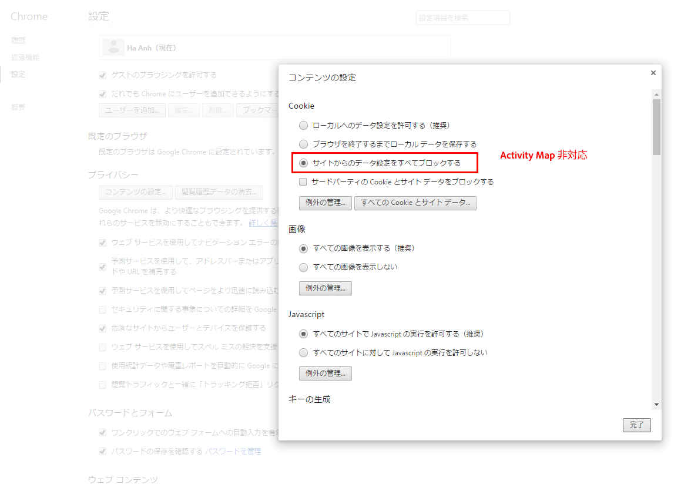
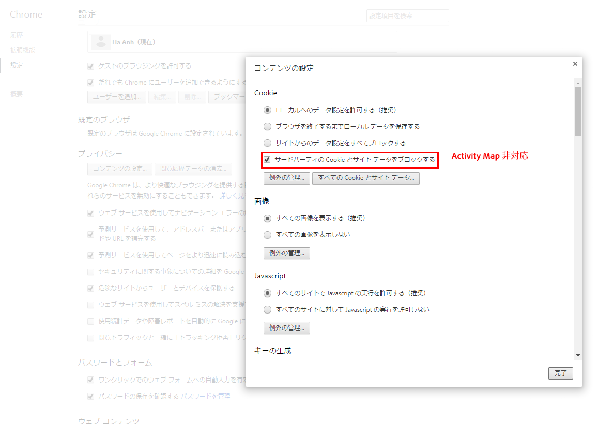
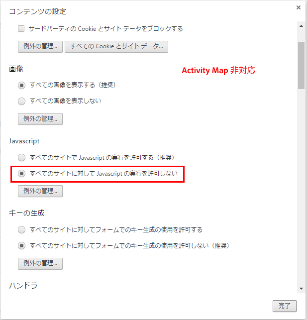
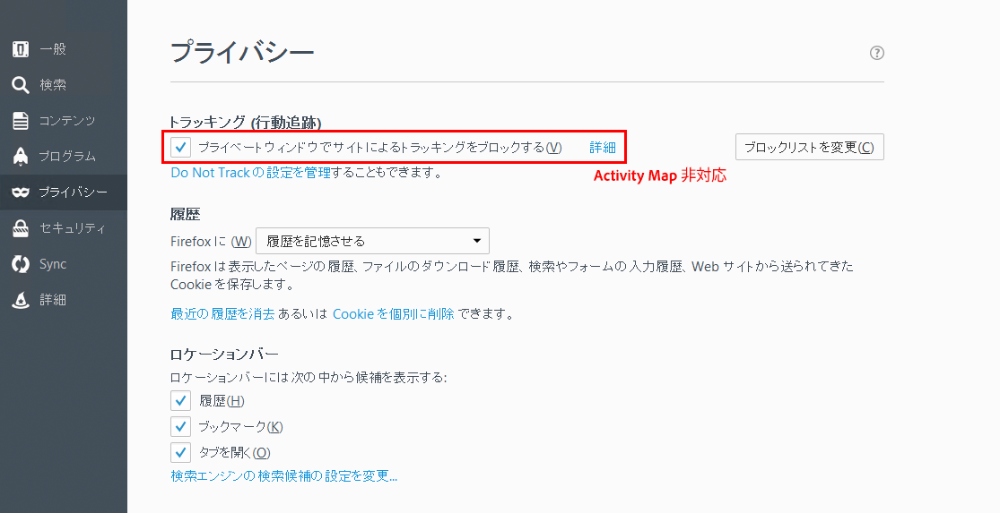
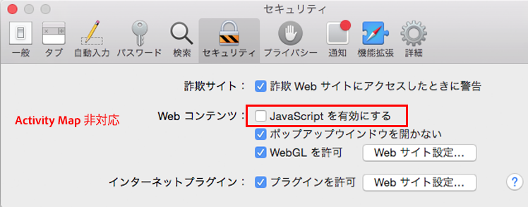
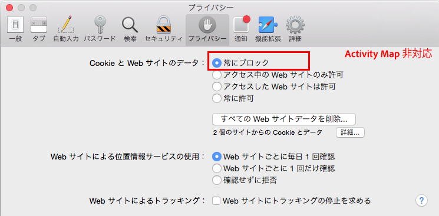
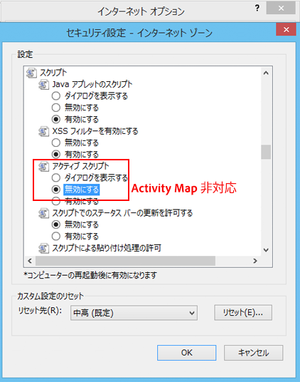

# Activity Map データ収集のトラブルシューティング

Activity Map ディメンションのデータが表示されない場合は、このページを使用して、その理由を判断します。

## デバッガーを使用したデータ収集の確認

まず、AppMeasurementがActivity Map データを正しく収集していることを確認します。

1. [Adobe CX Enterprise Debugger Chrome Extension](https://experienceleague.adobe.com/en/docs/experience-platform/debugger/home)をダウンロードしてインストールします。
2. Web ページに移動し、リンクをクリックします。
3. 後続のページが読み込まれたら、デバッガーを開きます。 Activity Mapのコンテキストデータ変数が`activitymap.`と`.activitymap`の間に挟まれていることを確認します。

## Activity Map データが存在しない考えられる理由

次の各項目を確認して、Activity Map コンポーネントが存在することを確認します。

* **AppMeasurement バージョン**: Activity Mapはv1.6以降でサポートされています。 最新の安定したバージョンのAppMeasurementにアップグレードすると、多くのエッジケースの問題が解決されます。
* **Activity Map モジュール**: `AppMeasurement_Module_Activity_Map` モジュールが`AppMeasurement.js` ファイルに存在するかどうかを確認します。 実装でAdobe Experience Platformを使用してデータを収集する場合は、**[!UICONTROL リンクトラッキング]**&#x200B;でAnalytics拡張機能を設定する際に、**[!UICONTROL ClickMapを有効にする]**&#x200B;がオンになっていることを確認してください。
* **`s_sq` Cookie**: Activity Mapは、データ収集の`s_sq` Cookieに依存しています。
   * `cookieDomainPeriods`変数が正しく設定されていることを確認してください。特に、`*.co.uk`や`*.co.jp`などの地域ドメインの場合に確認してください。
   * `linkInternalFilters`変数が目的の値に設定されていることを確認してください。 クリックしたリンクが内部フィルターと一致しない場合、Activity Mapはそれを離脱リンクとみなし、データを収集しません。
* **Activity Map オーバーレイが実行中**: Activity Map オーバーレイが有効になっている場合、AppMeasurementはweb ページのクリックデータをトラッキングしません。

Activity Map の使用と互換性のないブラウザーのパラメーターを示します。 Adobeでは、これらの設定を無効にすることをお勧めします。

## Chrome

## Firefox

## Safari

## Internet Explorer

**検証**

Developer Console の「ネットワーク」タブを使用た操作呼び出し：

1. サイトに開発用 Launch スクリプトを読み込みます。
1. 要素のクリック時に、「ネットワーク」タブで「/ee」を検索します。

Adobe Experience Platform Debugger：

1. [Adobe Experience Platform Debugger](https://chromewebstore.google.com/detail/adobe-experience-platform/bfnnokhpnncpkdmbokanobigaccjkpob) をダウンロードしてインストールします。
1. [!UICONTROL ログ]／[!UICONTROL Edge]／[!UICONTROL Edge に接続]に移動します。

* **インタラクション呼び出しが「ネットワーク」タブで実行されていません**: コレクト呼び出しのクリックデータの収集は、`"/ee"`または`"collect?"`のいずれかでフィルタリングされます。
* **collect呼び出しのペイロード表示がありません**:collect呼び出しは、トラッキングが他のサイトへのナビゲーションに影響を与えないように設計されているため、document unload機能はcollect呼び出しに適用されます。 この機能はデータ収集には影響しませんが、ページで検証する必要がある場合は、それぞれの要素に`target="_blank"`を追加してください。 リンクが新しいタブで開きます。
