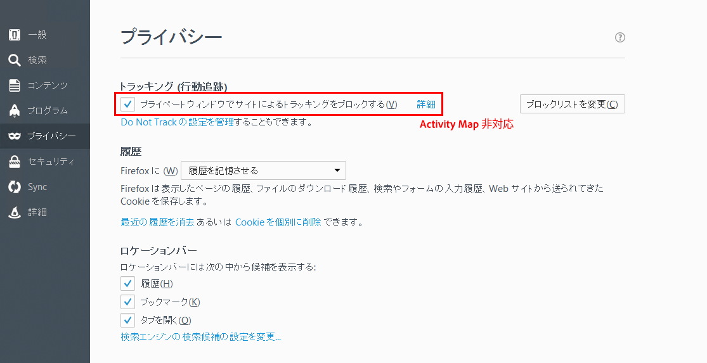

# Activity Mapデータ収集のトラブルシューティング

Activity Mapディメンションのデータが表示されない場合は、このページを使用して、その理由を判断します。

## デバッガーを使用したデータ収集の確認

まず、AppMeasurementがActivity Mapデータを正しく収集していることを確認します。

1. [Adobe Experience Cloud Debugger Chrome Extension](https://experienceleague.adobe.com/ja/docs/experience-platform/debugger/home) をダウンロードしてインストールします。
2. Web ページに移動して、リンクをクリックします。
3. 後続のページが読み込まれたら、デバッガーを開きます。 `activitymap.` と `.activitymap` の間にActivity Mapコンテキストデータ変数が挟まれていることが確認できることを確認します。

## Activity Mapデータが存在しない理由

Activity Mapコンポーネントが存在することを確認するために、次の各項目を確認します。

* **AppMeasurementのバージョン**: Activity Mapは v1.6 以降でサポートされています。 AppMeasurementの最新の安定したバージョンにアップグレードすると、多くのエッジケースの問題が解決されます。
* **Activity Mapモジュール**: `AppMeasurement.js` ファイルに `AppMeasurement_Module_Activity_Map` モジュールが存在するかどうかを確認してください。 実装でAdobe Experience Platformを使用してClickMapを収集する場合は、「リンクトラッキング **[!UICONTROL の下に Analytics 拡張機能を設定する際に]** データを有効にする **[!UICONTROL がオンになっていることを確認]** ます。
* **`s_sq` cookie**:Activity Mapは、データ収集に `s_sq` cookie を使用します。
   * 特に `*.co.uk` や `*.co.jp` などの地域ドメインで、`cookieDomainPeriods` 変数が正しく設定されていることを確認します。
   * `linkInternalFilters` 変数が目的の値に設定されていることを確認します。 クリックされたリンクが内部フィルターに一致しない場合、Activity Mapはリンクを離脱リンクと見なし、データを収集しません。
* **Activity Map オーバーレイ実行中**: Activity Map オーバーレイが有効な場合、AppMeasurementでは Web ページのクリック データが追跡されません。

Activity Map の使用と互換性のないブラウザーのパラメーターを示します。Adobeでは、これらの設定を無効にすることをお勧めします。

## Chrome

## Firefox

## Safari

## Internet Explorer

**検証**

Developer Console の「ネットワーク」タブを使用た操作呼び出し：

1. サイトに開発用 Launch スクリプトを読み込みます。
1. 要素のクリック時に、「ネットワーク」タブで「/ee」を検索します。

Adobe Experience Platform Debugger：

1. [Adobe Experience Platform Debugger](https://chromewebstore.google.com/detail/adobe-experience-platform/bfnnokhpnncpkdmbokanobigaccjkpob) をダウンロードしてインストールします。
1. [!UICONTROL ログ]／[!UICONTROL Edge]／[!UICONTROL Edge に接続]に移動します。

* **[ ネットワーク ] タブで対話呼び出しが実行されていません**: Collect 呼び出しのクリック データ コレクションは、`"/ee"` または `"collect?"` でフィルタリングします。
* **collect 呼び出しにペイロード表示はありません**:collect 呼び出しは、トラッキングが他のサイトへのナビゲーションに影響を与えないように設計されているので、ドキュメントのアンロード機能は collect 呼び出しに適用できます。 この機能はデータ収集に影響を与えませんが、ページ上で検証する必要がある場合は、それぞれの要素に `target="_blank"` を追加します。 リンクが新しいタブで開きます。
