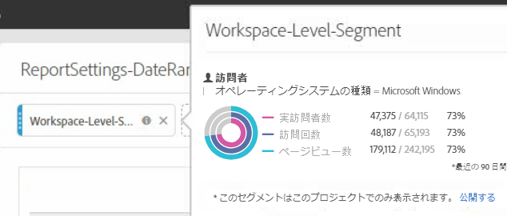
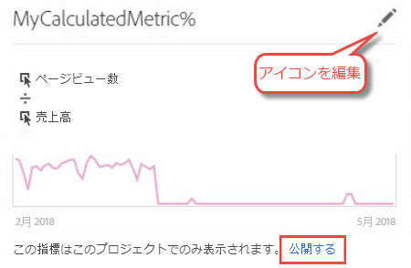

# プロジェクトコンバーターに関する FAQ

>[!IMPORTANT]
>
>アドビは、2021 年 3 月 2 日に Ad Hoc Analysis の提供を終了します。[詳細情報](https://adobe.ly/discoverworkspace)

## プロジェクトコンバーターに関する FAQ {#topic_8231595303AD403E9322645A63632D57}

* [既知のコンバージョンの問題](/help/analyze/ad-hoc-analysis/c-aha-project-converter/aha2aw-converter-faq.md#section_39C922A58B2E49C9877B363042801361)
* [コンバージョンに関する FAQ](/help/analyze/ad-hoc-analysis/c-aha-project-converter/aha2aw-converter-faq.md#section_1E53FE373AF045978F939916124E194E)

## 既知のコンバージョンの問題 {#section_39C922A58B2E49C9877B363042801361}

| 問題 | 説明 |
| --- | --- |
| 分類または列に関する分単位の精度 | 分単位の精度に分類が適用されている場合、または列に分単位の精度が存在する場合は、プロジェクトを Analysis Workspace に変換できません。回避策として、分単位の精度で分類を削除し、列から分単位の精度を削除して、プロジェクトを変換します。その後、Analysis Workspace で分単位の精度に分類を適用できます。 |
| 列セグメントとともに使用される内部計算指標 | 内部計算指標を列セグメントとともに使用している場合は、プロジェクトを Analysis Workspace に変換できません。この問題を回避するには、コンバージョン前に内部計算指標をプロジェクトから削除してから、Analysis Workspace で再度追加します。 |

## コンバージョンに関する FAQ {#section_1E53FE373AF045978F939916124E194E}

<table id="table_48CC119236C94835A6A512E989BE4200"> 
 <thead> 
  <tr> 
   <th colname="col1" class="entry"> 質問 </th> 
   <th colname="col2" class="entry"> 回答 </th> 
  </tr>
 </thead>
 <tbody> 
  <tr> 
   <td colname="col1"> 
<b>質問：Ad Hoc Analysis の機能のうち、Analysis Workspace でサポートされないものがありますか。</b> 
 </td> 
   <td colname="col2"> 
回答：サイト分析レポートは Analysis Workspace ではサポートされません。その他のビジュアライゼーションについても、Ad Hoc Analysis と Workspace の間で若干の違いがあります。詳しくは、以下の質問を参照してください。 
 </td> 
  </tr> 
  <tr> 
   <td colname="col1"> 
<b>質問：表の設定はどのように変換されますか。</b> 
 </td> 
   <td colname="col2"> 
    <ul id="ul_A645A004FB094A1593439A6607FE9A6B"> 
     <li id="li_033CA771F08A4BC3B0BC52CDCCA03FF4"><b>表示される行数</b>：Analysis Workspace では 1 ページに 10 行しか表示されません（一度に最大 400 行表示されるようにカスタマイズ可能）が、Ad Hoc Analysis では 1 ページに最大 50,000 行表示されます。データはまだ Analysis Workspace 内に存在しているので、1 ページあたりの行数は単純にデフォルトの 10 行になることに注意してください。 </li> 
     <li id="li_A8B8890149334032A56D8D1C0F8691EA"><b>アドバンス検索：</b>複数の同時検索オプションはサポートされませんが、単一の検索オプション（次の単語のすべて、完全に一致、次の単語のいずれか、次の単語をどれも使用しない、など）は Analysis Workspace に変換されます。 </li> 
    </ul> </td> 
  </tr> 
  <tr> 
   <td colname="col1"> 
<b>質問：チャートやグラフはどのように変換されますか。</b> 
 </td> 
   <td colname="col2"> 
回答：Analysis Workspace ではチャートやグラフはビジュアライゼーションと呼ばれることに注意してください。 
 
    <ul id="ul_597F5AB826EF434295D0CABD0313CAD5"> 
     <li id="li_AFB2805418034721A9519D999128C0A8"><b>設定</b>：Analysis Workspace では、項目数や棒グラフ数といったビジュアライゼーション設定はサポートされません。 </li> 
     <li id="li_D5C7EA8815344EDB8585CBB8E1AF583E"><b>円グラフ</b>：<a href="https://docs.adobe.com/content/help/ja-JP/analytics/analyze/analysis-workspace/visualizations/donut.html"  >ドーナツグラフ</a>ビジュアライゼーションとしてエクスポートされます。Analysis Workspace のこのビジュアライゼーションでは、分割数の上限は 19 分割になっています。 </li> 
     <li id="li_91659FBFD77C4B3393D78447D658B7B4"><b>バブルチャート</b>：<a href="https://docs.adobe.com/content/help/ja-JP/analytics/analyze/analysis-workspace/visualizations/scatterplot.html"  >散布図</a>ビジュアライゼーションとしてエクスポートされます。散布図ではデフォルトで、最初の指標が x 軸に、2 番目の指標が y 軸にそれぞれ描画されます。指標が 1 つしかない場合、バブルチャートは折れ線グラフビジュアライゼーションに変換されます。 </li> 
     <li id="li_FA05085FFB1747EBAF63616AC2B8D59C"><b>ヒストグラム</b>：Analysis Workspace と Ad Hoc Analysis では、サポートされるグループ化ロジックが異なっています。このため、ヒストグラムは<a href="https://docs.adobe.com/content/help/ja-JP/analytics/analyze/analysis-workspace/visualizations/bar.html"  >棒グラフ</a>ビジュアライゼーションに変換されます。 </li> 
     <li id="li_959499D20796459CA0F6BBC8F0A8D808"><b>散布図</b>：Analysis Workspace にエクスポートされたプロジェクトでは、Y 軸が最初の列に設定され、X 軸が 2 番目の列、直径が 3 番目の列になります。 </li> 
     <li id="li_14E06D7A5106405A89A07B44FFD9A92D"><b>フォールアウトの表</b>：フォールスルーまたはフォールアウトの表を表示するには、チェックポイントを右クリックして分類オプションを選択します。 </li> 
     <li id="li_240F43C386F04111A7632A8FCA37832C"><b>フォールアウトレポートレベルの日付範囲</b>：カスタマイズされたレポートの日付範囲は、フォールアウトビジュアライゼーションに適用されていません。 </li> 
     <li id="li_1FF5B3FD9E424E7190AF03FD4DD9D654"><b>フローレポート</b>：日付範囲やセグメント化を維持するため、フローは個別のパネルに移動されます。繰り返しインスタンスは、フロー設定の下に含めたり除外したりできます。 </li> 
     <li id="li_BE8F8F6EC2EA49E18EF52539BC1700E0"><b>コンバージョンファネル</b>：これは Analysis Workspace ではサポートされないので、フリーフォームテーブルに変換されます。コンバージョンファネルの代わりとしてお勧めなのは、フォールアウトビジュアライゼーションですが、これは若干異なる動作を示します。 </li> 
    </ul> </td> 
  </tr> 
  <tr> 
   <td colname="col1"> 
<b>質問：セグメントはどのように変換されますか。</b> 
 </td> 
   <td colname="col2"> 
    <ul id="ul_15D5B17461E2402DB07DF8B0A10AAC37"> 
     <li id="li_CF9C3D235A664B15B21D9F89DC5EF7D3">セグメントは変換後のプロジェクトの内部（非公開）になります。以下に示すように、それらを公開することができます。 
 
 </li> 
     <li id="li_AE61DAEC5C0047349DD192EFEEDB0BF9">Ad Hoc Analysis のワークスペースレベルのセグメントは、Analysis Workspace のプロジェクト／ワークスペースレベルに適用されます。 </li> 
     <li id="li_B1559E2C18724FE189AF87D0BEF16811">Ad Hoc Analysis のレポートレベルのセグメントは、Analysis Workspace のテーブル列レベルに適用されます。 </li> 
     <li id="li_0E6DF6D44EA448A4A212BA2BB8E342CF">Ad Hoc Analysisテーブルセグメントは、Workspaceのテーブル列レベルで適用されます。 </li> 
    </ul> 
セグメントを編集するには、<a href="https://docs.adobe.com/content/help/ja-JP/analytics/components/segmentation/seg-home.html"  >セグメントビルダー</a>を使用します。 
 </td> 
  </tr> 
  <tr> 
   <td colname="col1"> 
<b>質問：日付範囲はどのように変換されますか。</b> 
 </td> 
   <td colname="col2"> 
    <ul id="ul_A24AB597F3CE4847AF00D49A9A72A395"> 
     <li id="li_24FD18AF64114445939C4FBC03F2D406">日付範囲「最近の X 日間」の場合、Ad Hoc Analysis では今日が<i>除外</i>されますが、Analysis Workspace では今日は<i>含まれません</i>。したがって、「過去90日間」のような日付範囲は、ツール間で正確に一致しない場合があります。 代わりに、「Last X <b>full </b> days」の範囲をAnalysis Workspaceに適用します。 </li> 
     <li id="li_AA4390470C494748B4B12030B1226720">Ad Hoc Analysis のワークスペースレベルの日付範囲は、Analysis Workspace のプロジェクト／ワークスペースレベルに適用されます。 </li> 
     <li id="li_B8F0CDD413154856A315D087FEC4D418">Ad Hoc Analysis のレポートレベルの日付範囲は、Analysis Workspace のテーブル列レベルに適用されます。 </li> 
    </ul> 
カスタム日付範囲を編集するには、Analytics／コンポーネント／日付範囲を選択します。 
 </td> 
  </tr> 
  <tr> 
   <td colname="col1"> 
<b>質問：計算指標はどのように変換されますか。</b> 
 </td> 
   <td colname="col2"> 
    <ul id="ul_ADA380D5D09B4223AAE4853D4C64F679"> 
     <li id="li_010572F793F54680ABE64117DAB7E800">計算指標はエクスポートされたプロジェクトの内部（非公開）になります。それらを公開するには、指標を右クリックして公開するをクリックします。 
 
 </li> 
     <li id="li_930546EC8FEB432C8810FAF93556FC9A">すべてのタイプの計算指標がエクスポート対象としてサポートされています。 </li> 
     <li id="li_DFF7C6F8BB2344928D49194DA0F6EC38"><b>配分タイプ</b>：Analysis Workspace では計算指標の配分タイプは明示的に表示されませんが、エクスポート時には、Ad Hoc Analysis に存在していた配分タイプが作成され、そのタイプへのマッチングがおこなわれます。 </li> 
    </ul> 
配分タイプを編集するには、編集（鉛筆）アイコンをクリックして<a href="https://docs.adobe.com/content/help/ja-JP/analytics/components/calculated-metrics/cm-overview.html"  >計算指標ビルダー</a>を開きます。 
 </td> 
  </tr> 
  <tr> 
   <td colname="col1"> 
<b>質問：Ad Hoc Analysis のグローバルデータ設定は変換後のプロジェクトにどのように適用されますか。</b> 
 </td> 
   <td colname="col2"> 
グローバルデータ設定を使用する場合、同じプロジェクトを 2 回エクスポートしたときに両者の動作が異なることがあります。 
 
    <ul id="ul_E3827883DD8045FAAB359D7E85E3EEFA"> 
     <li id="li_1056CA4813C44638BEB070228AE6914C"><b>繰り返しインスタンスのカウント：</b>エクスポート時に適用されていた設定が、Analysis Workspace 内のエクスポート後のプロジェクトに適用されます。 </li> 
     <li id="li_D5405E2862CF434CA82AA9DE000F4BBC"><b>データソース：</b> Analysis Workspace ではデータソースも含め、Analytics のすべてのデータが表示されます。 </li> 
    </ul> </td> 
  </tr> 
  <tr> 
   <td colname="col1"> 
<b>質問：Ad Hoc Analysis プロジェクトのスケジュールが作成されていた場合、そのスケジュールは Analysis Workspace に変換されますか。</b> 
 </td> 
   <td colname="col2"> 
スケジュールは一切変換されません。Analysis Workspace でスケジュールを作成するプロジェクトを開き、共有／ファイルをスケジュールに従って送信を選択して新しいスケジュールをセットアップします。Ad Hoc Analysis のスケジュールされたプロジェクトを忘れずにキャンセルしてください。 
 </td> 
  </tr> 
 </tbody> 
</table>

