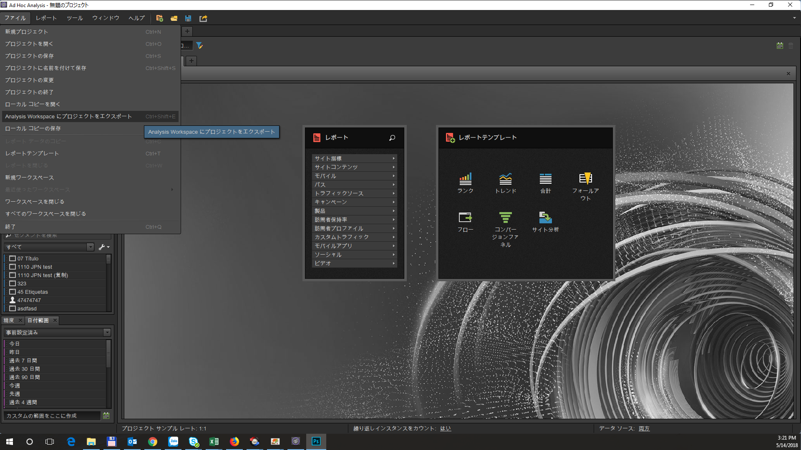
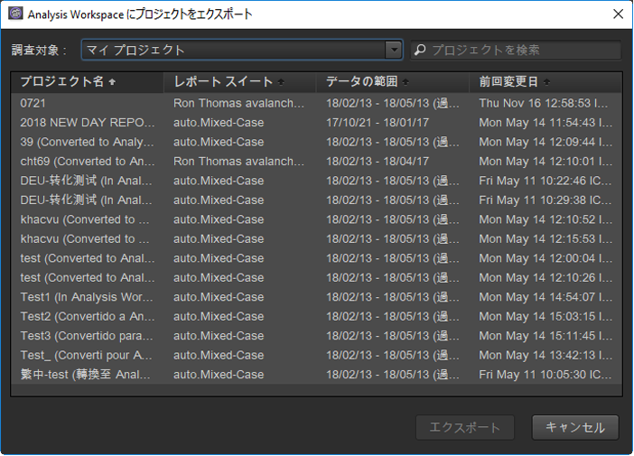
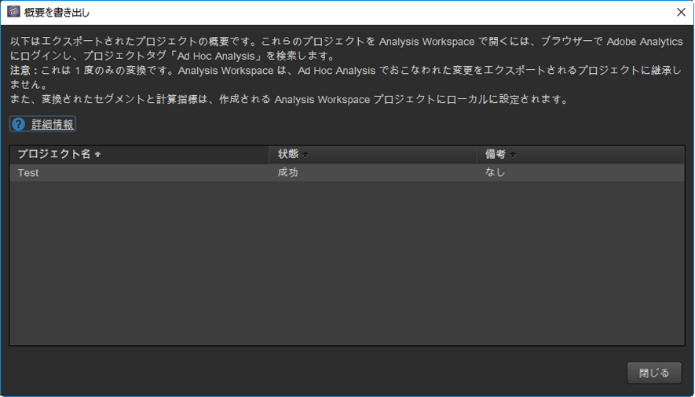
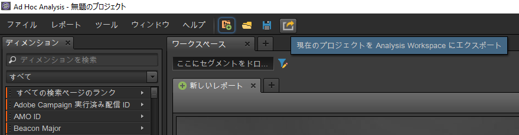

# Ad Hoc Analysisのプロジェクトの変換

## Convert your projects in Ad Hoc Analysis {#topic_5A55F73488704C5D8E42CDD04B5984DE}

プロジェクトを変換する前に、以下の点に注意してください。

* プロジェクトを変換するには、管理者として、または Analysis Workspace を使用する権限を持つ非管理者として、Ad Hoc Analysis にログインする必要があります。
* これは 1 回限りの変換なので、変換した Ad Hoc Analysis プロジェクトにさらに変更を加えた場合、それらの変更は Analysis Workspace には一切反映されません。ただし、プロジェクトを再度変換するという選択肢があります。
* 変換された Ad Hoc Analysis プロジェクトはすべて Ad Hoc Analysis 内に存在し続け、変換済みであることとその変換回数を示す括弧が、タイトル内に表示されます。例：

   

Ad Hoc Analysis のプロジェクトを変換するには、次の 2 つの選択肢があります。

* リストから変換するプロジェクトを選択します。
* 現在開いているプロジェクトのみを変換します。

**リストからプロジェクトを選択する**

1. In Ad Hoc Analysis, click **[!UICONTROL File]** &gt; **[!UICONTROL Convert Projects to Analysis Workspace]**.

   

1. In the **[!UICONTROL Convert Projects to Analysis Workspace]** dialog, select the project to convert or press  +  to select the entire list.

   

1. Click **[!UICONTROL Convert]**.
1. [!UICONTROL 変換サマリ]に、変換されたすべてのプロジェクト、および変換の成功／失敗を示すステータス列とエラーコードが一覧表示されます。Contact Adobe Client Care for further diagnosis with the "`Error-Id: <Error-Code>`".

   

**現在のプロジェクトを変換する**

1. Ad Hoc Analysis で、変換するプロジェクトを開きます。
1. 「**[!UICONTROL 現在のプロジェクトを Analysis Workspace に変換」をクリックします。]**

1. [!UICONTROL 変換サマリ]に、変換されたすべてのプロジェクト、および変換の成功／失敗を示すステータス列とエラーコードが一覧表示されます。Contact Adobe Client Care for further diagnosis with the "`Error-Id: <Error-Code>`".
