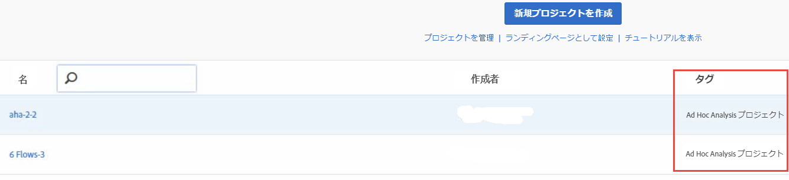

# Analysis Workspace での変換後のプロジェクトの表示

>[!IMPORTANT]
>
>Adobeは2021年3月1日にAd Hoc Analysisを廃止に移す。 [詳細情報](https://adobe.ly/discoverworkspace)

Analysis Workspace でプロジェクトを表示する前に、[FAQ](/help/analyze/ad-hoc-analysis/c-aha-project-converter/aha2aw-converter-faq.md#topic_8231595303AD403E9322645A63632D57) を参照し、Ad Hoc Analysis と Analysis Workspace での[用語の違い](/help/analyze/ad-hoc-analysis/c-aha-project-converter/aha2aw-converter-faq.md#topic_8231595303AD403E9322645A63632D57)を確認してください。

1. **[!UICONTROL Analytics]**／**[!UICONTROL ワークスペース]**&#x200B;に移動します。Ad Hoc Analysis から変換されたプロジェクトには「Ad Hoc Analysis プロジェクト」というタグが付けられることに注意してください。

   

1. プロジェクト名をクリックしてプロジェクトを表示します。
1. 必要に応じてプロジェクトにさらに変更を加えます。それらの変更は Ad Hoc Analysis には反映されないことに注意してください。

