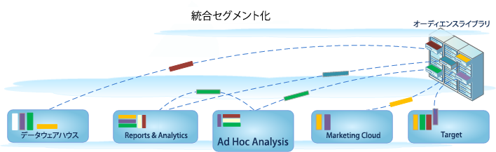

# セグメントの構築

>[!IMPORTANT]
>
>Adobeは2021年3月1日にAd Hoc Analysisを廃止に移す。 [詳細情報](https://adobe.ly/discoverworkspace)

Ad Hoc Analysis は、Analytics セグメント化環境に統合されており、これによって、アドビ製品間で訪問者セグメントを作成、共有、管理および適用できます。Ad Hoc Analysis は、セグメントビルダーおよびセグメントマネージャーの Java ベースのユーザーインターフェイスです。これは、他の Analytics ツールで使用する Web ベースのツールと同じであり、サーバーコールのマッチングを実行するほか、Java ベースのコンソールと同じ機能を提供します。

Ad Hoc Analysis には、従来のようなセグメント作成機能のほかに、セグメントの管理[ワークフロー](https://docs.adobe.com/content/help/en/analytics/components/segmentation/segmentation-workflow/seg-workflow.html)の設定に使用する[セグメントマネージャー](https://docs.adobe.com/content/help/ja-JP/analytics/components/segmentation/segmentation-workflow/seg-manage.html)などの新機能が加わっています。[セグメントビルダー](/help/components/segmentation/segmentation-workflow/seg-build.md)で普段どおりにセグメントの作成と保存が可能であるだけでなく、Ad Hoc Analysis コンソールでは[フォールアウトレポートからセグメントを生成](https://docs.adobe.com/content/help/en/analytics/analyze/analysis-workspace/visualizations/fallout/compare-segments-fallout.html)し、一般アクセスおよびアプリケーション用のオーディエンスライブラリに新しいセグメントや拡張したセグメントを保存することができます。

## Ad Hoc Analysis の統合セグメント化機能 {#section_5FA03A06DE054448AD519CE30C39E294}

統合セグメント化環境でのセグメントの作成および管理に関する詳細については、[統合セグメント化](/help/components/segmentation/segmentation-workflow/seg-build.md)に関するドキュメントを参照してください。

* [新機能](/help/analyze/ad-hoc-analysis/c-content-ref.md#section_BD58629D1A9346BF879E229FA6BEC7A2)
* [既存のセグメントへの影響](/help/analyze/ad-hoc-analysis/c-content-ref.md#section_76CF47142D1A4FB6A0718AD9073049FE)
* [既存のセグメントフォルダーへの影響](/help/analyze/ad-hoc-analysis/c-content-ref.md#section_FB04DCF775694E69B761DCA53F301C30)
* [セグメントマネージャーでは Analytics のセグメントをすべて管理できるのですか？](/help/analyze/ad-hoc-analysis/c-content-ref.md#section_AF5EDD72C74A4739BD40C4AF125CE489)
* [ヒットコンテナとは何ですか？ページビューコンテナとは違うものですか？](/help/analyze/ad-hoc-analysis/c-content-ref.md#section_65BBE60A836C4001938830DDA15DC256)
* [セグメントの使用、作成および管理に必要な権限と許可](/help/analyze/ad-hoc-analysis/c-content-ref.md#section_648DFA3A882146C485A84ED014EEC707)
* [同じ名前でありながら定義が異なるセグメントがある場合には、どうしたら良いでしょうか？](/help/analyze/ad-hoc-analysis/c-content-ref.md#section_E2C3A1B4B4274D1B86CAA9C0359D049C)
* [Adobe が推奨するセグメントのクリーンアップ方法](/help/analyze/ad-hoc-analysis/c-content-ref.md#section_3AC2D265F9084557A24C6FB39DC6EE49)
* [このセグメントを削除できないのはなぜですか？](/help/analyze/ad-hoc-analysis/c-content-ref.md#section_0FEB6711031A4ABCA915CDA745ECF38D)
* [その他、既存のセグメントに発生する事項](/help/analyze/ad-hoc-analysis/c-content-ref.md#section_83ACAB256F394DCD8B424D8920BDD853)

## 機能 {#section_BD58629D1A9346BF879E229FA6BEC7A2}

* [セグメント](https://docs.adobe.com/content/help/ja-JP/analytics/components/segmentation/seg-home.html)が、レポートスイート全体で共通になりました。セグメントはこれまで、各レポートスイートに固有のものでした。
* [セグメントマネージャ](https://docs.adobe.com/content/help/ja-JP/analytics/components/segmentation/segmentation-workflow/seg-manage.html)を使用すると、セグメントの共有、タグ設定、検証および承認の機能を使用して[ワークフロー](https://docs.adobe.com/content/help/en/analytics/components/segmentation/segmentation-workflow/seg-workflow.html)を設定できます。
* [セグメントビルダー](/help/components/segmentation/segmentation-workflow/seg-build.md)が更新され、セグメントの作成が簡素化しました。
* フォルダーを使用する代わりに[セグメントにタグを設定](https://docs.adobe.com/content/help/en/analytics/components/segmentation/segmentation-workflow/seg-tag.html)して、セグメントを整理したり検索したりできます。これまでは、（[!DNL ad hoc analysis] の）フォルダーを使用してセグメントを整理していました。
* Ad Hoc Analysis 以外でも[連続セグメント](https://docs.adobe.com/content/help/en/analytics/components/segmentation/segmentation-workflow/seg-sequential-build.html)を作成できます。

   >[!NOTE]
   >
   >Ad Hoc Analysis では、日付範囲をセグメントに追加できません。この機能は、Analysis Workspace で使用できます。また、Ad Hoc Analysis で「シーケンスの前のみ」／「シーケンスの後のみ」も使用できません。

## 既存のセグメントへの影響 {#section_76CF47142D1A4FB6A0718AD9073049FE}

既存のセグメントは、引き続き、Analytics セグメントの導入前と同じように動作します。既存のセグメントが適用されたレポートも、これまでと同様に適切に機能します。

従来の定義済みセグメントおよびスイートセグメントは、ほとんどがセグメントテンプレートとしてセグメントビルダーに移行します。セグメントテンプレートは、一般的な閲覧者を含むカスタムセグメントをすばやく作成するために部品として利用できます。セグメントテンプレートは、レポートに直接適用できませんが、カスタムセグメントには容易に保存できます。

## 既存のセグメントフォルダーへの影響 {#section_FB04DCF775694E69B761DCA53F301C30}

セグメントマネージャーでは、（Ad Hoc Analysis）フォルダーの代わりに、[タグ](https://docs.adobe.com/content/help/en/analytics/components/segmentation/segmentation-workflow/seg-tag.html)を使用します。フォルダー名はタグに自動的に変換され、個々のセグメントに適用されています。

## セグメントマネージャーでは Analytics のセグメントをすべて管理できるのですか？{#section_AF5EDD72C74A4739BD40C4AF125CE489}

Ad Hoc Analysis のセグメントマネージャーでは、自身の所有となっている（自分で作成した）セグメントと、共有により閲覧可能になっているセグメントのみを表示できます。

## ヒットコンテナとは何ですか？ページビューコンテナとは違うものですか？ {#section_65BBE60A836C4001938830DDA15DC256}

ページビューコンテナの名称が「ヒットコンテナ」に変わりました。これは、ページビューだけでなく、すべての種類のデータをセグメント化するコンテナであることを意味しています。例えば、モバイル SDK からの [!DNL trackAction] コールおよびリンクトラッキングコールはいずれも、ヒットコンテナに格納されるか、そこから除外されるかのどちらかです。

このコンテナは名前が変更されただけで、機能に変更はありません。

## セグメントの使用、作成および管理に必要な権限と許可 {#section_648DFA3A882146C485A84ED014EEC707}

どのユーザーも個人用セグメントを作成したり、編集したりできます。これらのセグメントは、他の Analytics ユーザーと直接共有できます。

管理者であれば、あらゆるセグメントを編集できるほか、グループと[セグメントを共有](https://docs.adobe.com/content/help/en/analytics/components/segmentation/segmentation-workflow/t-seg-share.html)したり、組織のセグメントにアクセスするための[権利を設定](https://docs.adobe.com/content/help/ja-JP/analytics/components/segmentation/segment-reference/seg-rights.html)したりできます。

## 同じ名前でありながら定義が異なるセグメントがある場合には、どうしたら良いでしょうか？ {#section_E2C3A1B4B4274D1B86CAA9C0359D049C}

セグメントは複数のレポートスイートで動作するので、同じ名前のセグメントが複数存在する結果になることがあります。そのような場合には、以下のいずれかを推奨しています。

* 同じ名前でありながら定義が異なるセグメントの名前を変更します。
* 不要なセグメントを削除します。

## Adobe が推奨するセグメントのクリーンアップ方法 {#section_3AC2D265F9084557A24C6FB39DC6EE49}

* すべてのセグメントに「移行前」などのタグを付けます。
* 自分が所有しているセグメントを確認します。
* セグメントを適切なセグメントライブラリに追加します。
* 正規のセグメントを承認します。
* ベストプラクティスに従ってセグメントにタグを設定します。

## このセグメントを削除できないのはなぜですか？{#section_0FEB6711031A4ABCA915CDA745ECF38D}

セグメントが [Experience Cloud に公開されている](https://docs.adobe.com/content/help/ja-JP/core-services/interface/audiences/t-publish-audience-segment.html)場合には、そのセグメントを削除したり、編集したりすることはできません。ただし、コピーしたうえでそのコピーしたものを編集することは可能です。

## その他、既存のセグメントに発生する事項 {#section_83ACAB256F394DCD8B424D8920BDD853}

<table id="table_0AE814A64D2A48ABB28402C4303F420E"> 
 <thead> 
  <tr> 
   <th colname="col1" class="entry"> セグメントのカテゴリ </th> 
   <th colname="col2" class="entry"> そのセグメントに発生すること </th> 
  </tr> 
 </thead>
 <tbody> 
  <tr> 
   <td colname="col1"> お気に入りセグメント（Ad Hoc Analysis） </td> 
   <td colname="col2">Ad Hoc Analysis のこのセグメントは、Adobe Analytics の通常のセグメントとして表示されます。 
セグメントマネージャーのお気に入り機能（セグメントをお気に入りとしてマークする機能）と混同しないようにしてください。 
 </td> 
  </tr> 
  <tr> 
   <td colname="col1">事前設定済みセグメント 
    <ul id="ul_BBF3C3F4D41A40AF98DA9DA6D299AD03"> 
     <li id="li_B65A004BDF8743FDABCD3332AEB8A010">直帰数 </li> 
     <li id="li_908CF5F964154C9D9EBBAC2A900DCB49">モバイルデバイスからの訪問 </li> 
     <li id="li_4A715F49AA374463B501D731261A3A4C">自然検索からの訪問 </li> 
     <li id="li_67CE51237EC34FD4B33942BA14584EBF">有料検索からの訪問 </li> 
     <li id="li_C3820743178A4E9F9E5E5B5C47401DF2">訪問者 ID Cookie の訪問 </li> 
    </ul> </td> 
   <td colname="col2"> 
ここに挙げたセグメントはいずれも、セグメントテンプレートとしてセグメントビルダーに移行します。 
 
既存のレポートにこのセグメントが適用されている場合でも、そのレポートは引き続き正しく動作します。 
 </td> 
  </tr> 
  <tr> 
   <td colname="col1">Experience Cloud（スイート）セグメント 
    <ul id="ul_6968AFF6DEDA4BC8A7885B07CC1F57DF"> 
     <li id="li_073D9496F0C64AEB855855D01E65C1BA">非購入者 </li> 
     <li id="li_8958FD4272A14E16A9AA08216E8BC573">購入者 </li> 
     <li id="li_1436D7C9651D4AC38E10662DEDDD2B95">初回訪問回数 </li> 
     <li id="li_69F42B4F6107407792B0014804A8AF7B">ソーシャルサイトからの訪問件数 </li> 
     <li id="li_29CA111186BE475C943E9F8450BDE8C8">10 分を超える訪問* </li> 
     <li id="li_1FEF207959DC4D2E9FC925DD43177AA0">以前に 5 回以上の訪問履歴がある訪問* </li> 
     <li id="li_219AB1D4FD7E469C9076A23D2CCC7C2C">Facebook からの訪問件数* </li> 
    </ul> </td> 
   <td colname="col2"> 
 ここに挙げた（アスタリスク * が付いたものを除く）セグメントのほとんどは、セグメントテンプレートとしてセグメントビルダーに移行します。このほかに、新しいセグメントテンプレートがいくつか追加されています。 
 
既存のレポートにこのセグメントが適用されている場合でも、そのレポートは引き続き正しく動作します。 
 </td> 
  </tr> 
  <tr> 
   <td colname="col1">管理セグメント 
（別名「グローバル」セグメント） 
 </td> 
   <td colname="col2"> 
 <b>管理</b>セグメントは、新しいセグメントインターフェイスに移行し、全員が共有するセグメントとして表示されます。 
 
このセグメントの所有者は、ログイン企業の管理者ユーザー一覧に記載されているアカウントのうち、最も古くから存在する管理者に設定されます。ただし、管理者であれば誰でも、このセグメントの削除、編集および共有が可能です。 
 
管理者がグローバルセグメントの作成および管理に使用していた Admin Console のセグメント管理インターフェイスは、利用できなくなりました。このため、セグメントを作成したり、（特定のグループ、個人または全員で）共有したりするには、新しいセグメントビルダーを使用する必要があります。 
 </td> 
  </tr> 
 </tbody> 
</table>

