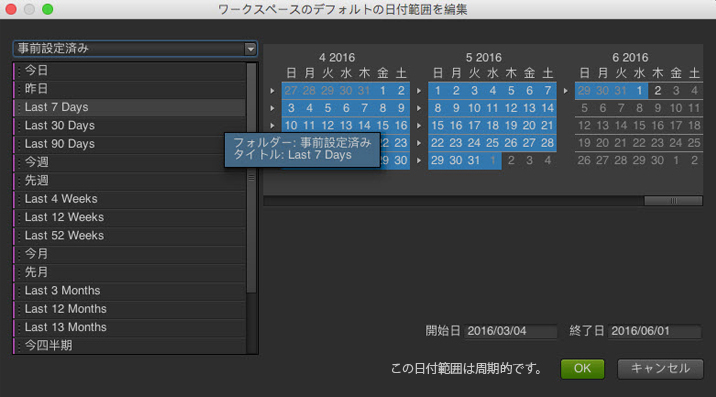

# 日付と日付範囲

カレンダーで、日付や日付範囲を指定したり、プリセットを選択できます。プロジェクト、ワークスペースおよびレポートのレベルでカレンダーを選択できます。デフォルトの日付は、プロジェクトの日付範囲です。ただし、ワークスペースの日付範囲はプロジェクトの日付範囲より優先されます。同様に、レポートの日付範囲は、ワークスペースおよびプロジェクトの日付設定より優先されます。データの有効範囲外の日付範囲を選択することはできません。

## Dates and date ranges {#concept_AB32765013F449908B5964AB622C75FF}

カレンダーで、日付や日付範囲を指定したり、プリセットを選択できます。プロジェクト、ワークスペースおよびレポートのレベルでカレンダーを選択できます。デフォルトの日付は、プロジェクトの日付範囲です。ただし、ワークスペースの日付範囲はプロジェクトの日付範囲より優先されます。同様に、レポートの日付範囲は、ワークスペースおよびプロジェクトの日付設定より優先されます。データの有効範囲外の日付範囲を選択することはできません。

「**[!UICONTROL 日付をクリア]」できるゴミ箱アイコンがカレンダーアイコンの右側に表示されている場合、データ範囲がレポートレベルで指定されていることになります。**

日付範囲パネルに表示されている日付範囲（や精度パネルの時間など）をレポートまたは[!UICONTROL 表ビルダー]にドラッグすることもできます。特定の日、週、月、年または周期的な日付を選択できます。なお、Reports and Analytics でカスタムカレンダーを使用している場合は、その設定が自動で適用されます。

プロジェクトの作成中に日付範囲を選択する場合、左側の「事前設定済み」を使用すると、周期的な日付が設定されます（右側のカレンダーを使用すると、周期的な日付は設定されません）。日付範囲が周期的かどうかは、「**[!UICONTROL OK]」ボタンの隣に「この日付範囲は周期的です。」と表示されているかどうかで簡単に確認できます。**

>[!NOTE]
>
>レガシーレポートの実行については、アカウントマネージャーにお問い合わせください。

## レガシー日付スライス {#concept_53AA34DB3CE647608CAF4B41D6EAF45E}

2010 年の後半、アドビは、処理や保存機能を向上させるために、統合データプラットフォームへのレポートスイートの移行を開始しました。移行よりも前から存在するデータは、レガシーデータ（履歴データ）とみなされ、四半期や年による制限を受けます。

<!-- 

c_legacy_data.xml

 -->

**履歴日付スライスにアクセスするには**

1. [プロジェクトを作成するか、または開きます。](../../analyze/ad-hoc-analysis/c-getting-started.md#task_918A4539134E4E62B00486DCB8D3D403)
1. [カレンダー](../../analyze/ad-hoc-analysis/c-dates.md#concept_E8A2E36E595C45C785ECB724CA37FA47)を開き、 **[!UICONTROL 「四半期]** 」また **[!UICONTROL は「年]**」を選択します。

>[!NOTE]
>
>履歴日付スライスは、四半期と年の制限にあります。データの日付範囲がレガシースライスから新しい処理プラットフォームに及んでいる場合は、そのデータを表示することはできません。両方にまたがる日付範囲は、エラーになります。また、日付範囲はグレゴリオ暦カレンダーにのみ適用され、カスタムカレンダーには適用されません。

