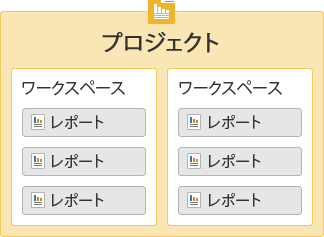
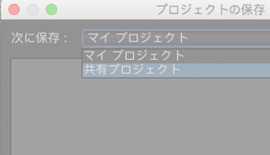

# Get Started with Ad Hoc Analysis{#concept_48936BA28FAE42DB81F1B2CD4726EB17}

>[!Imutant]
>2018 年 8 月 7 日、アドビは Ad Hoc Analysis のサポート終了の意向を表明しました。サポート終了日については確定次第お知らせします。サポート終了の予定や詳細については [https://adobe.ly/discoverworkspace](https://adobe.ly/discoverworkspace) を参照してください。

Web サイト上でのアクティビティを迅速かつインタラクティブに分析できます。複数のレポートを同時に表示して、複数のディメンションにセグメントを適用することもできます。データをミクロとマクロの両方の観点から分析し、重要なビジネス指標にどのように影響しているかを確認することも容易です。

これらの機能により、サイトトラフィック、訪問者の人口統計、売上高、製品の動向についての疑問に答えることができます。また、データのフィルター、並べ替え、セグメント化を行うことで、緻密な分析も可能です。結果はほとんど瞬時に返されるので、複数要素の組み合わせによる効果を素早く分析できます。

<table id="table_C9C0444687FC418580F996E1D2ADB61A"> 
 <thead> 
  <tr> 
   <th colname="col1" class="entry"> 使用開始時のタスク </th> 
   <th colname="col2" class="entry"> 説明 </th> 
  </tr> 
 </thead>
 <tbody> 
  <tr> 
   <td colname="col1"> 
1. Adobe Analytics にログインする。 
 </td> 
   <td colname="col2"> 
<a href="https://marketing.adobe.com" scope="external" format="https"> marketing.adobe.comにアクセス </a>し、Adobe Analytics資格情報を使用してログインします。 
 </td> 
  </tr> 
  <tr> 
   <td colname="col1"> 
2. Ad Hoc Analysis を起動する。 
 </td> 
   <td colname="col2">Adobe Analytics／ツール／Ad Hoc Analysis をクリックして、「Ad Hoc Analysis を起動」ボタンをクリックします。 
 
注意：このページに「<b>Ad Hoc Analysis を起動</b>」ボタンが表示されない場合は、管理者が管理ツールの「Ad Hoc Analysis ライセンスユーザー<i></i>」グループにユーザーを追加していることを確認してください。 
 
 </td> 
  </tr> 
  <tr> 
   <td colname="col1"> 
3. プロジェクトを作成する。 
 </td> 
   <td colname="col2"> 
スタートアップページで、レポートスイートを選択して「プロジェクトの作成」をクリックします。 
 
<a href="../../analyze/ad-hoc-analysis/c-getting-started.md#concept_FAE346335B0347A192C6C806C775D72B" type="concept" format="dita" scope="local"> プロジェクトとワークスペース</a>を参照してください。 
 </td> 
  </tr> 
  <tr> 
   <td colname="col1"> 
4. レポートを開く。 
 </td> 
   <td colname="col2"> 
Marketing Cloud の標準のレポートメニューを使用して、レポートを検索できます。テンプレートを選択することもできます。 
 
詳しくは、 <a href="../../analyze/ad-hoc-analysis/c-getting-started.md#concept_370F674C5B4C45368731AA801C5A45F8" type="concept" format="dita" scope="local"> レポートテンプレート</a>. 
 </td> 
  </tr> 
  <tr> 
   <td colname="col1"> 
5. レポートを設定する。 
 </td> 
   <td colname="col2"> 
次のようなタスクを実行し、レポートを設定します。 
 
    <ul id="ul_0D2E8C614F2A4899A376BCEECEA374C6"> 
     <li id="li_FA925D52A8FD4DFAB0C88B797B24E72B"> セグメントを作成してデータを詳細に分析する </li> 
     <li id="li_5E91632551D2473BA8BD0637CDC1A9F6"> 指標、ディメンションおよびセグメントを <a href="../../analyze/ad-hoc-analysis/c-tablebuilder.md#concept_664FC77306E148DBA4EA081814943C5E" type="concept" format="dita" scope="local"> 表ビルダー</a> </li> 
     <li id="li_019316C9A94B4A8C8A77D07C04E50278"><a href="../../analyze/ad-hoc-analysis/c-dates.md#concept_E8A2E36E595C45C785ECB724CA37FA47" type="concept" format="dita" scope="local"> 日付範囲の設定</a> </li> 
     <li id="li_2B33B325D5EE420AB412B73AD1D231C5"> <a href="../../analyze/ad-hoc-analysis/c-schedule.md#concept_12D2DDD66086453BAB6D48D9D22932F2" type="concept" format="dita" scope="local"> レポート配信のスケジュール</a>を設定する </li> 
    </ul> 
このヘルプシステムで検索して、必要なヘルプを参照してください。 
 </td> 
  </tr> 
 </tbody> 
</table>

## 必要システム構成 {#concept_6691331B45174290BD9B839806A9B52D}

レポートはほとんどの Web ブラウザーで適切に機能しますが、レポートの表示と機能に最適なシステム要件があります。

<!-- 

c_sys_reqs.xml

 -->

>[!NOTE]
>
>2018 年 7 月から、Ad Hoc Analysis では Java 8 以降のみがサポートされます。2018年7月のメンテナンスリリース以降、Java7でAd Hoc Analysisを実行するように選択した場合、アドビはAd Hoc Analysisの実装をサポートしなくなります。

* OpenGL 2.0 をサポートするビデオカード
* cookie：必要
* オペレーティングシステム：Windows および Mac OS
* Macromedia Flash Player：バージョン 6 以降
* 画面の解像度：800 x 600（1024 x 768 を推奨）
* 画面の色：16 ビット以上
* JavaScript：有効
* Java バージョン：Java 1.7 以降（前述の注意を参照）

   Java の正しいバージョンがインストールされていない場合は、インストールされます。互換性のないバージョンの Java がインストールされている場合、Ad Hoc Analysis はアップデートをダウンロードし、このアップデートのインストールを指示するプロンプトを表示します。

## Java のアップグレード手順 {#section_E4C0C6492FF24636A0FF71A59331111D}

2018 年 7 月から、Ad Hoc Analysis では Java 8 以降のみがサポートされます。2018年7月のメンテナンスリリース以降、Java7でAd Hoc Analysisを実行するように選択した場合、アドビはAd Hoc Analysisの実装をサポートしなくなります。

アドビの .jar ファイルは安全な 256 ビット暗号化を使用して署名されていますが、この機能は 1.7.0_76 以前の Java バージョンではサポートされていません。この 256 ビット証明書を使用することで、セキュリティが強化されています。

まだ Java 7 がインストールされている場合、2018 年 7 月のメンテナンスリリースの前にアップグレードする必要があります。その方法を次に示します。

* 自分のマシンにプログラムをインストールすることが許可されている場合

   1. https://www.java.comに移動します。
   1. **[!UICONTROL 「無料Javaダウンロード]**」をクリックします。
   1. **[!UICONTROL 「同意して無料ダウンロードを開始」をクリック]**&#x200B;します。
   1. お使いのオペレーティングシステム専用の最新の Java バージョンをインストールします。

* 自分のマシンにプログラムをインストールすることが&#x200B;**許可されていない**&#x200B;場合

   1. IT 部門と協力して、最新バージョンの Java をインストールします。

## Ad Hoc Analysis の起動 {#concept_B1CE3C1E6D1A4311B9835BEB69812E55}

<!-- 

c_login.xml

 -->

[!DNL Experience Cloud] または URL からログインできます。Reports and Analytics からログインすると、自動的にログインされます。URL からのログインは、リンクやお気に入りメニューなど、別の場所から Ad Hoc Analysis の URL にアクセスする場合にのみ必要です。

## Experience Cloud からのログイン {#task_128ED319F3AE49ED886EA3DFA8D0987F}

[!DNL Experience Cloud] からログインする手順を説明します。

<!-- 

t_login_suite.xml

 -->

1. In a browser, navigate to [!DNL marketing.adobe.com].
1. Type your company name, your username, and your password. Then click **[!UICONTROL Sign In]**.
1. **[!UICONTROL Adobe Analytics]** / **[!UICONTROL ツール]** / **[!UICONTROL Ad Hoc Analysis]**&#x200B;をクリックします。

   このページに「**Ad Hoc Analysis を起動**」ボタンが表示されない場合は、管理者が管理ツールの「Ad Hoc Analysis ライセンスユーザー&#x200B;**」グループにユーザーを追加していることを確認してください。
1. Click **[!UICONTROL Launch Ad Hoc Analysis]**.
1. Save the [!DNL discover.jnlp] file locally.

   この保存したファイルは、Ad Hoc Analysis を起動する際にいつでも実行できます。

## プロジェクトとワークスペース {#concept_FAE346335B0347A192C6C806C775D72B}

プロジェクトは、レポートスイートや日付範囲など、読み込みの対象とする一連のデータを定義するものです。プロジェクトには、任意の数のレポートと、そのレポートの指標、設定、ディメンションおよびセグメントがすべて含まれます。新規プロジェクトを開始したり、保存されているプロジェクトを読み込んだり、自動的に保存されたプロジェクトを読み込んだりできます。

<!-- 

c_projects.xml

 -->

レポートは、ワークスペースでグルーピングされます。**&#x200B;プロジェクトには複数のワークスペースを含めることができ、ワークスペースには複数のレポートを含めることができます。これらの項目を入れ子にして、関係をわかりやすく表した図を以下に示します。

一度に 1 つのプロジェクトのみ開くことができます。ただし、プロジェクト内で複数のワークスペースを開くことができます。各ワークスペースで、複数のレポートを開くことができます。

新しいプロジェクトのデフォルトの日付範囲は、「[!UICONTROL 最近の90 日間]」です。

## プロジェクトの開始 {#task_918A4539134E4E62B00486DCB8D3D403}

プロジェクトを開始する手順を説明します。

<!-- 

t_project_start.xml

 -->

1. ログインします。
1. Open a saved project or click **[!UICONTROL Create Project]**.
1. レポートを検索して選択するか、テンプレートを選択します。

## 最近保存したワークスペースを開く {#task_DE4A54180BC24E9DAEC98E2171DC6B40}

最近保存したワークスペースを開く手順を説明します。

<!-- 

t_recent_workspace.xml

 -->

1. **[!UICONTROL ファイル]** / **[!UICONTROL 最近使用したワークスペース]**&#x200B;をクリックします。

   最近使用したワークスペースは 5 つまで開くことができます。セッションを終了すると、最近使用したワークスペースはクリアされます。

## プロジェクトの共有 {#task_5911780D90164F3A8A677C8BC719750D}

共有プロジェクトは、会社のすべての Ad Hoc Analysis ユーザーが利用できます。

<!-- 

t_share_projects.xml

 -->

1. **[!UICONTROL ファイル]** /名前 **[!UICONTROL を付けて保存に移動]**&#x200B;します。
1. Select **[!UICONTROL Shared Projects]** from the **[!UICONTROL Save in:]**drop-down.

   

1. Click **[!UICONTROL Save]** to save the project.

   Shared projects can be opened via **[!UICONTROL File]** &gt; **[!UICONTROL Open]** &gt; **[!UICONTROL Shared Projects]**.

   >[!NOTE]
   >
   >1つまたは複数のプロジェクトを選択して、プロジェクトを共有するために、同じダイアログボックスで自分の共有プロジェクトを削除することができます。

## Rename a Workspace {#task_0DB177DD6DB54B7F9FE60A0B3FC7CFC3}

ワークスペース名を変更する手順を説明します。

<!-- 

t_rename_workspace.xml

 -->

1. ワークスペース名を右クリックします。
1. Choose **[!UICONTROL Rename Workspace]**.
1. Type a name, then click **[!UICONTROL OK]**.

## ローカルプロジェクトを開く {#task_1B3EF63A80C74776B24B99D80EAC74AC}

プロジェクトのローカルコピーを開く手順を説明します。

<!-- 

t_open_local_project.xml

 -->

1. **[!UICONTROL ファイル]** /ローカルコピー **[!UICONTROL を開くをクリック]**&#x200B;します。
1. Navigate to the local [!DNL .dproj] file, then click **[!UICONTROL Open]**.

## レポートテンプレート {#concept_370F674C5B4C45368731AA801C5A45F8}

テンプレートは、実行したい分析に応じた雛形となるものです。テンプレートには、ランクレポートやフォールアウトレポートなどの空白のキャンバスもあれば、デフォルトの指標やディメンションがあらかじめセットされたレポートもあります。

<!-- 

c_templates.xml

 -->

You can access templates when creating a project ( **[!UICONTROL File]** &gt; **[!UICONTROL New Project]**), or by adding a workspace or report.

| テンプレート | 説明 |
|--- |--- |
| ランク | 空白のキャンバスが用意されており、ここで表を作成できます。例えば、ページレポートでは、トラフィックに基づいてサイト上の各ページがランク付けされ、詳細テーブルにページビュー数や売上高などの指標に関する割合と数値が表示されます。 |
| トレンド | 選択した時間の精度（時間、日、週、月、四半期、年）でレポート期間中のコンバージョンやイベントのトレンドを調査できます。 |
| 合計 | 最重要項目のみを示す概要レポートです。売上高、ページビュー数、注文件数の合計値が含まれます。 |
| フォールアウト | チェックポイント間のコンバージョン率とフォールアウト率を表示するファネルを作成できます。例えば、購入プロセス中の訪問者のフォールアウトポイントを追跡できます。 |
| フロー | ページ、サイトセクションおよびサーバー間で最もよく使用されるパスを表示します。 |
| コンバージョンファネル | 特定の指標イベント間のコンバージョンの割合を表示します。このレポートを使用して、販売に至ったクリックスルー数や、販売数を把握できます。 |
| サイト分析 | 特定のページやイベント間を訪問者がどのように移動しているかを表示する 3 次元のパス表示ツールです。 |
| バーチャルフォーカスグループ | ある 1 つの訪問をランダムに選択し、その訪問に関する詳細なデータを表示します。このレポートを使用して、サイトの訪問者のフォーカスグループを作成できます。 |

## レポートを開く {#task_0AC455CDA198497AA546622FB05F300D}

プロジェクトの作成時に、レポートまたはテンプレートを開くことができます。既存のプロジェクトから開くこともできます。レポートを最初から作成するには、テンプレートを使用します。

<!-- 

t_reports_opening.xml

 -->

いくつかの方法で、レポートを開くことができます。

* [!UICONTROL 新しいレポート]ページで、レポートやレポートテンプレートを選択します。
* メニューから「**[!UICONTROL レポート]」をクリックして、レポートまたはレポートテンプレートを選択します。**
* Launch a report from a dimension: right-click a dimension name, then select **[!UICONTROL Run Report]** &gt; **`report name`**.
