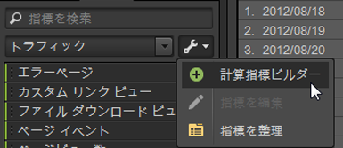
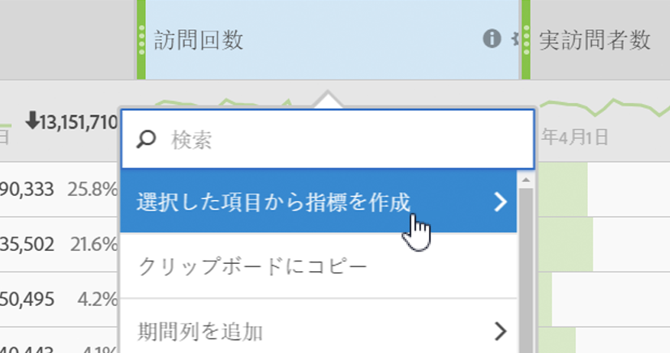

# 指標

指標は、ページビュー数、クリックスルー数、リロード回数、平均滞在時間、購入点数、注文件数、売上高など、訪問者のアクティビティに関する量的な情報です。指標と関連データは、レポートの列に表示されます。

## 指標 {#concept_46A67930CFDB4A078225C5B189688AF3}

指標は、ページビュー数、クリックスルー数、リロード回数、平均滞在時間、購入点数、注文件数、売上高など、訪問者のアクティビティに関する量的な情報です。指標と関連データは、レポートの列に表示されます。

標準指標には次のようなものがあります。

* **トラフィック**：訪問者数に関するデータを表示します。
* **コンバージョン**：Web サイトの成功イベントに関するデータを表示します。成功イベントには、Web サイト上での購入、ダウンロードなど、望ましいユーザーアクションが含まれます。
* **計算**：他の指標を組み合わせて作成されたカスタマイズ可能な指標です。例えば、売上高からキーワード費用と商品費用を差し引いて純売上高を計算する指標などを作成できます。その後、この値を注文総数で割って、注文あたりの平均純売上高を計算できます。

[ での指標の使用方法については、「](https://docs.adobe.com/content/help/en/analytics/components/variables/metrics/metricslist.html)解析リファレンス&#x200B;*」の「*&#x200B;指標の定義[!DNL Experience Cloud]」を参照してください。

You can use the [!UICONTROL Organize Metrics] tool to create new folders for your metrics. その後、必要に応じて指標をグループ化することができます。指標の整理ツールでは、ドラッグ＆ドロップによって既存の指標をカスタムフォルダーにコピーできます。

必要に応じてフォルダーの作成、フォルダーの名前の設定、フォルダーへの指標ができますが、お気に入りフォルダーおよび計算指標フォルダー以外のデフォルトのフォルダーを変更することはできません。

## 指標の整理 {#task_17C844A9387042EAA9983E1E554846B1}

指標を整理し、指標フォルダーを作成する手順を説明します。

<!-- 

t_organize_metrics.xml

 -->

1. ツールパネル [!UICONTROL Metrics] で、をクリックしま **[!UICONTROL More Actions]**&#x200B;す。( 

   ）をクリックします。
1. クリック **[!UICONTROL Organize Metrics]**.
1. Click **[!UICONTROL New]** to create a folder.
1. 他のフォルダーにある指標を選択し、新しいフォルダーにドラッグします。
1. クリック **[!UICONTROL OK]**.

   >[!NOTE]
   >
   >フォルダーを削除すると、フォルダー内のすべての指標が現在選択しているプロジェクトから削除されます。

## レポートへの指標の追加 {#task_747DD1718B3F4776B83A115D0BE8754C}

レポートに指標を追加する手順を説明します。

<!-- 

t_add_metrics_dsc.xml

 -->

1. In the [!UICONTROL Metrics] tool pane, locate the metric.

   指標を探すには、検索フィールドを使用するか、指標フォルダーの階層をたどります。

1. Drag the metric to the report table or [!UICONTROL Table Builder].

   You may want to specify default metrics in [!UICONTROL Settings] in advance, if you want to reduce the need to repeatedly add metrics to a report.

   See [Ranked Tab - Definitions](/help/analyze/ad-hoc-analysis/c-global-settings.md#reference_FB9BADD7E3DA42C1BB2A02A6E9D5C1CF).

## 計算指標ビルダー {#concept_F8E213CE786A43FB93847C5BA883A29C}

Ad Hoc Analysis の計算指標ビルダーは、Analytics の統合された計算指標と連携するようになりました。ユーザーインターフェイスは、Analytics の計算指標ビルダーに似ています。

<!-- 

c_calc_metric_builder.xml

 -->

計算指標の作成および管理方法について詳しくは、[計算指標ガイド](https://docs.adobe.com/content/help/ja-JP/analytics/components/calculated-metrics/cm-overview.html)を参照してください。

次に、Ad Hoc Analysis の計算指標ビルダーへのアクセス方法を示します。

1. パネルで、 [!UICONTROL Metrics] をクリックし、 **[!UICONTROL More Options]**&#x200B;をクリックしま **[!UICONTROL Calculated Metrics Builder]**&#x200B;す。

   

1. 計算指標ビルダーインターフェイスでは、指標、セグメント、関数をドラッグ＆ドロップして、カスタム指標を作成できます。

   

