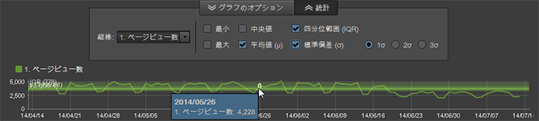

# レポートの概要

標準レポートには、Web サイトと訪問者のアクティビティに関するデータ、トラフィックパターン、リファラーデータ、広告キャンペーン、訪問者保持率、製品データなどが表示されます。レポートを実行し、ツールを使用してセグメント、指標およびレポート比較を設定できます。

## レポートの概要 {#concept_41459A705F2048EEA4EFA80F6BD9FFAB}

標準レポートには、Web サイトと訪問者のアクティビティに関するデータ、トラフィックパターン、リファラーデータ、広告キャンペーン、訪問者保持率、製品データなどが表示されます。レポートを実行し、ツールを使用してセグメント、指標およびレポート比較を設定できます。

カスタムデータを収集して、Web サイト専用のレポートを作成できます。例えば、Web サイトに検索機能がある場合は、送信された検索語句を追跡して、これらの語句と検索結果を表示するレポートを作成できます。

標準レポートセットには、あらゆる Web サイトに共通のトピックが含まれています。レポートに含まれる内容は以下のとおりです（ただし以下に限りません）。

* Web サイトデータ
* 訪問者データ
* トラフィックパターン
* 照会データ
* 広告キャンペーン
* 訪問者保持率
* 製品情報

Reports and Analytics をご使用のお客様にはなじみのあるレポートタイプやメニューが表示されます。Ad hoc analysis は、以下のタイプに基づいてレポートを分類します。

**サマリレポート**

[!UICONTROL 合計レポート]など、大まかな概要を表示するレポートが含まれます。データの全般的な概要に目を通す必要があるエグゼクティブ向けのレポートです。

**コンバージョンレポート**

コンバージョンレポートは、顧客行動の包括的で正確かつ詳細な分析結果を提供します。キャンペーン管理、販売サイクル、顧客フォールアウト、顧客コンバージョンなどの指標を使用すると、電子商取引、販売元、宣伝効果、顧客忠誠度、その他いろいろな項目についての評価が可能になります。

**トラフィックレポート**

トラフィックレポートでは、訪問者の Web サイトでの行動を詳しく把握できます。

* 訪問者の行動について重要な側面を分析する。
* トラフィックパターンを監視して把握する。
* よく閲覧されるサイトコンテンツを特定する。
* 測定可能な基準によって訪問者をセグメント化する。

## キャンペーン {#concept_A407CDF1D4AA49BAB396A1666E67FC87}

広告活動の効果についての情報が表示されます。どのような広告活動が最も多くのトラフィックを獲得したか、どの従業員がその活動を担当したかを調べることができます。

<!-- 

c_reports_campaigns.xml

 -->

これらのレポートは通常カスタマイズされるので、分析ごとに異なります。詳しくは、 ヘルプの「[キャンペーンマネージャー](https://marketing.adobe.com/resources/help/en_US/reference/campaign_manager_admin.html)」を参照してください。[!DNL Admin Console]

## 統計指標 {#concept_83FF70DB7895435E985699FE9012D585}

ランクレポートにデフォルトで表示される統計をカスタマイズできます。

<!-- 

c_Statistical_Calculation_ad_hoc.xml

 -->

レポートのニーズに応じて、データの平均値、中央値、標準偏差など、ランクレポートを実行したときにデフォルトで表示する統計指標を追加することができます。

**ランクレポートの統計指標を開くには：**

1. Select **[!UICONTROL Tools]** &gt; **[!UICONTROL Ranked]** from the menu.

1. Select **[!UICONTROL Settings]**.
1. Select **[!UICONTROL Default Statistics]**.

**[!UICONTROL 統計計算でゼロを無視]**。 このオプションをオンにすると、ゼロが無視され、別の指標を追加しても、既に計算が終わっている代表値が変わらなくなります。この設定は、統計指標すべてに影響します（合計は除く）。

| 指標 | 説明 |
|--- |--- |
| 最大値 | 特定のデータセットの行全体の最大値を示します。 |
| 最小値 | 特定のデータセットの行全体の最小値を示します。 |
| 合計 | データセットの各行の値の合計です。例えば、ある訪問者による訪問の回数の合計が算出されます（訪問者を訪問回数にかかわりなく 1 回だけカウントするのとは異なります）。この値は、収集したデータポイントの総合計になります。 |
| 平均値 | 平均値は、あるデータセットの行の値の合計をカウント数で割る（合計/カウント数）ことによって算出します。平均値は中央値と異なり、異常値の影響を受けるので、分布に偏りがある場合には通常、中央値を使用します。 |
| 標準偏差 | 標準偏差は、予想される平均からのばらつきの大きさを示すものです。標準偏差の値が小さいほど、各データポイントが平均に近いことになります。逆に、標準偏差の値が大きいほど、各データポイントが幅広い値に分散していることになります。 |
| 中央値 | 中央値は、データセットの行を上位と下位に二分する数値です。中央値は平均値と異なり、一般に異常値の影響を回避するために使用します。 |
| 四分位数 | 四分位数とは、データセットを 4 分の 1 ずつの グループ 4 つに分ける 3 つの点で識別する一連の値を指します。小さい方から 25% 目の値を第 1 四分位数、小さい方から 75 % 目の値を第 3 四分位数と言います（第 2 四分位数は中央値、第 4 四分位数は合計と、それぞれ同じです）。 |
| カウント数 | データセットの行数を返します。 |

## 平均値と指標合計の計算例 {#section_7C49196503964FB0A429FA347BC92D09}

Mean 関数では、Microsoft Excel でデータが列になっている場合とよく似た計算方法を使用します。具体的には、（平均直帰率を求める場合など）割合の&#x200B;**平均**&#x200B;を求めた場合であれば、割合の各数値の平均が計算されるのであって、平均値の割合が求まるわけではありません。平均値の割合を求めるときには、直帰率の指標の&#x200B;**合計**&#x200B;の計算が発生します。

<table id="table_9EC56B15C6A340DA8917CB0DBCAC2355"> 
 <thead> 
  <tr> 
   <th colname="col1" align="center" class="entry"> 日付 </th> 
   <th colname="col2" align="center" class="entry"> 単一訪問 </th> 
   <th colname="col3" align="center" class="entry"> 入口 </th> 
   <th colname="col4" align="center" class="entry"> 直帰率 </th> 
   <th colname="col5" align="center" class="entry"> </th> 
  </tr>
 </thead>
 <tbody> 
  <tr valign="top"> 
   <td colname="col1"> 
2013 年 6 月 
 
2013 年 7 月 
 
2013 年 8 月 
 </td> 
   <td colname="col2" align="center"> 
344 
 
297 
 
41 
 </td> 
   <td colname="col3" align="center"> 
1000 
 
1000 
 
1000 
 </td> 
   <td colname="col4" align="center"> 
34.4% 
 
29.7% 
 
41.0% 
 </td> 
   <td colname="col5"> </td> 
  </tr> 
  <tr valign="top"> 
   <td colname="col1" align="center" valign="middle"><b>平均値</b> </td> 
   <td colname="col2" valign="middle"> (344+297+41)/3 </td> 
   <td colname="col3" valign="middle"> (1000+1000+100)/3 </td> 
   <td colname="col4" valign="middle" align="right"> (34.4 + 29.7 + 41.0) / 3 = <b>35.0</b>% </td> 
   <td colname="col5" valign="middle"><b>割合の平均</b> </td> 
  </tr> 
  <tr valign="top"> 
   <td colname="col1" align="center" valign="middle"><b>指標合計</b> </td> 
   <td colname="col2" valign="middle"> 682 </td> 
   <td colname="col3" valign="middle"> 2100 </td> 
   <td colname="col4" valign="middle" align="right"> 682 / 2100 = <b>32.0</b>% </td> 
   <td colname="col5" valign="middle"><b>平均の割合</b> </td> 
  </tr> 
 </tbody> 
</table>

## 統計指標のオーバーレイ {#concept_97E1B32DAC734C7B9F8899717283CEEC}

Ad Hoc Analysis では、時系列（分、時間、日、週）による合計値のトレンドレポートで、各種の統計指標を表示できます。

<!-- 

c_overlay_calculations.xml

 -->

ある期間のデータを示したレポートで「**[!UICONTROL 統計]」ボタンを押すと、レポートの時系列にオーバーレイ表示する指標を選択できます。**

In addition to standard [Statistical Calculations](../../analyze/ad-hoc-analysis/c-overview-standard-reports.md#concept_83FF70DB7895435E985699FE9012D585), you can select the 1st, 2nd, and 3rd standard deviations in the overlays.

## グループマネージャー {#concept_E1433974A61144858E87334C006982B2}

Rather than using a single page in a report, you can group multiple pages and use them as categories for starting, intermediate, or destination location in the [!UICONTROL Fallout] and [!UICONTROL Site Analysis] reports. メインメニューから、またはレポート内からグループを編集できます。Reports and Analytics で作成したカテゴリも、「[!UICONTROL チェックポイントの選択]」リストに表示されます。

<!-- 

c_groups.xml

 -->

Click **[!UICONTROL Tools]** &gt; **[!UICONTROL Group Manager]**.
