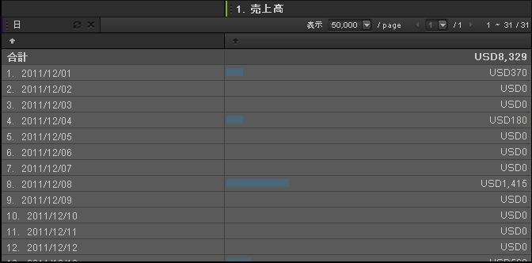

# 時間

時間ディメンションは、時間、日、週、日付範囲にわたるトレンド分析に有効なレポートディメンションです。例えば、製品レポートには、選択した日付範囲内で製品から得られた売上高が表示されます。日付ディメンションを追加して、レポート期間の各日の内訳のトレンドを確認できます。精度には、時間、日、週、月、四半期および年を設定できます。日付範囲プリセットには、今日、昨日、最近の 7 日間などの設定が含まれています。

## 時間 {#concept_CB64A0A2150C471FB0B0B42516905887}

時間ディメンションは、時間、日、週、日付範囲にわたるトレンド分析に有効なレポートディメンションです。例えば、製品レポートには、選択した日付範囲内で製品から得られた売上高が表示されます。日付ディメンションを追加して、レポート期間の各日の内訳のトレンドを確認できます。精度には、時間、日、週、月、四半期および年を設定できます。日付範囲プリセットには、今日、昨日、最近の 7 日間などの設定が含まれています。

時間ディメンションを追加するには、精度ツールパネルから 1 つまたは複数の日付範囲を選択し、レポートの表または表ビルダーにドラッグします。

次の例では、日付ディメンションのトレンドが売上高で表示されています。

## 時間 - 定義 {#reference_6E718B78E437438E825DB9262086A987}

時間パネルで日付範囲とトレンドプリセットを選択し、[!UICONTROL 表ビルダー]またはレポートグリッドにドラッグできます。

<!-- 

r_time_panel.xml

 -->

| フィールド | 定義 |
|--- |--- |
| 日付範囲 | 1 つまたは複数の期間を選択して、表ビルダーまたはレポートグリッドにドラッグできます。期間を分類として行に表示したり、列見出しとして表示したりできます。日、週、月、カスタムの日付範囲などを期間として選択できます。SiteCatalyst でカスタムカレンダーを使用する場合、レポートスイートでこれらの設定が継承されます。 |
| トレンド | 時間、日、週、月などにわたるトレンドレポートを作成できます。「トレンド」から項目を選択してレポートにドラッグすると、カレンダーで指定した日付範囲に基づく時間設定でのデータが表示されます。 |