# Analysis Workspaceの概要

Analysis Workspace では、単一の Analytics レポートの通常の制限事項がすべて取り除かれます。堅牢かつ柔軟なキャンバスでカスタム分析プロジェクトを作成できます。任意の数のデータテーブル、ビジュアライゼーション、コンポーネント（ディメンション、指標、セグメントおよび時間の精度）をプロジェクトにドラッグ＆ドロップします。分類およびセグメントの作成、分析用のコホートの作成、アラートの作成、セグメントの比較、フローおよびフォールアウト分析をすばやくおこなうほか、レポートのキュレーションとスケジュールをおこなって会社の任意のユーザーと共有します。

**[!UICONTROL Analytics]** / **[!UICONTROL ワークスペース]**

## Overview video {#section_B99BF8A326D94ECB91BD69C9888AD10C}

>[!VIDEO](https://www.youtube.com/watch?v=IHOy-QsvVcA)

YouTube のプレイリストは、[こちら](https://www.youtube.com/playlist?list=PL2tCx83mn7GuNnQdYGOtlyCu0V5mEZ8sS)から参照できます。

>[!NOTE]
>
>See [What's New in Analysis Workspace](../../analyze/analysis-workspace/new-features-in-analysis-workspace.md#concept_EDB651D6F41E4F7BB4EB5E1EBB95D195) for updates about features.

## Full control over project elements and components {#section_B7E3EDA3EDEE407D833F4FDB69646EEC}

Analysis Workspace は、次のような自由と柔軟性を提供します。

* コンポーネント（ディメンション、指標、セグメントおよび時間の精度）をドラッグ＆ドロップする
* 複数のビジュアライゼーションをプロジェクトにドラッグ＆ドロップする
* プロジェクト内で場所を問わずビジュアライゼーションを移動、リサイズおよびスタックする

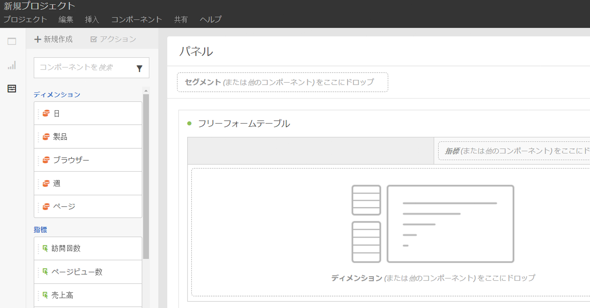

詳しくは、[Analysis Workspace プロジェクトの作成](../../analyze/analysis-workspace/build-workspace-project/t-freeform-project.md#task_C2C698ACC7954062A28E4784911E6CF2)を参照してください。

## Multiple visualizations in a project {#section_B7670740C2D44130B21DAF0873280DA5}

必要な数のビジュアライゼーションをプロジェクトにドラッグ＆ドロップします。

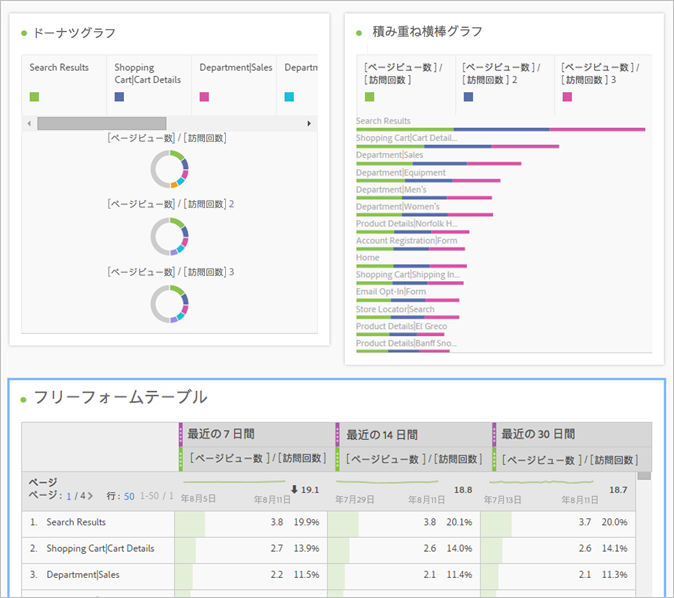

フリーフォームデータテーブルのセルに対応する複数のビジュアライゼーションで、変化の割合を示すプロジェクトを作成します。

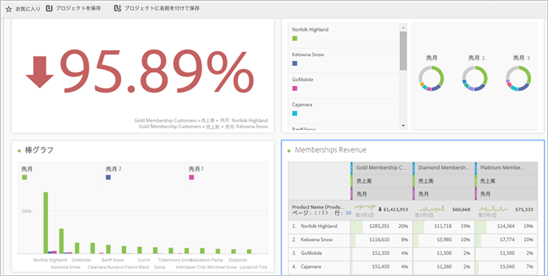

See [Create an Analysis Workspace project](../../analyze/analysis-workspace/build-workspace-project/t-freeform-project.md#task_C2C698ACC7954062A28E4784911E6CF2) for more information.

## Intra-linking to panels and visualizations {#section_253EA04E067F4A29A8B54CE2B7631086}

In conjunction with the [rich text editing](../../analyze/analysis-workspace/visualizations/text.md#concept_2315D97E27364E3194AC1C459B654B2F) capabilities of Analysis Workspace, you can link down to specific panels and visualizations within a project from a text box, such as to create a project's table of contents. プロジェクトリンクを共有するのと同じように、プロジェクト内の特定のビジュアライゼーションやパネルを他の人と共有することができます。「パネルリンクを取得」および「ビジュアライゼーションリンクを取得」という新しい右クリックオプションが追加されました。イントラリンクをプロジェクトに追加するには：

1. テキストビジュアライゼーションをプロジェクト内にドラッグします。例えば、コンテキストが必要なビジュアライゼーションまたはテーブルの横に配置します。
1. テキストボックスに目次などを入力して、パネルまたはビジュアライゼーションにリンクさせたい項目（この例では成功指標）をハイライト表示します。

   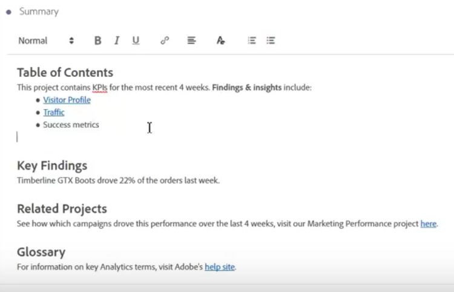

1. 目的のパネルまたはビジュアライゼーションまでスクロールして、そのヘッダーを右クリックします。
1. Scroll down and select **[!UICONTROL Get Panel Link]** or **[!UICONTROL Get Visualization Link]**:

   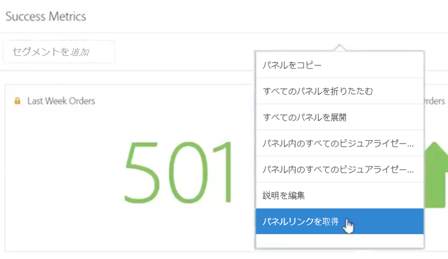

1. そのリンクをコピーして、テキストビジュアライゼーション内の成功指標ハイパーリンクに追加します。チェックマークをクリックしてテキストを保存します。

パネルまたはビジュアライゼーションがプロジェクト内で折りたたまれている場合は、リンクをクリックすると、パネル／ビジュアライゼーションが展開されて表示されます。

>[!NOTE]
>
>You can also use this feature within the **[!UICONTROL Edit Description]** right-click option.

## Link to other projects {#section_AE886C367C3E4F189B65B1BD9BCDBD8C}

You can link users to other projects that may be of interest to them by going to  **[!UICONTROL Share]** &gt; **[!UICONTROL Get Project Link]** and embedding this link in project descriptions, for example.

## Dynamic visualization of selected cells {#section_182CEC285E4547EBA4608D5F70C9D5D7}

個別のセルを選択して、ビジュアライゼーションの変更を動的に確認します。選択したセルでビジュアライゼーションを[同期およびロック](../../analyze/analysis-workspace/analysis-workspace-features.md#section_9D66A001586F49CEB0C565581E44957C)します。

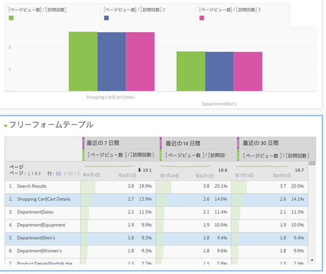

## Lock selected items or positions {#section_9D66A001586F49CEB0C565581E44957C}

ビジュアライゼーションをロックすることで、ビジュアライゼーションに対応するフリーフォームデータテーブルのソースを制御できます。

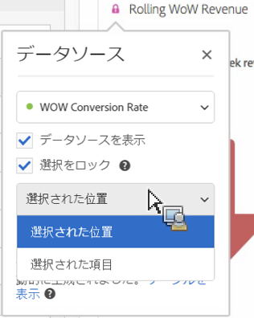

See [Manage data sources](../../analyze/analysis-workspace/visualizations/t-sync-visualization.md#task_A73B065DC3834AFCA422E364A1468099).

## Trend visualizations from selected cells {#section_34930C967C104C2B9092BA8DCF2BF81A}

選択したセルからビジュアライゼーションを作成します(Right-click &gt; **[!UICONTROL Trend Selection]**.)

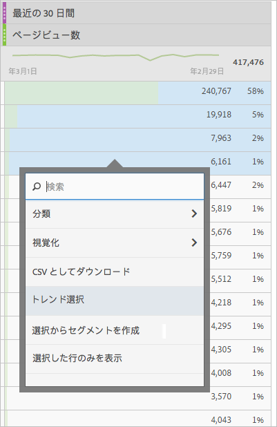

トレンド選択は、下のテーブルに&#x200B;**リンク**&#x200B;され、テーブルで別の行を選択すると、トレンドグラフにその行が反映されるようになりました。

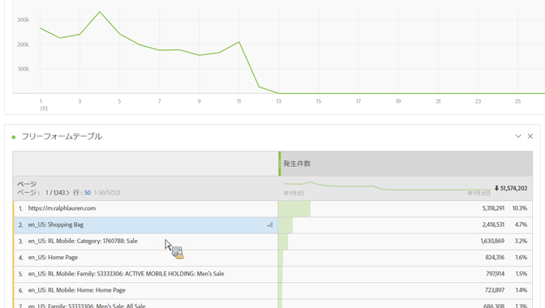

## Dimensions and dimension item breakdowns {#section_1380C1F9E51E4BFB8C5D35E7A53BC70D}

小売業者の場合、キャンペーンをこれまでよりも深く分析して、顧客とのより良い関わり方を把握できます。特定のニーズに合わせて様々な方法でデータを分類し、関連する指標、ディメンション、セグメント、タイムライン、その他の分析分類値を使用するクエリを作成します。

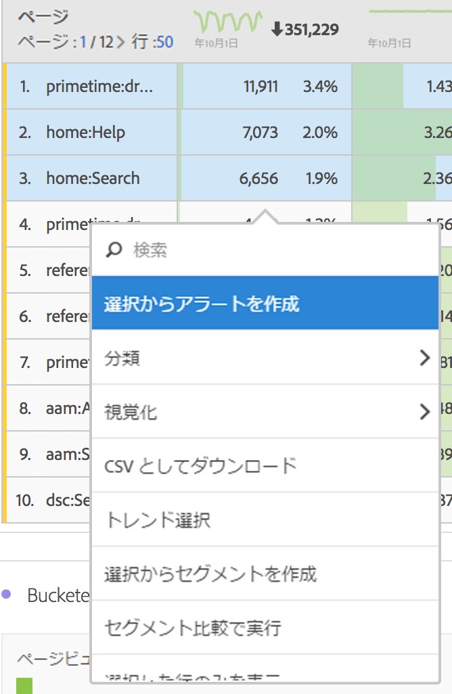

See [Break down dimensions](../../analyze/analysis-workspace/components/dimensions/t-breakdown-fa.md#task_B594DA2476E84DFDA8279E831F0BD9C4).

## Segments from table selections {#section_73BC3688089B426D969B3D5B606DA970}

フリーフォームデータテーブルのセルをを選択し、選択範囲からセグメントを作成します。

複数のセグメントを比較して、即座にセグメントを作成および適用します。複数のセグメントを適用して、行動や操作に基づいて特定の顧客に焦点を当て、比較および対比します。

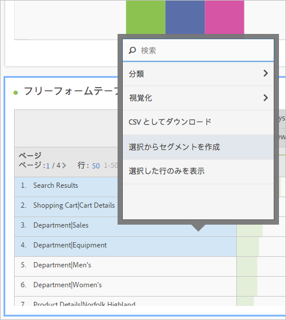

プロジェクトレベルのフリーフォームパネルにセグメントをドロップすると、セグメントがプロジェクト全体に適用されます。

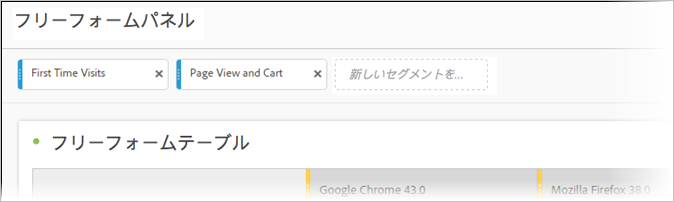

詳しくは、[セグメント](../../analyze/analysis-workspace/components/t-freeform-project-segment.md#task_11C6A2C7717B48049E5750B9D20FEC80)を参照してください。

## Project and component tagging {#section_F54D688132A541F2982326D5E022B90D}

Analysis Workspace でプロジェクトおよびコンポーネントにタグを適用できます。

* 情報パネル（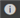

* コンポーネントを右クリックして、コンポーネントパネルからタグ付け（またはタグを作成）します。
* 検索フィールドで # を使用して、タグを検索します。

## Component actions {#section_CBF4D0A5F63E4B0883077B8D852B800B}

コンポーネントの左側のレールの最上部にあるアクションメニューから、コンポーネントレベルのアクションを実行します。コンポーネントを選択し、「**[!UICONTROL アクション]」をクリックしてアクションを表示します。**

| コンポーネントのアクション | 説明 |
|--- |--- |
| タグ | コンポーネントにタグを適用して整理したり管理したりします。このアクションは各コンポーネントマネージャーに表示されます（Analytics／コンポーネント／セグメントや Analytics／コンポーネント／プロジェクトなど）。 |
| お気に入り | コンポーネントをお気に入りのリストに追加します。このアクションは各コンポーネントマネージャーに表示されます（Analytics／コンポーネント／セグメントや Analytics／コンポーネント／プロジェクトなど）。 |
| 承認 | コンポーネントを正規のものとして承認します。このアクションは各コンポーネントマネージャーに表示されます（Analytics／コンポーネント／セグメントや Analytics／コンポーネント／プロジェクトなど）。 |
| 共有 | セグメントにのみ適用します。 |
| 削除 | セグメントにのみ適用します。 |

See [Visualizations](../../analyze/analysis-workspace/visualizations/freeform-analysis-visualizations.md#concept_09242627629147A88A68F1506954C276) for more information.

## Additional feature descriptions {#section_5F06AE43C0194CFDBCA7EE0EA3C30B05}

**ドラッグおよびスタックできるもの**

コンポーネント

* ディメンション
* セグメント
* 指標
* 日付範囲
* 時間の精度（時間、日、週など）

**複数のフリーフォームテーブルおよび複数のビジュアライゼーション**

パネルに追加できるフリーフォームテーブルおよびビジュアライゼーションの数に技術的な制限はありません。また、各フリーフォームテーブルまたはテーブルの選択した行で新しいビジュアライゼーションを実行（または CSV に書き出し）できます。

**列の整列、並べ替えおよびコピー**

* 日付範囲プリセットを並べ替えます（カスタム日付範囲は含まれません）。
* 列を Ctrl（または Command）+ クリック + ドラッグすると、その列がコピーされ、このコピーをドラッグして、テーブルの新しい位置に貼り付けます。

See [Hotkeys Available in Analysis Workspace](../../analyze/analysis-workspace/build-workspace-project/fa-shortcut-keys.md#concept_9A6356084DBC4D468E265E7A65B3E051) for more information.

**選択と操作**

Excel で選択するのと同じように、行および列を選択できます。さらに、選択範囲に対して次の操作を実行できます。以下に例を示します。

* 選択範囲からビジュアライゼーションを作成
* クリップボードにコピー（Ctrl または Command + C）
* 複数選択した行の分類。行を選択し、次にディメンションを選択範囲にドラッグします。または、選択範囲を右クリックして、分類メニューを使用します。

**自動保存と未保存の変更**

ブラウザーを閉じようとすると（または戻るボタンを使用すると）、プロジェクトが保存されていない場合、変更の保存を促すメッセージが表示されます。システムがクラッシュした場合、アラートを受け取り、前回プロジェクトを読み込んだ際のプロジェクトの状態に復元できます。

既に存在する（新規でない）プロジェクトは、ブラウザーがクラッシュしたとき、または保存する機会がない何らかの状態のときにのみ、自動保存されます。

**すべての訪問**

Analysis Workspace に特有のデフォルトのセグメントです。*`All Visits`*&#x200B;は、テーブルに追加したコンポーネントの合計を表示します。

**計算指標**

標準指標を使用するのと同じ方法で計算を使用します。

[計算指標](https://marketing.adobe.com/resources/help/en_US/analytics/calcmetrics/)を参照してください。
