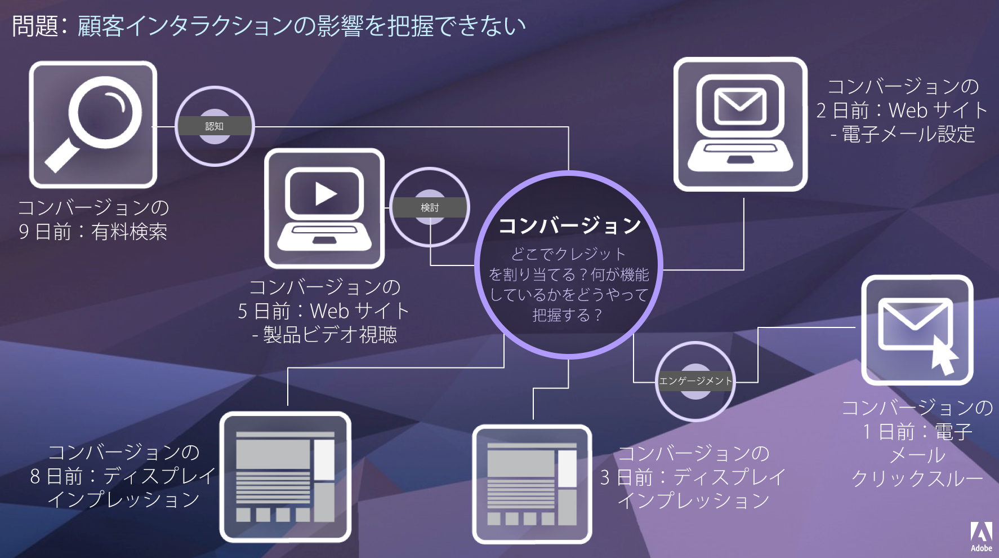

# Attribution IQ

Attribution IQ は、マーケティング活動がコンバージョンにどのように貢献しているかに関する詳細なインサイトを提供する、Adobe Analytics の機能セットです。

特定のカスタマージャーニーは、線形ではなく、予測不可能な場合も多くあります。各顧客は、それぞれのペースで進みます。多くの場合、ダブルバック、停止、再起動、または他の非線形動作に関与します。このような生物的なアクションにより、カスタマージャーニー全体を通したマーケティング活動の影響を把握することが難しくなっています。また、複数のチャネルのデータを結び付ける作業の妨げにもなります。

Adobe Analytics Attribution IQ を利用することで、現代のインテリジェンス担当チームは、カスタマージャーニー全体を通して意味のあるエンゲージメントがどのようにおこなわれるかを理解して、顧客を目標とする成果に導く転機を識別します。カスタマージャーニーのこの側面を理解することで、マーケティングイニシアチブが効果的に最適化されます。

Adobe Analytics を使用すると、以下が可能になるので、アトリビューションを強化できます。

* 有料メディアに勝るアトリビューションの定義：マーケティングキャンペーンだけでなくあらゆるディメンション、指標、チャネル、イベントをモデルに適用できます（例：内部検索）。
* 無制限のアトリビューションモデル比較の利用：必要な数のモデルを動的に比較できます。
* 実装の変更の回避：レポート時間処理とコンテキスト対応セッションで、カスタマージャーニーのコンテキストを実行時間に組み込んで適用できます。
* アトリビューションシナリオに最適なセッションの構築。
* アトリビューションのセグメント別分類：すべての重要なセグメントにわたってマーケティングチャネルのパフォーマンスを容易に比較できます（例：新規顧客とリピート顧客、製品 X と製品 Y、忠誠度または CLV）。
* チャネルのクロスオーバー分析およびマルチタッチ分析の調査：ベン図やヒストグラムを使用でき、アトリビューション結果のトレンドを追跡できます。
* 主要なマーケティングシーケンスの視覚的分析：コンバージョンにつながったパスをマルチノードのフローおよびフォールアウトビジュアライゼーションで視覚的に調査できます。
* 計算指標の構築：任意の数のアトリビューション割り当て方法を使用できます。

## 機能 {#features}

Attribution IQ は、次の機能で構成されます。

* [アトリビューションパネル：](c-panels/attribution/attribution.md)
