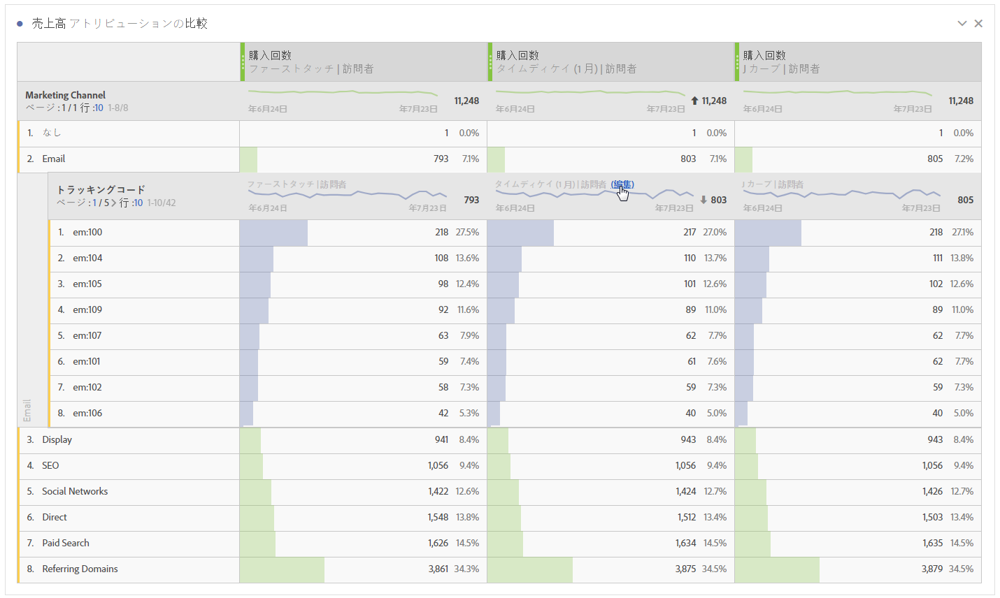
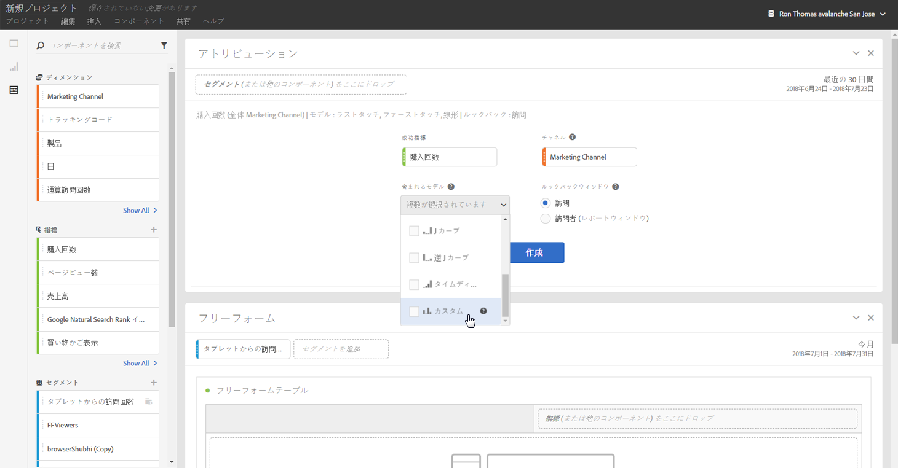

# Analysis Workspace の Attribution IQ の使用

Analysis Workspace の Attribution IQ を使用すると、サポートされているあらゆるアトリビューションモデルの相互比較、コンバージョンにつながる主要なマーケティングシーケンスの高度なフォールアウトおよびフロービジュアライゼーションによる視覚化、あらゆるマーケティングチャネルまたはキャンペーンのトレンド追跡によるパフォーマンスの時間的変化の簡便な確認、チャネルまたはキャンペーンパフォーマンスの統計的異常の検出によるパフォーマンス低下時または上昇時の警告通知などが可能になります。

## Use attribution in freeform tables {#section_F2F72AE840EB4EA781302A559726E6F4}

Analysis Workspace のフリーフォームテーブルでは、ほぼあらゆる指標に対して使用できるアトリビューションモデルをサポートしています。列設定で、フリーフォームテーブル列指標に対してアトリビューションモデルを設定できます。

1. フリーフォームテーブル列の設定（歯車）アイコンをクリックします。

   

1. Under **[!UICONTROL Data Settings]**, check **[!UICONTROL Use non-default attribution model]**. 様々なアトリビューションモデルの詳細については、[Attribution IQ の概要](../../../analyze/analysis-workspace/attribution-iq/attribution.md#section_4B9E7F83AE0B451A992397E55C3F5871)を参照してください。

   

## Apply attribution models to breakdowns {#section_ED1E7532CF084B5AB0942BD80B4770C9}

フリーフォームテーブル内のあらゆる分類にも、任意のアトリビューションモデルを適用することができ、そのモデルは親列と同じでも別のものでもかまいません。例えば、マーケティングチャネルディメンションで線形の注文件数を分析するものの、チャネル内の特定のトラッキングコードには U 字形の注文件数を適用するといったことができます。分類に適用されるアトリビューションモデルを編集するには、その分類モデルの上にマウスポインターを置いて「編集」をクリックするだけです。

## Compare one attribution model to another {#section_1D74C09549CC4EC8A952A7392C76D375}

If you’d like to quickly and easily compare one attribution model to another, right click a metric and select **[!UICONTROL Add comparative attribution model]**:

これにより、指標にドラッグして設定を 2 回おこなわなくても、アトリビューションモデルをすばやく簡単に相互比較できます。

## Attribution panel and visualizations {#section_6B02F28182F14ECC9FC5020F224726E6}

アトリビューションパネルを使用すると、各種アトリビューションモデルの比較分析を簡単に作成できます。アトリビューションパネルにアクセスするには、以下の手順に従います。

1. 左端のパネルアイコンをクリックします。
1. アトリビューションパネルを Analysis Workspace プロジェクトにドラッグします。

   

1. アトリビューションの分析対象となる成功指標を追加し、アトリビューションの分析基準となるあらゆるチャネルディメンション（マーケティングチャネルや内部プロモーションなど）を追加します。

   

1. 比較する[アトリビューションモデル](../../../analyze/analysis-workspace/attribution-iq/attribution.md)のほか、[ルックバックウィンドウ](../../../analyze/analysis-workspace/attribution-iq/attribution.md)を選択します。

   アトリビューションパネルには、マーケティングチャネル（または他のディメンション）がどのように連携しているかをよく把握するのに役立つ様々なデータやビジュアライゼーションが表示されます。

   

   各ビジュアライゼーションを以下に説明します。

| ビジュアライゼーション | 説明 |
|--- |--- |
| トータル指標 | レポート時間帯で発生したコンバージョンの合計数。これらは、選択したディメンションに関してアトリビューション分析がおこなわれたコンバージョンです。 |
| 指標アトリビューション比較棒グラフ | 選択したディメンションの各ディメンション項目についてアトリビューション分析がおこなわれたコンバージョンを視覚的に比較できます。それぞれの棒の色は、選択した個別のアトリビューションモデルを表します。 |
| 指標アトリビューションフリーフォームテーブル | 棒グラフと同じデータを表示します。この表の異なる列または行を選択すると、棒グラフとパネル内の他のビジュアライゼーションの一部がフィルタリングされます。この表は、Workspaceの他のフリーフォームテーブルと同様に、指標、セグメント、分類などを追加できます。 |
| ディメンション重複グラフ | 上位 3 つのディメンション項目（チャネルなど）と、それらがコンバージョンに一緒に関与する頻度を示すベン図です。例えば、バブルの重複部分のサイズは、両方のディメンション項目（チャネルなど）に訪問者が接触したときにコンバージョンが発生した頻度を示します。フリーフォームテーブルで他の行を選択すると、その選択を反映するようにビジュアライゼーションが更新されます。 |
| ジャーニーあたりのマーケティングタッチポイント | レポート日付範囲における訪問者のマーケティング（または任意のディメンション）タッチポイントの数を示すヒストグラムです。これは、使用しているデータセットでのマルチタッチアトリビューションの効果を確認するのに役立ちます。ほぼすべての訪問者にタッチポイントが 1 つしかない場合は、アトリビューションモデルが違っても、結果はあまり変わりません。 |
| マーケティングチャネルパフォーマンスの詳細 | 散布図を使用して、最大 3 つのアトリビューションモデルを視覚的に比較できます。 |
| マーケティングチャネルフロー | 訪問者のジャーニー全体を通してどのチャネルとのインタラクションが最もよく発生しているか、また、どのような順序で発生しているかを確認できます。 |
