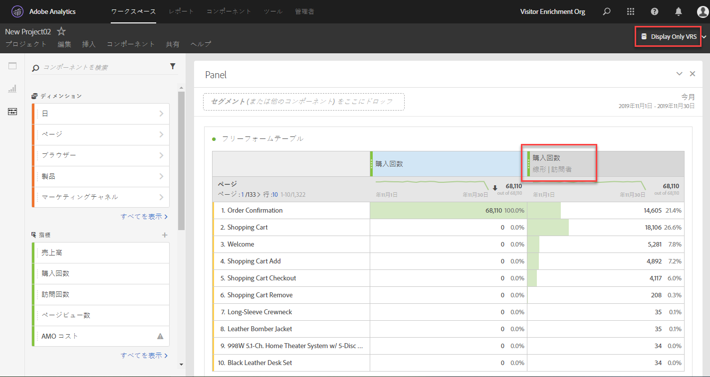

# アトリビューションに関する FAQ

## アトリビューションを使用する際の「なし」行項目とは

「なし」行項目は、ルックバックウィンドウ内でタッチポイントなしで発生したすべてのコンバージョンを表す包括的な項目です。「なし」の行項目に起因する変換の数を減らすには、ルックバック期間を長くしたカスタムルックバックウィンドウを使用してみてください。

## アトリビューションモデルを使用すると、レポートウィンドウ外の日付が表示されることがあるのはなぜですか。

[入口数](/help/components/metrics/entries.md)や[バウンス率](/help/components/metrics/bounce-rate.md)など、訪問ベースの指標の中には、レポートーウィンドウの開始日付範囲の前の期間にデータを属性付けされるものもあります。 これは、ルックバックウィンドウを使用する属性モデルによるものです。ルックバックウィンドウでは、指標に対してクレジットを付与するため、どの程度属性を遡るかを決定します。 最も一般的なシナリオは、訪問が午前 0 時にまたがる場合です。 次に例を示します。

1. あるユーザーが 9 月 7 日（PT）の午後 11 時 55 分にホームページを訪問します。
1. 何ページか訪問し、最後の訪問は 9 月 8 日（PT）午前 12 時 5 分に発生したとします。
1. 1 週間後に、日付範囲が 9 月 8 日～ 9 月 14 日（PT）の日別トレンドレポートを作成します。

[ページ表示](/help/components/metrics/page-views.md)などのヒットベースの指標は、期待された出力を生成します。9 月 8 日～ 9 月 14 日（PT）の各日のデータがトレンド表示されます。ただし、訪問ベースの指標では、上記の訪問が 9 月 7 日（PT）に表示されます。 訪問の属性付きエントリは 9 月 7 日に発生し、デフォルトでは9 月 1 日～  9 月 31 日（PT）がルックバックウィンドウです。

この例では、9 月 7 日（PT）のバウンス率は常に 0% と表示されます。 この指標は `Bounces divided by Entries` と定義されています。これは、ヒットベースの指標を、訪問ベースの指標で割った値です。 バウンスは 1 つのイメージリクエストで構成されるので、複数日にまたがることはできません。9 月 7 日（PT）のバウンスはレポートーウィンドウの外で発生し、その日のバウンス率が 0% と保証されています。 また、このレポートでは、他のヒットベースの指標でも、9 月 7 日（PT）に 0 と表示されます。これらのヒットはレポートーウィンドウ内にないからです。

もう 1 つ似た例を考えてみましょう。 次の例と上の例の違いは日付だけです。

1. あるユーザーが 8 月 31 日（PT）の午後 11 時 55 分にホームページを訪問します。
1. 何ページか訪問し、最後の訪問は 9 月 1 日（PT）午前 12 時 5 分に発生したとします。
1. 1 週間後に、日付範囲が 9 月 1 日～ 9 月 7 日（PT）の日別トレンドレポートを作成します。

この例では、入口数とバウンス率に 8 月 31 日（PT）のデータが表示されません。 ルックバックウィンドウとレポートウィンドウの両方が 9 月 1 日に開始するため、データを 8 月 31 日（PT）から関連付けることはできません。

## 訪問、訪問者、カスタムアトリビューションのルックバックを使用する必要があるのはいつですか。

アトリビューションルックバックの選択は、ユースケースによって決まります。コンバージョンで一般的に 1 回の訪問より長い時間がかかる場合は、訪問者またはカスタムのルックバックをお勧めします。コンバージョンサイクルが長い場合、カスタムのルックバックウィンドウは、レポートーウィンドウの前からデータを取り込むことができる唯一のタイプであるため、最適です。

## アトリビューションを使用する場合、prop と eVar はどのように比較されますか。

アトリビューションはレポートの実行時に再計算されるので、アトリビューションモデリングの目的での prop または eVar（またはその他のディメンション）に違いはありません。prop は、任意のルックバックウィンドウまたはアトリビューションモデルを使用して永続化できます。eVar の配分または有効期限の設定は無視されます。

## アトリビューションモデルは、データフィードや Data Warehouse など、他の Analytics 機能で使用できますか。

いいえ。アトリビューションモデルは、Analysis Workspace でのみ使用できるレポートの時間処理を使用します。詳しくは、[レポートの時間処理](/help/components/vrs/vrs-report-time-processing.md)を参照してください。

## アトリビューションモデルを使用できるのは、レポート時間処理を有効にして仮想レポートスイートを使用する場合だけですか。

アトリビューションモデルは、仮想レポートスイートの外部で使用できます。バックエンドでレポート時間処理を使用している間、アトリビューションモデルは、標準レポートスイートと仮想レポートスイートの両方で使用できます。

## サポートされていないディメンションと指標は何ですか。

アトリビューションパネルでは、すべてのディメンションがサポートされます。サポートされない指標は次のとおりです。

* すべての計算指標
* 個別訪問者数
* 訪問数
* 発生件数
* ページビュー数
* A4T（Analytics と Target の統合）関連指標
* 滞在時間指標
* バウンス
* バウンス率
* 入口
* 出口
* エラーページ（404）
* 検索
* 単一ページ訪問数
* 単一アクセス

## アトリビューションは分類と連携しますか。

はい、分類は完全にサポートされます。

## アトリビューションはデータソースと連携しますか。

はい、ほとんどのデータソースがサポートされています。アトリビューションは Analytics の訪問者の識別子と関連付けられないので、サマリーレベルのデータソースでは使用できません。トランザクション ID のデータソースについては、レポート期間処理が有効になっている仮想レポートスイートで使用される場合を除いて対応しています。

## アトリビューションは Advertising Analytics との統合に対応していますか。

一致タイプやキーワードなどのメタデータディメンションは、アトリビューションと連携します。ただし、指標（インプレッション数、コスト、クリック数、平均掲載順位、平均品質スコアなど）では概要レベルのデータソースを使用するので、互換性がありません。

## アトリビューションはマーケティングチャネルとどのように連携しますか？

マーケティングチャネルが初めて導入された際には、ファーストタッチとラストタッチのディメンションのみが導入されました。現在のバージョンのアトリビューションでは、明示的なファーストタッチディメンションとラストタッチディメンションは不要になりました。アドビでは、汎用の「マーケティングチャネル」ディメンションと「マーケティングチャネルの詳細」ディメンションを提供し、それらを目的のアトリビューションモデルで使用できるようにしています。これらの汎用ディメンションは、ラストタッチチャネルディメンションと同じように動作しますが、異なるアトリビューションモデルでマーケティングチャネルを使用する場合の混乱を防ぐために、異なるラベルが付けられます。

マーケティングチャネルのディメンションは、（処理ルールで定義された）従来の訪問の定義に依存するので、仮想レポートスイートを使用して訪問の定義を変更することはできません。

## リスト変数などの複数値の変数でアトリビューションはどのように機能しますか。

Analytics のディメンションには、1 回のヒットに複数の値を含めることができるものもあります。一般的な例としては、listVar 変数や product 変数があります。

複数の値を持つヒットにアトリビューションを適用すると、同一ヒット内のすべての値に同じクレジットが付与されます。多くの値がこのクレジットを受け取るので、個々の行項目を合計した場合とはレポートの合計が異なる場合があります。レポートの合計では重複が排除され、各ディメンションの項目には適切なクレジットが付与されます。

## アトリビューションとセグメント化はどのように連携しますか。

アトリビューションは常にセグメント化の前に実行され、セグメント化はレポートフィルターの適用前に実行されます。この概念は、セグメントを使用する仮想レポートスイートにも適用されます。

例えば、「ディスプレイ広告によるヒット」セグメントを適用した VRS を作成すると、一部のアトリビューションモデルを使用して、テーブル内の他のチャネルを表示できます。

>[!NOTE]
>
>セグメントで指標を含むヒットが抑制される場合、これらの指標インスタンスはどのディメンションにも関連付けられません。ただし、類似したレポートフィルターでは、単に一部のディメンション項目を非表示にするだけで、アトリビューションモデルに従って処理される指標には影響しません。その結果、セグメントは、同等の定義を持つフィルターよりも低い値を返すことができます。
