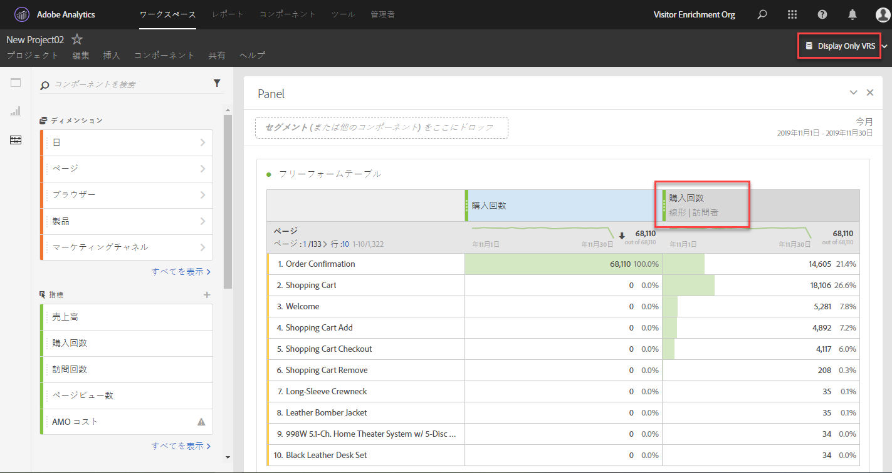

# よくある質問

アトリビューションに関するよくある質問とその回答を紹介します。

+++## アトリビューションを使用する場合、**[!UICONTROL None]**&#x200B;の行項目は何ですか？

「なし」行項目は、ルックバックウィンドウ内でタッチポイントなしで発生したすべてのコンバージョンを表す包括的な項目です。 「なし」行項目に起因するコンバージョンの数を減らすには、ルックバック期間が長いカスタムルックバックウィンドウを使用してみてください。

+++

+++## アトリビューションモデルを使用する際、レポートウィンドウ以外で日付が表示されることがあるのはなぜですか？

[入口数](/help/components/metrics/entries.md)や[バウンス率](/help/components/metrics/bounce-rate.md)など、訪問ベースの指標の中には、レポートーウィンドウの開始日付範囲の前の期間にデータを属性付けされるものもあります。 これは、ルックバックウィンドウを使用する属性モデルによるものです。ルックバックウィンドウでは、指標に対してクレジットを付与するため、どの程度属性を遡るかを決定します。 最も一般的なシナリオは、訪問が午前 0 時にまたがる場合です。 次に例を示します。

1. ユーザーは9月7日午後11:55時にホームページにアクセスします。
1. 彼らはいくつかのページを訪問し、最後は9月8日午前12:05に発生しました。
1. 1 週間後に、日付範囲が 9 月 8 日～ 9 月 14 日（PT）の日別トレンドレポートを作成します。

[ページ表示](/help/components/metrics/page-views.md)などのヒットベースの指標は、期待された出力を生成します。9 月 8 日～ 9 月 14 日（PT）の各日のデータがトレンド表示されます。 ただし、訪問ベースの指標では、上記の訪問が 9 月 7 日（PT）に表示されます。 訪問の属性付きエントリは 9 月 7 日に発生し、デフォルトでは9 月 1 日～ 9 月 31 日（PT）がルックバックウィンドウです。

この例では、9 月 7 日（PT）のバウンス率は常に 0% と表示されます。 この指標は `Bounces divided by Entries` と定義されています。これは、ヒットベースの指標を、訪問ベースの指標で割った値です。 バウンスは 1 つのイメージリクエストで構成されるので、複数日にまたがることはできません。9 月 7 日（PT）のバウンスはレポートーウィンドウの外で発生し、その日のバウンス率が 0% と保証されています。 また、このレポートでは、他のヒットベースの指標でも、9 月 7 日（PT）に 0 と表示されます。これらのヒットはレポートーウィンドウ内にないからです。

もう 1 つ似た例を考えてみましょう。 次の例と上の例の違いは日付だけです。

1. ユーザーは8月31日の午後11:55時にホームページにアクセスします。
1. 彼らはいくつかのページを訪問し、最後は9月1日午前12:05時に発生しました。
1. 1 週間後に、日付範囲が 9 月 1 日～ 9 月 7 日（PT）の日別トレンドレポートを作成します。

この例では、入口数とバウンス率に 8 月 31 日（PT）のデータが表示されません。 ルックバックウィンドウとレポートウィンドウの両方が 9 月 1 日に開始するため、データを 8 月 31 日（PT）から関連付けることはできません。

+++

<!--
not relevant anymore due to introduction of separation of container and lookback window 
+++## When should I use a visit, visitor, or custom attribution lookback?

The choice of attribution lookback depends on your use case. If conversions typically take longer than a single visit, a visitor or custom lookback is recommended. For longer conversion cycles, custom lookback windows are best as they are the only type that can pull in data from prior to the reporting window.

+++
-->

+++## アトリビューションを使用する場合、propとeVarはどのように比較されますか？

アトリビューションはレポートの実行時に再計算されるので、アトリビューションモデリングの目的での prop または eVar（またはその他のディメンション）に違いはありません。 prop は、任意のルックバックウィンドウまたはアトリビューションモデルを使用して永続化できます。eVar の配分または有効期限の設定は無視されます。

+++

+++## アトリビューションモデルは、データフィードやData Warehouseなど、他のAnalytics機能で使用できますか？

いいえ。 アトリビューションモデルは、Analysis Workspace でのみ使用できるレポートの時間処理を使用します。 詳しくは、[レポートの時間処理](/help/components/vrs/vrs-report-time-processing.md)を参照してください。

+++

+++## アトリビューションモデルは、レポート時刻処理が有効になっている仮想レポートスイートを使用している場合にのみ使用できますか？

アトリビューションモデルは、仮想レポートスイートの外部で使用できます。 バックエンドでレポート時間処理を使用している間、アトリビューションモデルは、標準レポートスイートと仮想レポートスイートの両方で使用できます。

+++

+++## サポートされていないディメンションと指標は何ですか？

アトリビューションパネルでは、すべてのディメンションがサポートされます。 サポートされない指標は次のとおりです。

* すべての計算指標
* ユニーク訪問者
* 訪問回数
* 発生件数
* ページビュー数
* A4T指標
* 滞在時間指標
* バウンス
* バウンス率
* 入口
* 出口
* エラーページ（404）
* 検索
* 単一ページ訪問数
* 単一アクセス

+++

+++## アトリビューションは分類で機能しますか？

はい、分類は完全にサポートされています。

+++

+++## アトリビューションはデータソースと連携しますか？

はい、ほとんどのデータソースがサポートされています。 アトリビューションは、概要レベルデータソースでは、Analytics の訪問者の識別子に関連付けられていないので使用できません。

トランザクション ID データソースは、他のヒットと同様に処理されます。 トランザクション ID データソースでは、従来のレポートで通常使用される特別な処理を使用しません。 つまり、レポート時間処理を使用する場合、トランザクション ID ヒットには、トランザクション ID ヒットのタイムスタンプ付近に発生するヒットから伝播されるeVar値が含まれます。 値は、元のトランザクションの時間付近で発生したヒットから反映されません。

可能な場合、アトリビューションは、永続値ではなく、データソース内のイベント内で送信されるMID列の値に依存します。 アトリビューションモデルは、データソースの MID 列値にその場で適用されます。 例えば、[&#x200B; ラストタッチアトリビューション &#x200B;](models.md)を使用する場合、モデルは指標の各インスタンスから始まります。 モデルがMID列で観察された最後の値に達するまで、ヒットで順次逆方向に歩きます。

不可能な場合、アトリビューションは評価のためにデータソースの&#x200B;*前のレコード*&#x200B;のMID値を使用します。 AA が順不同のデータをサポートしていないことを考慮すると、この以前のレコードはタイムスタンプによって順序付けされていない可能性があります。

レコードが順番に並べられていないので、永続性を適用することで期待される値は、指定されたトランザクション ID のタイムスタンプと元のトランザクションの間に存在する時間の長さに影響を与える可能性があります。

+++

+++## Advertising Analyticsとの連携でアトリビューションは機能しますか？

一致タイプやキーワードなどのメタデータディメンションは、アトリビューションと連携します。 ただし、指標（インプレッション数、コスト、クリック数、平均順位、平均品質スコアなど）では概要レベルのデータソースを使用するので、互換性がありません。

+++

+++## マーケティングチャネルでのアトリビューションの仕組み？

マーケティングチャネルが初めて導入された際には、ファーストタッチとラストタッチのディメンションのみが導入されました。 現在のバージョンのアトリビューションでは、明示的なファーストタッチディメンションとラストタッチディメンションは不要になりました。 アドビでは、汎用の[!UICONTROL マーケティングチャネル]ディメンションと[!UICONTROL マーケティングチャネル詳細]ディメンションを提供しているので、目的のアトリビューションモデルで使用できます。 これらの汎用ディメンションは、[!UICONTROL ラストタッチチャネル]ディメンションと同じように動作しますが、異なるアトリビューションモデルでマーケティングチャネルを使用する場合の混乱を防ぐために、異なるラベルが付けられます。

マーケティングチャネルのディメンションは、（処理ルールで定義された）従来の訪問の定義に依存するので、仮想レポートスイートを使用して訪問の定義を変更することはできません。

+++

+++## アトリビューションは、リスト変数などの複数値の変数でどのように機能しますか？

Analytics のディメンションには、1 回のヒットに複数の値を含めることができるものもあります。 一般的な例としては、listVar 変数や product 変数があります。

複数の値を持つヒットにアトリビューションを適用すると、同一ヒット内のすべての値に同じクレジットが付与されます。 多くの値がこのクレジットを受け取るので、個々の行項目を合計した場合とはレポートの合計が異なる場合があります。 レポートの合計では重複が排除され、各ディメンションの項目には適切なクレジットが付与されます。

+++

+++## アトリビューションはセグメンテーションとどのように連携しますか？

アトリビューションは常にセグメント化の前に実行され、セグメント化はレポートフィルターの適用前に実行されます。 この概念は、セグメントを使用する仮想レポートスイートにも適用されます。

例えば、「ディスプレイ広告によるヒット」セグメントを適用した仮想レポートスイートを作成すると、一部のアトリビューションモデルを使用して、テーブル内の他のチャネルを表示できます。

>[!NOTE]
>
>セグメントで指標を含むヒットが抑制される場合、これらの指標インスタンスはどのディメンションにも関連付けられません。 ただし、類似したレポートフィルターでは、単に一部のディメンション項目を非表示にするだけで、アトリビューションモデルに従って処理される指標には影響しません。 その結果、セグメントは、同等の定義を持つフィルターよりも低い値を返すことができます。

+++
