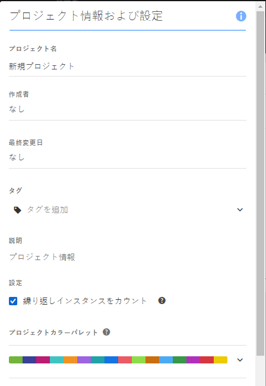
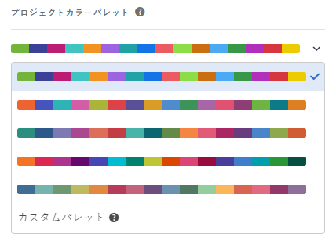

# ビジュアライゼーションカラーパレット

異なるカラーパレットを選択するか、お勤めの会社のブランドカラーと一致する独自のパレットを指定することにより、ワークスペースで使用するビジュアライゼーションカラーパレットを変更できます。この機能は、ワークスペースのほとんどのビジュアライゼーションに影響しますが、変更概要、フリーフォームテーブルの条件付き書式およびマップビジュアライゼーションには影響&#x200B;**しません**。

>[!NOTE]
>
>Internet Explorer11でカラーパレットのサポートが有効になっていない。

次の点に注意してください。

* 選べる 5 色のプリセットカラーパレットがあります。デフォルトのパレットと1つのパレットは最適なコントラストのために最適化されており、カラーブラインドのユーザーにとってもアクセスが容易になります。
* 上 2 つより下の 3 番目から 5 番目のカラーパレットは色彩調整用に最適化されています。

## カラーパレットを変更します。

1. **[!UICONTROL ワークスペース]** / **[!UICONTROL プロジェクト]** / **[!UICONTROL プロジェクト情報および設定に移動]**&#x200B;します。
1. **[!UICONTROL プロジェクトカラーパレット]ドロップダウンから、5 色のプリセットカラー設定の中から 1 つを選ぶことができます。**

   

1. 独自のパレットを指定するには、プリセットオプション下の&#x200B;**[!UICONTROL カスタムパレット]を選択します。**
1. 使おうとしている色について、コンマ区切りで最大 16 個の 16 進数の値 (たとえば #00a4e4) を指定します。たとえば、4 つの値だけを使いたい場合、これらの色は自動的により多くの色を含むビジュアライゼーションで繰り返されます。

