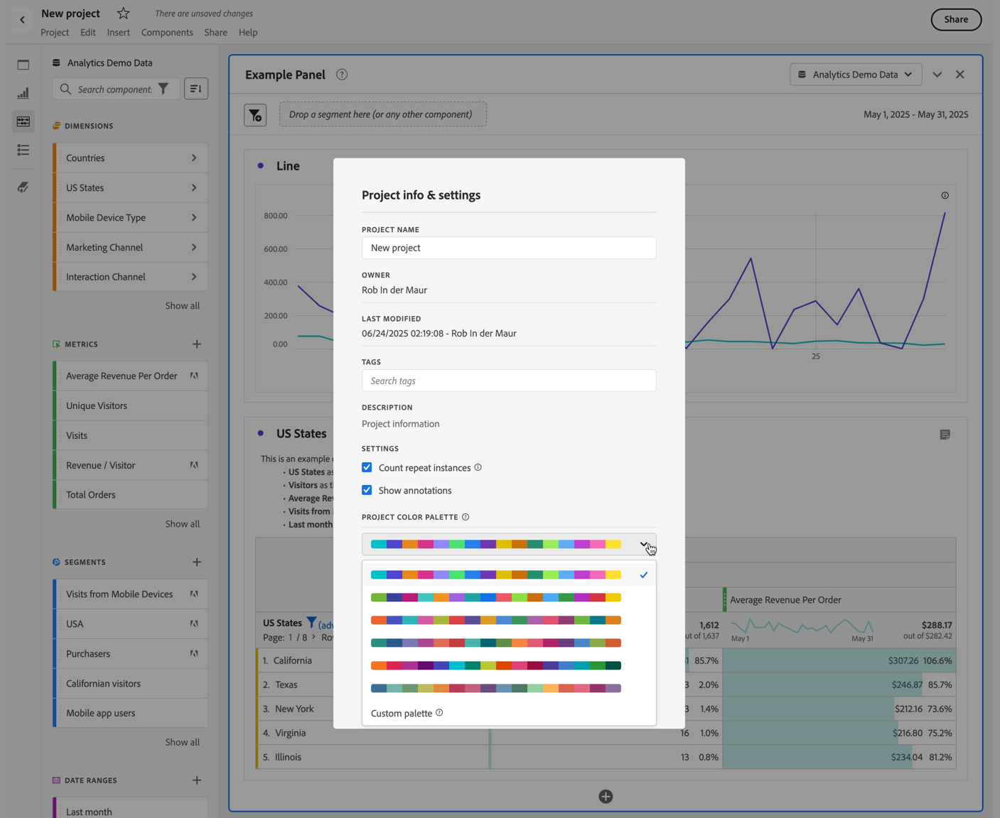

# ビジュアライゼーションカラーパレット {#visualization-color-palette}

<!-- markdownlint-disable MD034 -->

>[!CONTEXTUALHELP]
>id="workspace_project_colorpalette"
>title="プロジェクトカラーパレット"
>abstract="このプロジェクトで使用するカラーパレットを変更します。"

<!-- markdownlint-enable MD034 -->

Workspace で使用するビジュアライゼーションカラーパレットを変更できます。事前定義済みのカラーパレットを選択するか、会社のブランディングカラーに一致する独自のパレットを指定できます。この機能は、Workspace のほとんどのビジュアライゼーションに影響しますが、変更概要、フリーフォームテーブルの条件付き書式およびマップビジュアライゼーションには影響 **しません**。

>[!NOTE]
>
>カラーパレットのサポートは、Internet Explorer 11 に対して有効ではありません。

。

次の点に注意してください。

* 6 色のプリセットカラーパレットから選択できます。デフォルトのパレットと 2 番目にリストされているパレットはいずれも、コントラストが最適化されており、色覚に障害のあるユーザーが利用しやすいようになっています。
* 他のパレットは、カラーの調和のために最適化されています。

## カラーパレットの変更：

1. **[!UICONTROL Workspace]**／**[!UICONTROL プロジェクト]**／**[!UICONTROL プロジェクト情報と設定]**&#x200B;に移動します。
1. **[!UICONTROL プロジェクトカラーパレット]** ドロップダウンメニューから、事前設定済みのカラースキームの 1 つを選択できます。
1. 独自のパレットを指定するには、プリセットオプションの下にある「**[!UICONTROL カスタムパレット]**」を選択します。
1. 最大 16 個のコンマ区切りの 16 進値（例：`#00a4e4`）を指定して、独自のカラーパレットを作成します。例えば、4 つの値のみを指定する場合、より多くのカラーを含むビジュアライゼーションではカラーが自動的に繰り返されます。

<!--
# Visualization Color Palettes {#visualization-color-palettes}

>[!CONTEXTUALHELP]
>id="workspace_project_colorpalette"
>title="Project color palette"
>abstract="Change the color palette used in this project."

You can change the visualization color palette used in Workspace by choosing a different color palette or by specifying your own palette that could match your company's branding colors. This feature affects most visualizations in Workspace, but it does **not** affect [!UICONTROL Summary Change], conditional formatting in [!UICONTROL Freeform] tables, and the [!UICONTROL Map] visualization.

>[!NOTE]
>
>Color palette support is not enabled for Internet Explorer 11.

Keep in mind:

* There are five pre-set color palettes to choose from. The default palette and the one below have been optimized for optimal contrast and are both more accessible for those who are color blind.
* The third to the fifth color palettes below the top two have been optimized for color harmony.

## Change your [!UICONTROL color palette]:

>[!BEGINSHADEBOX]

See  [Using a custom color palette](https://video.tv.adobe.com/v/23876?quality=12&learn=on){target="_blank"} for a demo video.

>[!ENDSHADEBOX]

1. Navigate to **[!UICONTROL Workspace]** > **[!UICONTROL Project]** > **[!UICONTROL Project Info & Settings]**.
1. From the **[!UICONTROL Project Color Palette]** drop-down list, you can pick one of five pre-set color schemes.

   

1. To specify your own palette, select **[!UICONTROL Custom Palette]** below the pre-set options.
1. Specify up to 16 comma-separated hexadecimal values (for example, #00a4e4) for the colors you intend to use. If, for example, you want to use only four values, these colors will automatically be repeated in visualizations that contain more colors.
-->