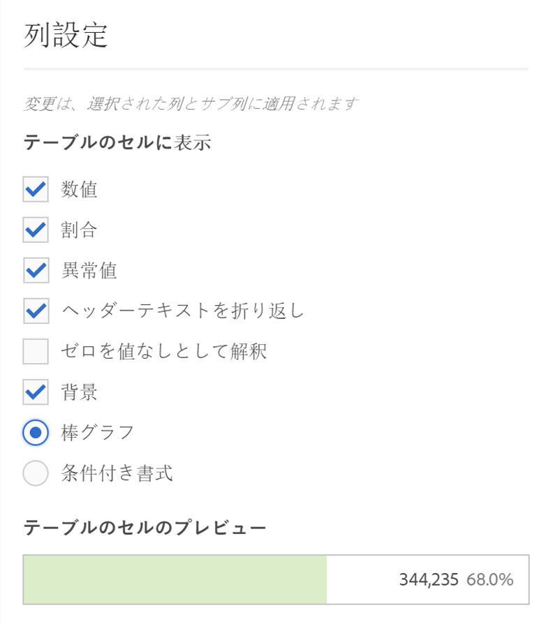
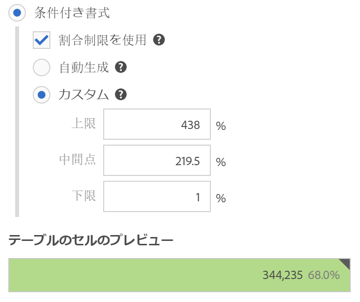
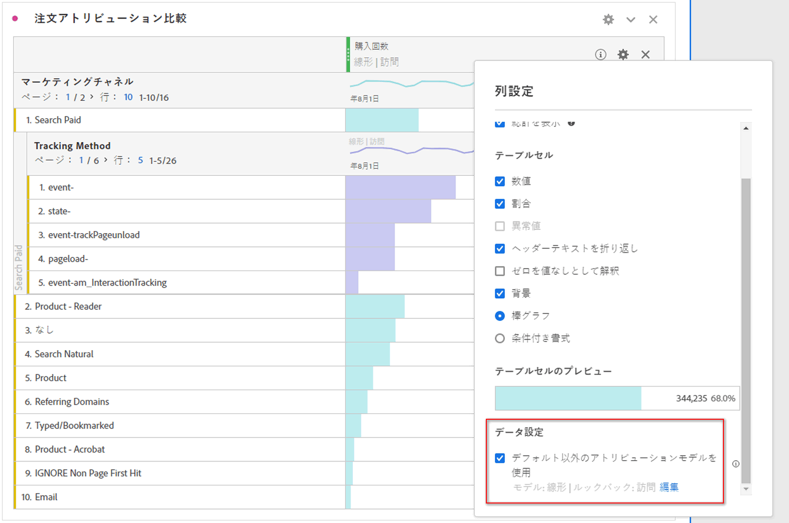
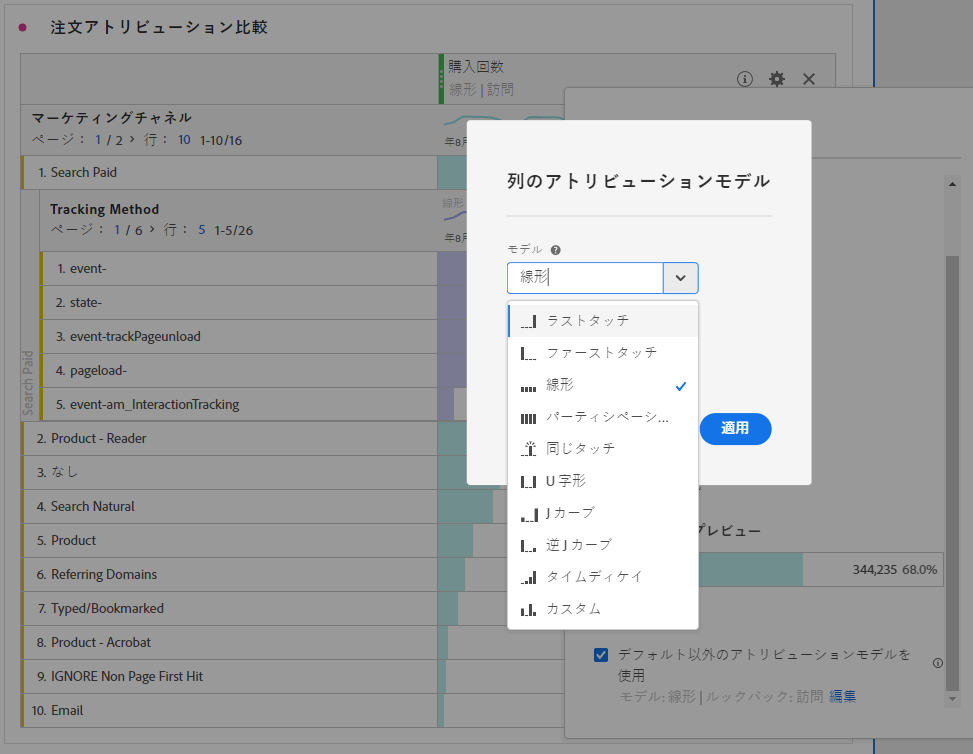

# [!UICONTROL 列設定]

[!UICONTROL 列設定]では、列の書式を設定できます。一部の列には条件付き書式を設定することもできます。

## [!UICONTROL 列設定]の編集 {#edit-column-settings}

「[!UICONTROL 列設定]」にアクセスするには、フリーフォームテーブルをプロジェクトにドラッグしてから、列見出しにあるギアアイコンをクリックします。

**一度に複数の列**&#x200B;の設定を編集できます。複数の列を選択し、いずれかの列の設定アイコンをクリックするだけです。加えた変更が、選択されているセルを含むすべての列に適用されます。

| 要素 | 説明 |
| --- | --- |
| **合計セル** |  |
| 合計を表示 | This total is typically equal to or a subset of the [!UICONTROL Grand Total]. 「[!UICONTROL なしを含む]」オプションなど、フリーフォームテーブル内で適用されたすべてのテーブルフィルターを反映します。 |
| 総計を表示 | この合計は、収集されたすべてのヒットを表します。「レポートスイートの合計」とも呼ばれます。 セグメントがパネルレベルまたはフリーフォームテーブル内で適用されると、この合計は、セグメント条件に一致するすべてのヒットを反映するように調整されます。Grand total is not supported for tables or breakdowns with [static rows](/help/analyze/analysis-workspace/build-workspace-project/workspace-totals.md). |
| **テーブルセル** |  |
| 数値 | セルに指標の数値を表示するかどうかを決定します。例えば、指標がページビュー数の場合、数値は行項目のページ表示回数になります。 |
| パーセント | セルに指標の割合の値を表示するかどうかを決定します。例えば、指標がページビュー数の場合、割合の値は行項目のページ表示回数を列の合計ページ表示回数で割った数になります。注意：より正確な数値を示すために、100％を超える割合が表示されるようになりました。列の幅をさらに大きくできるように、上限を 1,000％まで高める予定です。 |
| 異常値 | この列の値に対して異常値検出を実行するかどうかを決定します。 |
| ヘッダーテキストを折り返し | ヘッダーを読みやすく、またテーブルを共有しやすくするため、フリーフォームテーブルでヘッダーテキストを折り返せるようにします。これは、.pdf のレンダリングや名前の長い指標に使用すると便利です。デフォルトで有効です。 |
| ゼロを値なしとして解釈 | 値が 0 のセルについて、0 を表示するか空白にするかを決定します。この設定は、まだ終わっていない月の日ごとのデータを確認する際に便利です。将来の日付のセルに 0 を表示するのではなく、空白にすることができます。この設定はグラフにも反映されます（つまり、この設定がオンの場合、値が 0 の線やバーはグラフに表示されません）。 |
| 背景 | セルのすべての書式（棒グラフや条件付き書式など）をセルに表示するかどうかを決定します。 |
| 棒グラフ | 列の合計を最大値としてセルの値を示す横棒グラフを表示します。 |
| 条件付き書式 | 次の節を参照してください。 |
| テーブルのセルのプレビュー | 現在選択されている書式オプションが適用されると各セルがどのように表示されるかを示すプレビューが表示されます。 |

## 条件付き書式 {#conditional-formatting}

条件付き書式により、上限、中間点、下限を定義して書式を適用できます。「カスタム」制限を選択した場合を除き、フリーフォームテーブルに適用した条件付き書式（色など）も分類で自動的に有効となります。

| 要素 | 説明 |
| --- | --- |
| 条件付き書式 | データ値に基づいて、セルに次の色を適用します。 <ul><li>緑：高い値</li><li>黄色：中間点の値</li><li>赤：低い値</li></ul>  テーブルのディメンションを置き換えると、条件付き書式の制限がリセットされます。指標を置き換えると、その列の制限が再計算されます（指標が X 軸、ディメンションが Y 軸で示される場合）。 |
| 割合制限を使用 | 絶対値ではなくパーセンテージに基づいて制限範囲を変更します.このオプションは、割合のみに基づいている指標（バウンス率など）のほか、カウントと割合を持つ指標（ページビュー数など）で使用できます。 |
| 自動生成 | データに基づいて自動的に上限／中間／下限を計算する.上限は、この列の最大値です。下限は最小値であり、中間点は上限と下限の平均値です。 |
| カスタム | 上限／中間／下限を手動で割り当てる.これにより、どのような場合に列の値が良好、平均的、望ましくないと判断されるかを柔軟に決定できます。 |

## デフォルト以外のアトリビューションモデルを使用 {#attribution}

Analysis Workspace では、ほとんどすべての指標の[アトリビューション](../../attribution/overview.md)がサポートされています。

1. フリーフォームテーブル列の設定（歯車）アイコンをクリックします。

   

1. **[!UICONTROL データ設定]**&#x200B;で「**[!UICONTROL デフォルト以外のアトリビューションモデルを使用]**」チェックボックスをオンにします。様々なアトリビューションモデルの詳細については、「[アトリビューションモデルの概要](../../attribution/models.md)」を参照してください。

   

>[!MORELIKETHIS]
>
>* [データソースの管理](/help/analyze/analysis-workspace/visualizations/t-sync-visualization.md)

