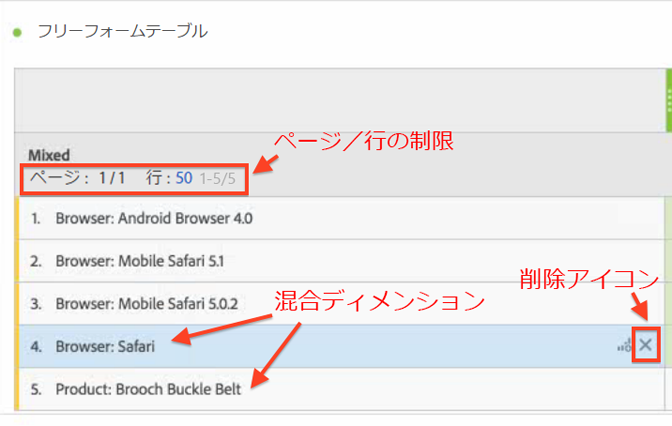
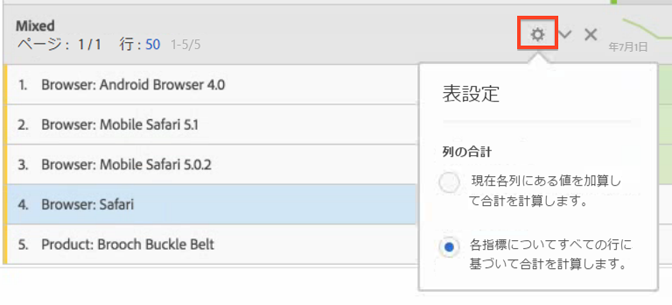

# 静的な行と動的な行

Analysis Workspace のテーブルでは、ディメンションをテーブルにドロップすると、「動的な」行が生成されます。つまり、特定の指標に関して、ディメンションに対応するすべての項目は、テーブルに取り込まれます。

例えば、ブラウザーディメンションをテーブルにドラッグすると、すべてのディメンション項目（例：Android ブラウザー、Mobile Safari、Firefox など）が動的にテーブルに取り込まれます。

一方、手動で特定の指標、セグメント、データ範囲、個別のディメンション項目を選択してテーブルにドロップすると、ハードコードされた、または「静的な」行またはリストになります。いくつかの方法で静的な行を操作できます。

* 静的な行のプレビューアイコンをクリックして、セグメント、指標、日付範囲をプレビューできます。
* 「x」アイコンをクリックして、テーブルから行を削除します。
* 表示される行の数を制限し、ページングを有効にします。
* 「混在ディメンション項目」を追加します。例えば、ブラウザーディメンションから項目を追加し、製品ディメンションから別の項目を追加します。

   次の図で説明します。

   

また、静的行モードの場合は、列の合計の計算方法を変更できます。ギアアイコンをクリックして、次の 2 つのオプションを切り替えます。

| オプション | 説明 |
|---|---|
| 現在各列にある値を加算して合計を計算します。 | このオプションは、現在、テーブルにある行のみを計算します。（クライアント側の計算） |
| 各指標についてすべての行に基づいて合計を計算します。 | このオプションは、テーブルにリストされていなくても、このディメンションに関するすべてのディメンション項目を含めます。（サーバー側の計算） |

