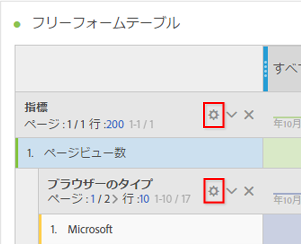
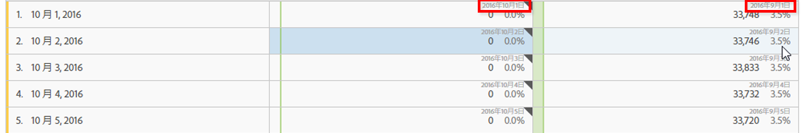

# 行の設定

行設定は、テーブルにドラッグしたコンポーネントによって異なります。

また、[テーブル内の右クリックアクション](../../../../analyze/analysis-workspace/visualizations/freeform-table.md#concept_0D2E24FCCBAF4194AA941448860E422F)を使用して、選択されている行を管理することもできます。

テーブルの行の設定にアクセスするには、それぞれのディメンション、セグメント、指標、期間または分類の横にある設定アイコンをクリックします。

<table id="table_7ACE6413DB1F40349ED2860020F92E55"> 
 <thead> 
  <tr> 
   <th colname="col1" class="entry"> 行設定 </th> 
   <th colname="col2" class="entry"> 説明 </th> 
  </tr>
 </thead>
 <tbody> 
  <tr> 
   <td colname="col1"> 
<a href="../../../../analyze/analysis-workspace/components/calendar-date-ranges/time-comparison.md#concept_93BCAD81B7A54ABBBA5CD9E419F6F764" format="dita" scope="local"> 日付の比較</a> 
 </td> 
   <td colname="col2"> 
<b>各列の日付を整列させて、すべて同じ行から始まるようにします。</b> 
 
日付を整列させると、例えば 2016 年 10 月を 9 月と比較する前月比の場合、左側の列は 10 月 1 日、右側の列は 9 月 1 日から始まります。 
 
 
 
デフォルトでは無効です。 
 </td> 
  </tr> 
  <tr> 
   <td colname="col1"> 
割合（％） 
 </td> 
   <td colname="col2"> 
<b>行ごとに割合を計算します。</b> 
 
フリーフォームテーブルで、列ではなく行全体のセルの割合が表示されるようにします。これは、割合のトレンド分析に特に役立ちます。視覚化アイコンを使用した場合、これはデフォルトでオンになります。 
 </td> 
  </tr> 
  <tr> 
   <td colname="col1"> 
列の合計 
 </td> 
   <td colname="col2"> 
これらの設定は、<a href="../../../../analyze/analysis-workspace/build-workspace-project/column-row-settings/manual-vs-dynamic-rows.md#concept_C50E7DFBC0504C72A973123192F487D8" format="dita" scope="local">手動の（静的な）行</a>（有限の項目セットを選択した場合）にのみ表示され、動的な行（すべての項目を示すディメンションにドロップした場合）は表示されません。 
注意：<i>指標の</i>手動の行では、この設定は無効です。これは、テーブルの現在の行以外について指標を合計することは意味がないからです。 
 
 
<b>現在各列にある値を加算して合計を計算します（デフォルトで有効です）。</b> 
 
このオプションは、現在、テーブルにある行のみを計算します。（クライアント側の計算） 
 
<b>各指標についてすべての行に基づいて合計を計算します（デフォルトで無効です）。</b> 
 
このオプションは、テーブルにリストされていなくても、このディメンションに関するすべてのディメンション項目を含めます。（サーバー側の計算） 
 </td> 
  </tr> 
  <tr> 
   <td colname="col1"> 
分類 
 </td> 
   <td colname="col2"> 
<b>位置で分類：</b> 
 
フリーフォームテーブル分類で固定位置に基づいて分類を実行できます。例えば、常に上位 7 行が分類されるように指定できます。 
 
（以前は、分類の値のリストはレポート作成の時点で「ロック」されていました。例えば、日付をページごとに分類する場合、その時点での上位 50 ページのリストが表示されていました。そのレポートを保存して 1 ヶ月後に実行した場合、上位 50 ページが変動している可能性があるものの、Analysis Workspace は現在の月を日付範囲としながらも、以前の分類の結果を使用して同じページを返していました。） 
 
固定位置に基づいて分類を実行するには、 
 
    <ol id="ol_A396A11566AA4F52BC3ABBC373CEF477"> 
     <li id="li_BDAB1E9A48D44944A4F7C31F1182B923">テーブルの一部の行を分類します。 </li> 
     <li id="li_C5610437D3714CCEB9F3C771864B4336">固定位置にするテーブル行の横にある設定（ギア）アイコンをクリックします。 </li> 
     <li id="li_675E429DC3B94201978166F9408D30B1">位置で分類の横にあるチェックボックスをオンにします。 </li> 
     <li id="li_E8A417D0D6D1438CAE825843BA0A7060">並べ替え順序または日付範囲を変更すると、分類はハードコードされた行ではなく行の位置に基づいておこなわれます。 </li> 
    </ol> 
デフォルトでは無効です。 
 </td> 
  </tr> 
 </tbody> 
</table>

