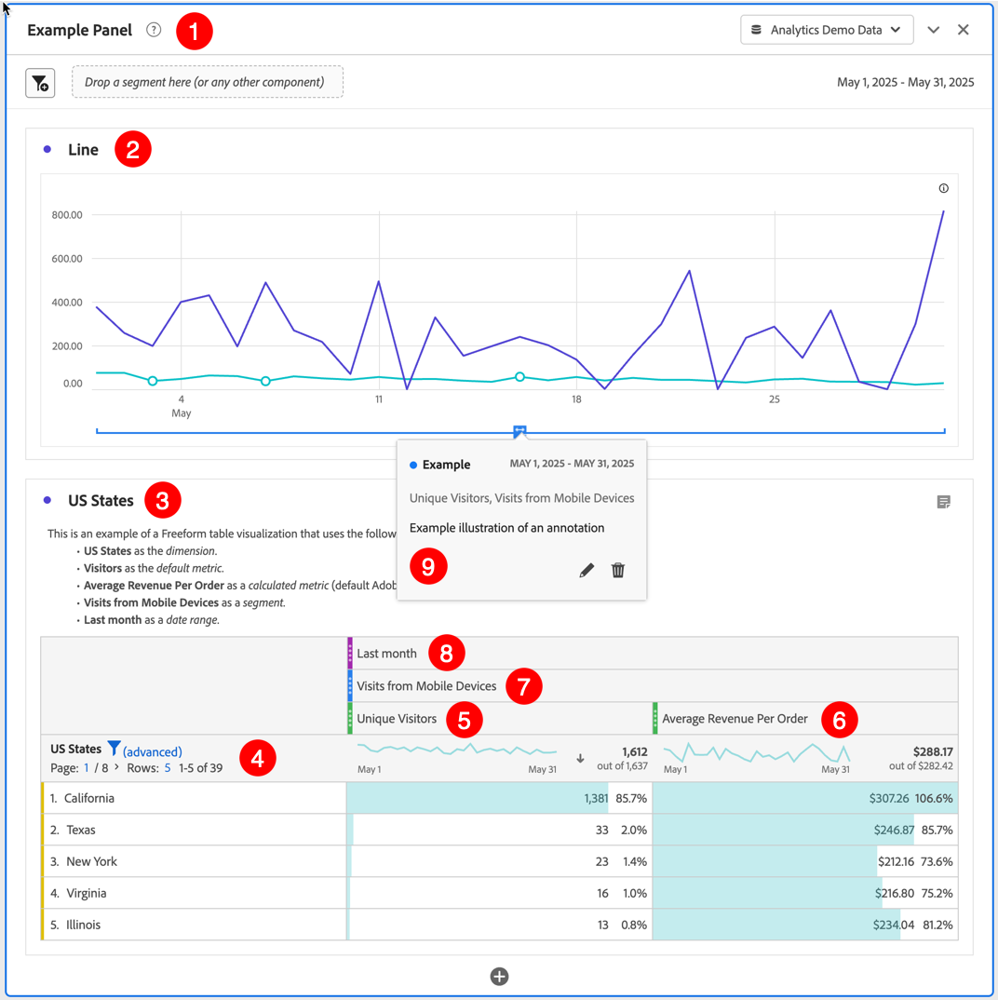

# プロジェクトの作成 {#create-projects}

Analysis Workspace の[プロジェクト](/help/analyze/analysis-workspace/build-workspace-project/freeform-overview.md)を使用すると、ビジネスクリティカルな分析を作成および表示できます。これらの分析は、組織内外の関係者と共有できます。

1. Adobe Analytics で、「**[!UICONTROL ワークスペース]**」を選択します。

1. 左パネルで「**[!UICONTROL プロジェクト]**」を選択し、「**[!UICONTROL プロジェクトを作成]**」を選択します。

1. 「**空の Workspace プロジェクト**」を選択し、ブラウザーを使用してWorkspace プロジェクトを作成します。

   モバイルアプリを使用して他の関係者と共有できるモバイルスコアカードプロジェクトを作成する方法については、[ 空のモバイルスコアカード ](/help/analyze/mobile-app/curator.md) を参照してください。

1. 「[!UICONTROL **作成**]」を選択します。

空の Workspace プロジェクトを作成したので、[Analysis Workspace](/help/analyze/analysis-workspace/home.md) のユーザーインターフェイスをもう理解できたはずです。理解できていれば、自分のプロジェクトを構築できます。それには、次の手順を実行します。

* プロジェクトに[パネル](/help/analyze/analysis-workspace/c-panels/panels.md)を追加します。例えば、 **[!DNL Example Panel]** は ➊ です。

* パネルに[ビジュアライゼーション](/help/analyze/analysis-workspace/visualizations/freeform-analysis-visualizations.md)を追加します。例：
   * **[!DNL Line]**[&#x200B;折れ線グラフ](/help/analyze/analysis-workspace/visualizations/line.md)ビジュアライゼーション➋
   * **[!DNL US States]**[&#x200B;フリーフォームテーブル](/help/analyze/analysis-workspace/visualizations/freeform-table/freeform-table.md)ビジュアライゼーション➌
* ビジュアライゼーションに[コンポーネント](/help/analyze/analysis-workspace/components/analysis-workspace-components.md)を追加します。例：
   * **[!DNL US States]**[&#x200B;ディメンション](/help/components/dimensions/overview.md)➍
   * **[!DNL Unique Visitors]**[&#x200B;指標](/help/analyze/analysis-workspace/components/apply-create-metrics.md)➎
   * **[!DNL Average Revenue Per Order]**[&#x200B;計算指標](/help/components/c-calcmetrics/cm-overview.md)➏
   * **[!DNL Visits from Mobile Devices]**[&#x200B;セグメント](/help/components/segmentation/seg-overview.md)➐
   * **[!DNL Last Month]**[&#x200B;日付範囲](/help/analyze/analysis-workspace/components/calendar-date-ranges/calendar.md)➑
   * **[!DNL Example]**[&#x200B;注釈](/help/analyze/analysis-workspace/components/annotations/overview.md)➒

## プロジェクト情報および設定 {#project-info-settings}

>[!CONTEXTUALHELP]
>id="workspace_project_countrepeatinstances"
>title="繰り返しインスタンスをカウント"
>abstract="レポート内でレポートインスタンスがカウントされるかどうかを指定します。  メモ：この設定は、フローまたはフォールアウトのビジュアライゼーションには適用されません。"

>[!CONTEXTUALHELP]
>id="workspace_project_repeatinstances"
>title="繰り返しインスタンスをカウント"
>abstract="レポート内でレポートインスタンスがカウントされるかどうかを指定します。 メモ：この設定は、フローまたはフォールアウトのビジュアライゼーションには適用されません。"

>[!CONTEXTUALHELP]
>id="workspace_project_commenting"
>title="コメントを許可"
>abstract="有効にすると、Analysis Workspace でプロジェクトの右側のパネルにコメント領域が表示されます。"

プロジェクト設定は、現在アクティブなプロジェクトに関するプロジェクトレベルの情報を提供します。

。

「設定」には次の項目が含まれます。

| 設定 | 説明 |
|---|---|
| プロジェクト名 | プロジェクトに設定された名前。名前をダブルクリックすると編集できます。 |
| 所有者 | プロジェクト所有者名 |
| 最終変更日 | プロジェクトの最終変更日。 |
| タグ | 分類を簡単にするためにプロジェクトに適用されたタグのリスト。 |
| 説明 | 説明は、プロジェクトの目的を明確にするのに役立ちます。説明をダブルクリックすると編集できます。 |
| 繰り返しインスタンスをカウント | レポート内でレポートインスタンスがカウントされるかどうかを指定します。メモ：この設定は、フローまたはフォールアウトのビジュアライゼーションには適用されません。 |
| 注釈を表示 | このプロジェクトに対して注釈を表示するかどうかを指定します。 |
| [プロジェクトカラーパレット](/help/analyze/analysis-workspace/build-workspace-project/color-palettes.md) | Workspace で使用する分類カラーパレットを変更するには、色弱のユーザー向け用に最適化されている既定のパレットを選択するか、カスタムパレットを指定します。この機能は、ほとんどのビジュアライゼーションを含む Workspace の多くの機能に影響します。 |
| [表示密度](/help/analyze/analysis-workspace/build-workspace-project/view-density.md) | 左パネル、フリーフォームテーブル、コホートテーブルでの垂直方向のパディングを減らし、1 画面に表示されるデータの量を増やすことができます。 |

<!--
# Create projects in Analysis Workspace

[Projects](/help/analyze/analysis-workspace/build-workspace-project/freeform-overview.md) in Analysis Workspace allow you to view business-critical analyses that can be shared with stakeholders inside or outside your organization. 

For general information about how to get started using Analysis Workspace, see [Analysis Workspace overview](/help/analyze/analysis-workspace/home.md).

The following sections describe how to create a project and start adding the key building blocks for any Analysis Workspace project: panels, visualizations, and components.

## Create a project from a blank project or a report

1. In Adobe Analytics, select [!UICONTROL **Workspace**].

1. Choose whether to create a blank project or to create a project from a report:

   +++Create a blank project

   1. On the [!UICONTROL **Workspace**] tab, select the [!UICONTROL **Projects**] tab on the left side of the page, then select [!UICONTROL **Create project**].

   1. Choose whether to create a blank project or a blank mobile scorecard

      * **Blank project** if you plan to share your analysis from the browser 
      * [**Blank mobile scorecard**](/help/analyze/mobile-app/curator.md) if you plan to share your analysis from the Adobe Analytics dashboards mobile app.

   1. Select [!UICONTROL **Create**].

   +++

   +++Create a project from a report
   
      1. On the [!UICONTROL **Workspace**] tab, select the [!UICONTROL **Reports**] tab on the left side of the page.

      1. Search for or navigate to the report you want to use, then select it when it appears.

          A set of standard reports is available by default. In addition, your organization might have created custom reports for you to choose from.
          
      1. Select [!UICONTROL **Project**] > [!UICONTROL **Save**] to save the report as a new project.

          For more information about reports, see "Navigate the Reports tab" in [Adobe Analytics landing page](/help/analyze/landing.md).

   +++

1. Next, you need to add panels, visualizations, and components to your project. First, add panels to your project in Analysis Workspace, as described in [Add panels to the project](#add-panels-to-the-project). You can then add visualizations to any panels. Finally, you can add components to any panels or visualizations.

## Add panels to the project {#panels}

[Panels](https://experienceleague.adobe.com/docs/analytics/analyze/analysis-workspace/panels/panels.html) are the foundation to any project in Analysis Workspace. Panels are used to organize the content (visualizations and components) of a project. 

Many of the panels provided in Analysis Workspace generate a full set of analyses based on a few user inputs. 

To add a panel:

1. Select the [!UICONTROL **Panels**] icon in the left rail.

   

1. Search for the panel you want to add. When it appears in the left rail, drag it into your project.

1. Add visualizations to your panel, as described in [Add visualizations to the project](#add-visualizations-to-the-project). 

   Alternatively, you can add components directly to a panel, as described in [Add components to the project](#add-components-to-the-project).

## Add visualizations to the project

[Visualizations](https://experienceleague.adobe.com/docs/analytics/analyze/analysis-workspace/visualizations/freeform-analysis-visualizations.html) (such as a freeform table, a bar chart, or a line chart) can be used to visually bring data to life. 

>[!TIP]
>
>Freeform tables are the most common type of visualization, and are the foundation for interactive data analysis. For more details about how to work with Freeform tables in Analysis Workspace, see [Freeform table](/help/analyze/analysis-workspace/visualizations/freeform-table/freeform-table.md).

To add a visualization:

1. Select the **[!UICONTROL Visualizations]** icon in the left rail.

   

1. Search for the visualization you want to add. When it appears in the left rail, drag it to a panel within your project. 

1. Add components to the visualization, as described in [Add components to the project](#add-components-to-the-project).

## Add components to the project

[Components](/help/analyze/analysis-workspace/components/analysis-workspace-components.md) make up the actual data of any project. You can add components to visualizations or to panels.

>[!TIP]
>
>For information about each component, select the Info icon next to a component's name in the left rail, or see the [Analytics Components Guide](/help/components/home.md).

Following is basic information about how to add a component to a project in Analysis Workspace. For more detailed information about adding the various types of components (dimensions, metrics, segments, and date ranges), see [Use components in Analysis Workspace](/help/analyze/analysis-workspace/components/use-components-in-workspace.md).

To add a component to a project in Analysis Workspace:

1. Select the **[!UICONTROL Components]** icon in the left rail.

   

1. Scroll to or search for the component you want to add, then drag it to a panel or visualization within your project. 

   For example, you can drag a segment to the segment drop zone in a panel header.

   

   For more information about adding components to projects, see [Use components in Analysis Workspace](/help/analyze/analysis-workspace/components/use-components-in-workspace.md).

1. (Optional) Share the project as described in [Save and share the project](#save-and-share-the-project).

## Save and share the project

As you create an analysis in Analysis Workspace, your work is [automatically saved](/help/analyze/analysis-workspace/build-workspace-project/save-projects.md). 

When you finish building out the project and it's gathering actionable insights, the project is ready to be consumed by others. You can share the project with users and groups in your organization, or even with people outside your organization. For information about sharing a project, see [Share projects](/help/analyze/analysis-workspace/curate-share/share-projects.md).
-->