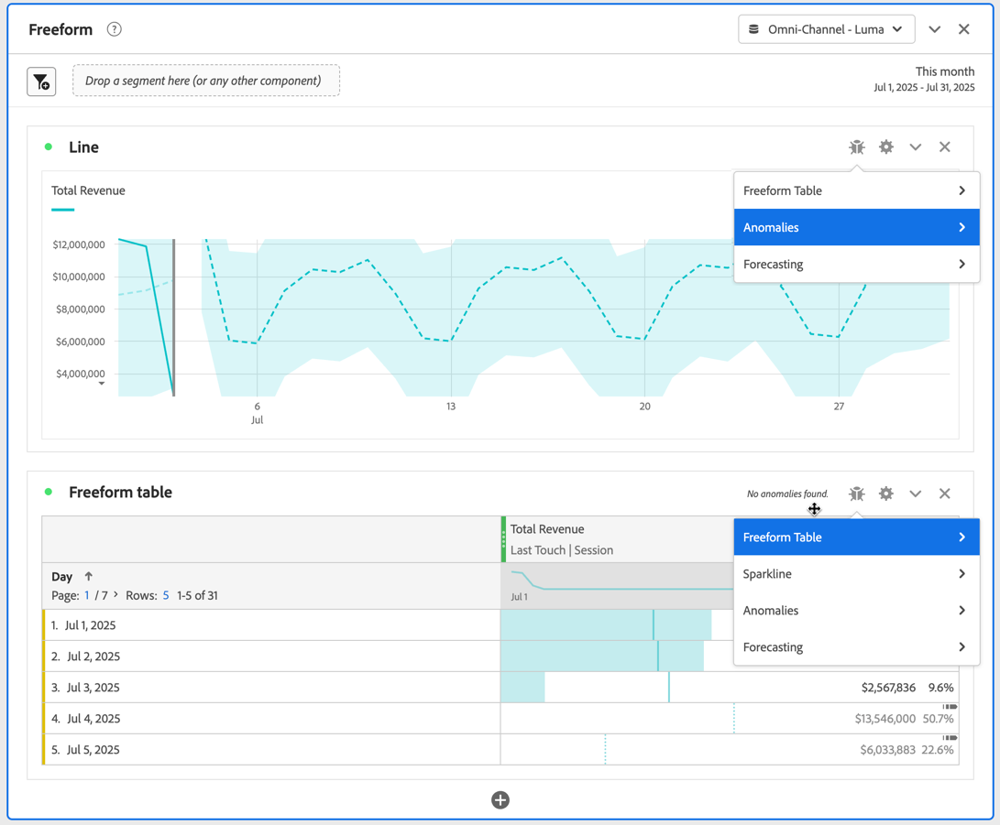
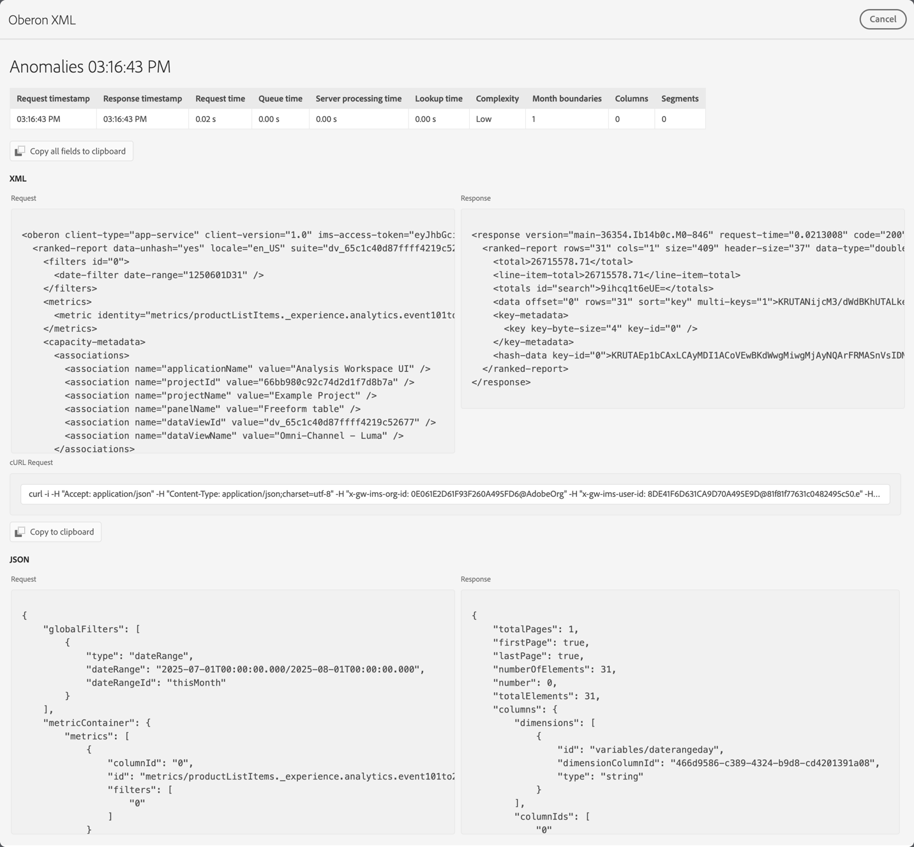

# プロジェクトデバッガー

プロジェクトデバッガーは、Analysis Workspaceのプロジェクトに関する問題のトラブルシューティングをAdobe サポートと連携して行う際に役立ちます。 Adobe サポートでは、デバッガーを有効にして、Adobe サポートで発生したチケットをトラブルシューティングするようにリクエストする場合があります。 問題の例は、ビジュアライゼーションの読み込み時間またはビジュアライゼーション内の壊れたコンポーネントです。

>[!NOTE]
>
>デバッガーを使用するには、プロジェクトに&#x200B;**編集**&#x200B;または&#x200B;**コピー** アクセスできる必要があります。
>

## デバッカーを有効にする

>[!IMPORTANT]
>
>デバッガーを有効にする前に、プロジェクトを保存します。
>

デバッガーを有効にするには：

1. Analysis Workspace プロジェクトメニューから「**[!UICONTROL Help]** > **[!UICONTROL Enable debugger]**」を選択します。
1. 「**[!UICONTROL デバッガーを有効にする]**」ダイアログで「**[!UICONTROL OK]**」を選択します。
1. ページまたはサイトの再読み込みを求めるメッセージがブラウザーに表示されたら、確認します。

## デバッガーの使用

デバッガーを有効にすると、プロジェクト内のすべてのビジュアライゼーションに追加の アイコンが表示されます。

特定のビジュアライゼーションにデバッガーを使用するには：

1. ビジュアライゼーションの上部にある「」を選択します。

   

1. コンテキストメニューから適切なアクションを選択します。 使用可能なアクションは、ビジュアライゼーションによって異なり、実行するデバッグのタイプを示します。 例えば、**[!UICONTROL 異常値]**&#x200B;を選択した場合、ビジュアライゼーションの異常値機能をデバッグします。
1. サブメニューから、タイムスタンプを選択します。
1. **[!UICONTROL Oberon XML]** デバッグウィンドウが開き、ビジュアライゼーションによって実行される特定の機能の詳細が表示されます。 異常値リクエストの出力の例については、以下を参照してください。

   

   詳細は次のとおりです。

   * **[!UICONTROL リクエストのタイムスタンプ]**
   * **[!UICONTROL 応答タイムスタンプ]**
   * **[!UICONTROL リクエスト時間]**
   * **[!UICONTROL キュー時間]**
   * **[!UICONTROL サーバー処理時間]**
   * **[!UICONTROL 検索時間]**
   * **[!UICONTROL 複雑さ]**
   * **[!UICONTROL 月の境界]**
   * **[!UICONTROL 列]**
   * **[!UICONTROL セグメント]**
   * **[!UICONTROL XML]** **[!UICONTROL 要求]**&#x200B;および&#x200B;**[!UICONTROL 応答]**
   * **[!UICONTROL cURL リクエスト]**
   * **[!UICONTROL JSON]** **[!UICONTROL 要求]**&#x200B;および&#x200B;**[!UICONTROL 応答]**

1.  **[!UICONTROL すべてのフィールドをクリップボード]**&#x200B;にコピーして、すべてのデバッグ情報をクリップボードにコピーします。 目的のエディターまたはツールに情報を貼り付けます。 情報は次の要素で構成されます。

   * XML (リクエスト)
   * XML (レスポンス)
   * JSON (リクエスト)
   * JSON (レスポンス)
   * cURL リクエスト

1. **[!UICONTROL cURL リクエスト]**&#x200B;の下の **[!UICONTROL クリップボードへのコピー]**&#x200B;を使用して、リクエストをクリップボードにコピーします。
1. **[!UICONTROL リクエスト]**&#x200B;または&#x200B;**[!UICONTROL 応答]**&#x200B;のテキスト領域のいずれかにカーソルを合わせて表示し、 **[!UICONTROL クリップボードにコピー]**&#x200B;を選択して、そのテキスト領域（XMLまたはJSON）の内容をクリップボードにコピーします。

1. コピーした情報と、Analysis Workspace プロジェクトのビジュアライゼーションのトラブルシューティングを行うためにAdobe サポートが要求した情報を交換します。

1. 「**[!UICONTROL キャンセル]**」を選択して&#x200B;**[!UICONTROL Oberon XML]** デバッグウィンドウを閉じ、プロジェクトに戻ります。

トラブルシューティングする他のビジュアライゼーションについて、上記の手順を繰り返します。

## デバッガーを無効にする

>[!IMPORTANT]
>
>デバッガーを無効にする前に、プロジェクトに加えた変更を保存し、デバッグ演習の一部として保持します。
>

デバッガーを無効にするには：

1. Analysis Workspace プロジェクトメニューから「**[!UICONTROL ヘルプ]**」 > 「**[!UICONTROL デバッガーを無効にする]**」を選択します。
1. 「**[!UICONTROL デバッガーを無効にする]**」ダイアログで「**[!UICONTROL OK]**」を選択します。
1. ページまたはサイトの再読み込みを求めるメッセージがブラウザーに表示されたら、確認します。
