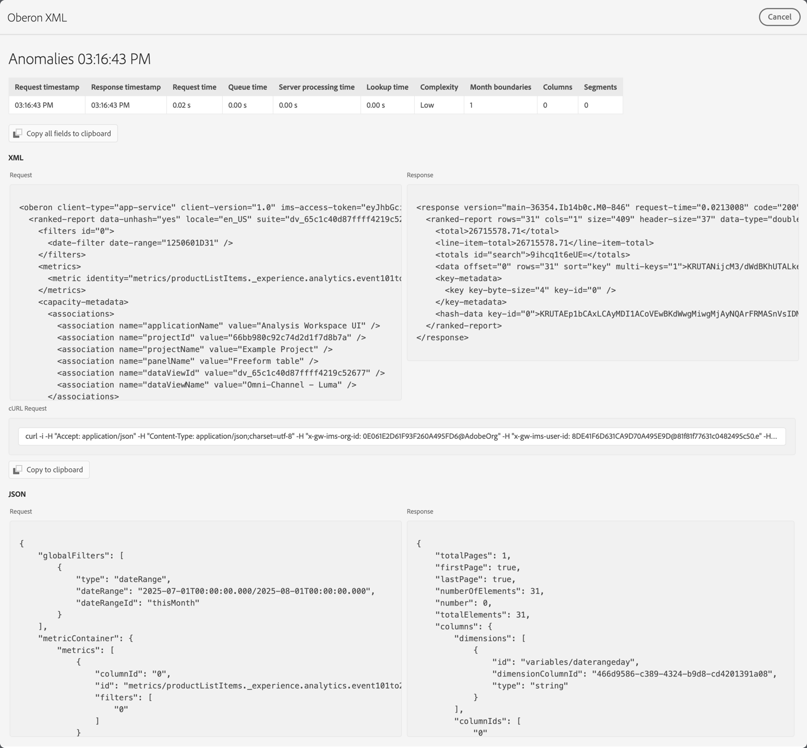

# プロジェクトデバッガー

プロジェクトデバッガーは、ユーザーとAdobe サポートがAnalysis Workspaceのプロジェクトに関する問題をトラブルシューティングするのに役立ちます。 Adobe サポートから、Adobe サポートで発生したチケットのトラブルシューティングをデバッガーで実行できるようにするようリクエストされる場合があります。 問題の例としては、ビジュアライゼーションの読み込み時間や、ビジュアライゼーション内のコンポーネントの破損があります。

>[!NOTE]
>
>デバッガーを使用するには、プロジェクトに対する **編集** または **コピー** アクセス権が必要です。
>

## デバッガーの有効化

>[!IMPORTANT]
>
>デバッガーを有効にする前に、プロジェクトを保存します。
>

デバッガーを有効にするには：

1. Analysis Workspace プロジェクトメニューから **[!UICONTROL ヘルプ]**/**[!UICONTROL デバッガーを有効にする]** を選択します。
1. **[!UICONTROL デバッガーを有効にする]** ダイアログで **[!UICONTROL OK]** を選択します。
1. ブラウザーからページまたはサイトのリロードを求められたら、確定します。

## デバッガーの使用

デバッガーを有効にすると、プロジェクト内のすべてのビジュアライゼーションに  アイコンが追加されます。

特定のビジュアライゼーションにデバッガーを使用するには：

1. ビジュアライゼーションの上部にある「」を選択します。

   

1. コンテキストメニューから適切なアクションを選択します。 使用可能なアクションはビジュアライゼーションによって異なり、実行するデバッグのタイプを示します。 例えば、「**[!UICONTROL 異常値]** を選択した場合、ビジュアライゼーションで異常値機能をデバッグします。
1. サブメニューから、タイムスタンプを選択します。
1. **[!UICONTROL Oberon XML]** デバッグウィンドウが開き、ビジュアライゼーションによって実行された特定の機能の詳細が表示されます。 異常値リクエストの出力の例については、以下を参照してください。

   

   詳細は次のとおりです。

   * **[!UICONTROL 要求タイムスタンプ]**
   * **[!UICONTROL 応答タイムスタンプ]**
   * **[!UICONTROL リクエスト時間]**
   * **[!UICONTROL キュー時間]**
   * **[!UICONTROL サーバー処理時間]**
   * **[!UICONTROL 参照時間]**
   * **[!UICONTROL 複雑さ]**
   * **[!UICONTROL 月の境界]**
   * **[!UICONTROL 列]**
   * **[!UICONTROL セグメント]**
   * **[!UICONTROL XML]** **[!UICONTROL Request]** および **[!UICONTROL Response]**
   * **[!UICONTROL cURL リクエスト]**
   * **[!UICONTROL JSON]** **[!UICONTROL Request]** および **[!UICONTROL Response]**

1. **[!UICONTROL Copy all field to clipboard]** を使用して、すべてのデバッグ情報をクリップボードにコピーします。 目的のエディターまたはツールに情報を貼り付けます。 情報は以下で構成されます。

   * XML (リクエスト)
   * XML (レスポンス)
   * JSON (リクエスト)
   * JSON (レスポンス)
   * cURL リクエスト

1.  の下の **[!UICONTROL コピー]**&#x200B;**[!UICONTROL クリップボードにコピー]** を使用して、リクエストをクリップボードにコピーします。
1. **[!UICONTROL リクエスト]** または **[!UICONTROL 応答]** テキスト領域にポインタを合わせて、表示する  **[!UICONTROL クリップボードにコピー]** を選択して、そのテキスト領域の内容（XML または JSON）をクリップボードにコピーします。

1. コピーした情報や、Adobe サポートからAnalysis Workspace プロジェクトのビジュアライゼーションのトラブルシューティングをリクエストされた情報を交換します。

1. 「**[!UICONTROL キャンセル]**」を選択して **[!UICONTROL Oberon XML]** デバッグウィンドウを閉じ、プロジェクトに戻ります。

トラブルシューティングを行う他のビジュアライゼーションに対して、上記の手順を繰り返します。

## デバッガーの無効化

>[!IMPORTANT]
>
>デバッガーを無効にする前に、プロジェクトに加えた変更を保存し、デバッグ演習の一部として保持します。
>

デバッガーを無効にするには：

1. Analysis Workspace プロジェクトメニューから **[!UICONTROL ヘルプ]**/**[!UICONTROL デバッガーを無効にする]** を選択します。
1. **[!UICONTROL デバッガーを無効にする]** ダイアログで **[!UICONTROL OK]** を選択します。
1. ブラウザーからページまたはサイトのリロードを求められたら、確定します。
