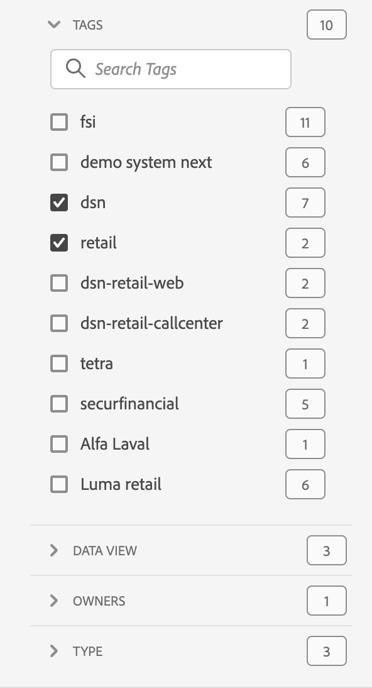

# プロジェクトの概要

Workspace プロジェクトでは、パネル、ビジュアライゼーション、コンポーネントを組み合わせて、分析を作成し、組織内の任意のユーザーと共有できます。最初のプロジェクトを開始する前に、プロジェクトへのアクセス方法、プロジェクト間の移動方法、およびプロジェクトの管理方法について説明します。

Adobe Analyticsのプロジェクトにアクセスするには、「**[!UICONTROL Workspace]**」を選択します。  **[!UICONTROL プロジェクト]**&#x200B;マネージャーには、自分が所有するすべてのプロジェクトまたは共有されているプロジェクトが一覧表示されます。環境設定で特に指定しない限り、プロジェクトリストを持つプロジェクトマネージャーもAdobe Analyticsのデフォルトのランディングページになります。

## タイトル領域

タイトル領域内 ➊ から、プロジェクトの作成、フォルダーの作成、環境設定の編集、追加タイルなどのパネルの表示／非表示を行うことができます。

* 左側のパネルの表示／非表示を切り替えて、**[!UICONTROL プロジェクト]**&#x200B;と&#x200B;**[!UICONTROL 学習]**&#x200B;から選択できるようにするには、「」を選択します。
* タイトルにはプロジェクトが表示され、オプションで選択したフォルダーへのパスが追加されます。[!UICONTROL プロジェクト]／**[!UICONTROL 会社フォルダー]**&#x200B;などです。個々のサブフォルダー部分を選択すると、特定のフォルダーに直接移動することができます。
* [**[!UICONTROL &#x200B; 空のプロジェクト &#x200B;]**](create-projects.md)、[**[!UICONTROL &#x200B; 空のモバイルスコアカード &#x200B;]**](/help/analyze/mobile-app/create-scorecard.md)、**[!UICONTROL ドキュメントを開く]** および **[!UICONTROL リリースノートを開く]** のタイルを表示するには、**[!UICONTROL さらに表示]** を選択します。 タイルで領域を非表示にするには、、**[!UICONTROL 表示を減らす]**&#x200B;の順に選択します。
* 表示する内容に応じて、[表示セレクター](#show-selector)を使用して、環境設定を編集し、**[!UICONTROL プロジェクト]**&#x200B;に表示されている現在のフォルダーに対するアクションを実行できます。

  | アクション | 説明 |
  |---|---|
  | **[!UICONTROL プロジェクトの作成]** | [新しいプロジェクトを作成](create-projects.md)する場合に選択します。 |
  | **[!UICONTROL フォルダーを作成]** | [新しいフォルダーを作成](workspace-folders/create-folders.md)する場合に選択します。 |
  | 、**[!UICONTROL 環境設定を編集]** | すべてのプロジェクトの[環境設定を編集](/help/analyze/analysis-workspace/user-preferences.md)します。パンくずリストのスペースが制限される場合、このアクションはサブメニューの一部になります。 |
  | **[!UICONTROL プロジェクトを追加]** | 現在のフォルダーに[プロジェクトを追加](workspace-folders/add-projects.md)する場合に選択します。パンくずリストのスペースが制限される場合、このアクションはサブメニューの一部になります。 |
  | **[!UICONTROL フォルダーの名前を変更]** | 現在のフォルダーの[名前を変更](workspace-folders/manage-folders.md#rename-folders)します。 |
  | **[!UICONTROL フォルダーを移動]** | 現在のフォルダーを[移動](workspace-folders/manage-folders.md#move-folders)します。 |
  | **[!UICONTROL フォルダーを削除]** | 現在のフォルダーを[削除](workspace-folders/manage-folders.md#delete-folders)します。 |

## プロジェクトリスト

プロジェクトリスト ➋ には、自分が所有しているすべてのプロジェクトと、共有されているプロジェクトが表示されます。リストには、次の列があります。

| 列 | 説明 |
| --- | --- | 
|  | 1 つ以上のプロジェクトを選択すると、プロジェクトインターフェイスの下部に青いアクションバーが表示されます。詳しくは、[アクション](#actions)を参照してください。 |
|  | プロジェクト「」を優先するか、「」を優先しないかを選択します。 |
| **[!UICONTROL タイトルと説明]** | プロジェクトを編集するには、タイトルリンクを選択して、[Workspace プロジェクト](/help/analyze/analysis-workspace/home.md)を開きます。共有されているプロジェクトには、と表示されます。 を選択すると、プロジェクトの詳細を含むポップアップメニューが表示されます。 を選択すると、アクションを含むコンテキストメニューが開きます。詳しくは、[アクション](#actions)を参照してください。 |
| **[!UICONTROL タイプ]** | Workspace プロジェクト、 フォルダーまたは[モバイルスコアカード](/help/analyze/mobile-app/home.md)。 |
| **[!UICONTROL タグ]** | プロジェクトに適用されたタグ。 |
| **[!UICONTROL スケジュール済み]** | プロジェクトが受信者にメールで送信されるようにスケジュールされているかどうか。 オプションは、 **[!UICONTROL オン]**&#x200B;または  **[!UICONTROL オフ]**&#x200B;です。 [他のユーザーへのプロジェクトデータの送信](/help/analyze/analysis-workspace/curate-share/t-schedule-report.md)を参照してください。 |
| **[!UICONTROL 共有リンク（任意のユーザー）]** | Analysis Workspace へのアクセス権を持たない人物を含め、プロジェクトを任意のユーザーと共有するかどうか。オプションは、 **[!UICONTROL アクティブ]**&#x200B;または  **[!UICONTROL 非アクティブ]**&#x200B;です。詳しくは、[プロジェクトの共有](/help/analyze/analysis-workspace/curate-share/share-projects.md)の[任意のユーザーとのプロジェクトの共有（ログイン不要）](/help/analyze/analysis-workspace/curate-share/share-projects.md#share-a-project-with-anyone-no-login-required)を参照してください。 |
| **[!UICONTROL プロジェクトの役割]** | プロジェクトでの自分の役割。オプションは、編集、複製、表示です。詳しくは、[プロジェクトの役割](/help/analyze/analysis-workspace/curate-share/curate.md)を参照してください。 |
| **[!UICONTROL レポートスイート]** | プロジェクトが関連付けられているレポートスイート。 |
| **[!UICONTROL 所有者]** | このプロジェクトを作成したユーザー（ユーザー自身、またはユーザー自身とそのプロジェクトを共有した他のユーザー）。 |
| **[!UICONTROL 共有先]** | プロジェクトが共有されているユーザー。 |
| **[!UICONTROL 最終変更日時]** | プロジェクトが最後に変更された日付。 |
| **[!UICONTROL 前回開いた日時]** | プロジェクトが最後に開かれた日時。 |
| **[!UICONTROL コンポーネント ID]** | コンポーネントの ID。 |
| **[!UICONTROL 最長の日付範囲]** | プロジェクト内の任意のパネルまたはビジュアライゼーションの最長の日付範囲。 |
| **[!UICONTROL クエリ数]** | プロジェクトに含まれるクエリの合計数。 |
| **[!UICONTROL 場所]** | プロジェクトが存在するフォルダー。 |

任意の列ヘッダーにポインタを合わせて  を表示し、コンテキストメニューから次の項目を選択します。

* **[!UICONTROL 昇順で並べ替え]**
* **[!UICONTROL 降順で並べ替え]**
* **[!UICONTROL 列をサイズ変更]**。列をサイズ変更するのに役立つ青色の線が表示されます。

### アクション

コンテキストメニューの  または青色のアクションバーを使用して、1 つ以上のプロジェクトに対してアクションを実行できます。

| アイコン | アクション | 説明 |
|:---:| ---|---|
|  | **[!UICONTROL *x *個を選択済み]** | 選択したプロジェクトとフォルダーを選択解除し、青色のアクションバーを削除します。 |
|  | **[!UICONTROL 削除]** | 1 つ以上のプロジェクトまたはフォルダーを削除します。確認メッセージが表示されます。 
削除するプロジェクト：
<ul><li>復元できません</li><li>がプロジェクトリストから削除されました</li><li>URL でアクセスできなくなりました</li><li>スケジュールされた配信に含まれなくなりました（以前にスケジュールされた配信用に設定されていた場合）   スケジュールされた配信について詳しくは、[ スケジュールされたプロジェクト ](/help/components/scheduled-projects-manager.md) を参照してください。  
 |
|  | **[!UICONTROL 共有]** | プロジェクトを共有します。詳しくは、[プロジェクトの共有](/help/analyze/analysis-workspace/curate-share/share-projects.md)を参照してください。 |
|  | **[!UICONTROL 名前変更]** | プロジェクトの名前を変更します。**[!UICONTROL 名前変更：*プロジェクト名ダイアログ&#x200B;*]**&#x200B;を開きます。新しい名前を入力し、「**[!UICONTROL 保存&#x200B;]**」を選択します。 |
|  | **[!UICONTROL コピー]** | 1 つ以上のプロジェクトをコピーします。プロジェクトには同じ名前とサフィックスの `(Copy)` が付けられます。 |
|  | **[!UICONTROL ピン留め]**&#x200B;または&#x200B;**[!UICONTROL ピン留め解除]** | 1 つ以上のプロジェクトまたはフォルダーをピン留めまたはピン留め解除します。ピン留めしたプロジェクトとフォルダーはリストの上部に表示され、指定した並べ替え順序は無視されます。 |
|  | **[!UICONTROL 上へ移動]** | ピン留めしたプロジェクトまたはフォルダーをプロジェクトリスト内で上に移動します。 |
|  | **[!UICONTROL 下へ移動]** | ピン留めしたプロジェクトまたはフォルダーをプロジェクトリスト内で下に移動します。 |
|  | **[!UICONTROL タグ]** | 1 つ以上のプロジェクトまたはフォルダーにタグを付けます。1 つ以上のタグを選択するための&#x200B;**[!UICONTROL タグコンポーネント]**&#x200B;ダイアログが表示されます。「**[!UICONTROL 保存]**」を選択して、選択したプロジェクトまたはフォルダーのタグを保存します。 |
|  | **[!UICONTROL 承認]**&#x200B;または&#x200B;**[!UICONTROL 未承認]** | プロジェクトを承認または未承認にします。管理者のみがプロジェクトを承認できます。 |
|  | **[!UICONTROL CSV を書き出し]** | 選択したプロジェクトを `Project List.csv` という名前の CSV ファイルに書き出します。 |
|  | **[!UICONTROL プロジェクトを追加]** | 選択したフォルダーに 1 つ以上のプロジェクトを追加します。**[!UICONTROL プロジェクトを追加]**&#x200B;で、1 つ以上のプロジェクトを選択できます。「**[!UICONTROL 追加]**」を選択して、プロジェクトをフォルダーに追加します。詳しくは、[フォルダーへのプロジェクトの追加](workspace-folders/add-projects.md#from-inside-a-folder)を参照してください。 |
|  | **[!UICONTROL 移動先]** | 選択した 1 つ以上のプロジェクトをフォルダーに移動します。**[!UICONTROL フォルダーを選択]**&#x200B;で、選択したプロジェクトを移動するフォルダーを選択し、「**[!UICONTROL 移動]**」を選択します。詳しくは、[フォルダーへのプロジェクトの追加](workspace-folders/add-projects.md#from-the-project-list)を参照してください。 |

## 表示セレクター

**[!UICONTROL 表示]**&#x200B;セレクター➌を使用して、プロジェクトインターフェイスのルックアンドフィールを切り替えることができます。**[!UICONTROL 表示]**&#x200B;セレクターでは、[タイトル領域](#title-area)で使用できるオプションと、[プロジェクトリスト](#project-list)に表示される列を定義します。

* [タイトル領域](#title-area)で使用可能なオプションを変更するには、「**[!UICONTROL すべてのプロジェクトを]**&#x200B;**[!UICONTROL 表示]**」または「**[!UICONTROL フォルダーとプロジェクトを]**&#x200B;**[!UICONTROL 表示]**」を選択します。

* [プロジェクトリスト](#project-list)に表示する列を定義するには、 を選択し、**[!UICONTROL テーブルをカスタマイズ]**&#x200B;ダイアログから列を選択または選択解除します。 「**[!UICONTROL 適用]**」を選択して、カスタマイズを適用します。列について詳しくは、[プロジェクトリスト](#project-list)を参照してください。

## フィルターパネル

フィルターパネル ➍ を使用して、[プロジェクトリスト](#project-list)のプロジェクトとフォルダーをフィルタリングできます。フィルターパネルを表示または非表示にするには、 を使用します。

フィルターパネルは、次のセクションで構成されています。

### タグ

| タグ | 説明 |
|---|---|
| {width="300"} | 「**[!UICONTROL タグ]**」セクションでは、タグでフィルタリングできます。 <ul><li>フィルタリングに使用するタグを検索するには、 *タグを検索*&#x200B;を使用します。</li><li>複数のタグを選択できます。使用できるタグは、フィルターパネルの他のセクションでの選択によって異なります。</li><li>数値は次の内容を示します。<ul><li>**2︎⃣**：現在のフィルターによって生成されたプロジェクトに使用できるタグ数。</li><li>7︎⃣：特定のタグに関連付けられているプロジェクト数。</li></ul></li></ul> |

### レポートスイート

| レポートスイート | 説明 |
|---|---|
| {width="300"} | 「**[!UICONTROL レポートスイート]**」セクションでは、レポートスイートをフィルタリングできます。 <ul><li>*レポートスイートを検索* を使用して、フィルタリングに使用するレポートスイートを検索します。</li><li>複数のレポートスイートを選択できます。 使用可能なレポートスイートは、フィルターパネルの他のセクションでの選択内容によって異なります。</li><li>数値は次の内容を示します。<ul><li>**3︎⃣**：現在のフィルターによって生成されたプロジェクトで使用できるレポートスイートの数。</li><li>4︎⃣：特定のレポートスイートに関連付けられているプロジェクトの数。</li></ul></li></ul> |

### 所有者

| 所有者 | 説明 |
|---|---|
| {width="300"} | 「**[!UICONTROL 所有者]**」セクションでは、所有者でフィルタリングできます。 <ul><li>フィルタリングに使用する所有者を検索するには、 *所有者を検索*&#x200B;を使用します。</li><li>複数の所有者を選択できます。使用できる所有者は、フィルターパネルの他のセクションでの選択によって異なります。</li><li>数値は次の内容を示します。<ul><li>**3︎⃣**：現在のフィルターによって生成されたプロジェクトに使用できる所有者数。</li><li>4︎⃣：特定の所有者に関連付けられているプロジェクト数。</li></ul></li></ul> |

### タイプ

| タイプ | 説明 |
|---|---|
| {width="300"} | 「**[!UICONTROL タイプ]**」セクションでは、プロジェクトやフォルダーのタイプでフィルタリングできます。<ul><li>次のオプションから 1 つ以上を選択できます。<ul><li> **[!UICONTROL フォルダー]**</li><li>**[!UICONTROL ワークスペースプロジェクト]**</li><li>**[!UICONTROL モバイルスコアカード]**</li></ul> <li>複数のフィルターを選択できます。使用できるその他のフィルターは、フィルターパネルの他のセクションでの選択によって異なります。</li><li>数値は次の内容を示します。<ul><li>**5︎⃣**：現在のフィルターによって生成されたプロジェクトに使用できるその他のフィルター数。</li><li>4︎⃣：特定のその他のフィルターに関連付けられているプロジェクト数。</li></ul></li></ul> |

### その他のフィルター

| その他のフィルター | 説明 |
|---|---|
| {width="300"} | 「**[!UICONTROL その他のフィルター]**」セクションでは、他の定義済みフィルターでフィルタリングできます。<ul><li>次のオプションから 1 つ以上を選択できます。<ul><li> **[!UICONTROL すべてを表示]**</li><li>**[!UICONTROL 自分と共有済み]**</li><li>**[!UICONTROL 自分が所有]**</li><li>**[!UICONTROL 承認済み]**</li><li>**[!UICONTROL お気に入り]**</li></ul> 選択できる内容は、役割と権限によって異なります。</li><li>複数のフィルターを選択できます。使用できるその他のフィルターは、フィルターパネルの他のセクションでの選択によって異なります。</li><li>数値は次の内容を示します。<ul><li>**5︎⃣**：現在のフィルターによって生成されたプロジェクトに使用できるその他のフィルター数。</li><li>4︎⃣：特定のその他のフィルターに関連付けられているプロジェクト数。</li></ul></li></ul> |

## 検索

「」フィールドを使用してプロジェクトとフォルダーを検索するには、検索領域 ➎ を使用します。入力を開始すると、[プロジェクトリスト](#project-list)が検索入力に基づいて自動的にフィルタリングされます。

また、検索領域には、フィルターパネルから適用されたフィルターも表示されます。

* フィルターを削除するには、フィルターで  を選択します。
* すべてのフィルターを削除するには、「すべてクリア」を選択します。

個々のフィルターを表示するスペースが制限されている場合は、「**[!UICONTROL *x* 個のフィルターでセグメント化]**」と表示されます。

* フィルターを削除するには：

   1. **[!UICONTROL *x *個のフィルター]** を使用して、フィルターのタイプと個々のフィルターを一覧表示するコンテキストメニューを開きます。
   1.  を使用して、タグを削除します。

<!--

# Projects overview

Workspace projects allow you to combine data components, tables and visualizations to craft your analysis and share with anyone in your organization. Before starting your first project, learn about how to access, navigate and manage your projects. 

Here is a video on how to build a Workspace project:

>[!BEGINSHADEBOX]

See  [Build a Workspace project](https://video.tv.adobe.com/v/3416041?quality=12&learn=on&captions=jpn){target="_blank"} for a demo video.

>[!ENDSHADEBOX]

## Project list {#project-list}

When you first go to **[!UICONTROL Analytics]** > **[!UICONTROL Workspace]**, the page lists all the projects you own or have been shared to you. This page is also the landing page for Adobe Analytics, unless you have previously set a custom landing page. 

The Projects page contains the following information: 

|  Element  | Description  |
|---|---|
| [Edit preferences](/help/analyze/analysis-workspace/user-preferences.md) | Manage settings for Analysis Workspace and its related components for all new projects or panels that you create.  |
| [Create folder](/help/analyze/analysis-workspace/build-workspace-project/workspace-folders/create-folders.md)  | Add a new folder or subfolder to the list of projects and folders. |
| [Create project](/help/analyze/analysis-workspace/build-workspace-project/create-projects.md)  | Start a new project from scratch or from a report.  |
|  Show more  | This selection reveals options for creating a blank project or mobile scorecard, [viewing training tutorials](https://experienceleague.adobe.com/ja/docs/analytics-learn/tutorials/analysis-workspace/analysis-workspace-basics/analysis-workspace-introduction), or [viewing release notes](/help/release-notes/latest.md).  |
|  | To show or hide filters. You can filter on tags, report suite, owners, type (project, folder, mobile scorecard), and other filters. | 
|  | Use the search field to search for folders, Workspace projects or mobile scorecards. |
| Show Folders & Projects| Choose whether to show the folder structure of projects. For more information, see [About Folders in Analytics](/help/analyze/analysis-workspace/build-workspace-project/workspace-folders/about-folders.md). |
|   | This icon allows you to customize the columns you see for each project in the projects list.  |

The list of projects can display the following columns:

|  Column  | Description  |
|---|---|
| [!UICONTROL Name]  | Name of the Workspace project. Select  to show a popup with more details on a project or folder. Select  to show actions available. See [Manage projects](#manage-projects) for more details.  | 
| [!UICONTROL Type] | Indicates whether this entry is a Workspace project, a folder, or a [Mobile scorecard](https://experienceleague.adobe.com/ja/docs/analytics/analyze/mobapp/home). |
| [!UICONTROL Tags]  |Tags that were applied to the project.  |
| [!UICONTROL Scheduled] | Indicates whether projects are scheduled to be emailed to recipients. See [Schedule projects](/help/analyze/analysis-workspace/curate-share/t-schedule-report.md). |
| Shared link (anyone) | Projects can be shared with anyone, even with people who don't have access to Analysis Workspace. This column shows whether projects have been shared in this way. See [Share a project with anyone (no login required)](/help/analyze/analysis-workspace/curate-share/share-projects.md#share-public-link) in [Share projects](/help/analyze/analysis-workspace/curate-share/share-projects.md) for more information. |
| [Project Role](https://experienceleague.adobe.com/ja/docs/analytics/analyze/analysis-workspace/curate-share/share-projects) | Indicates your role for the project - owners, edit, duplicate, view. |
| [!UICONTROL Report suite] | The report suite that the project is associated with. |
| [!UICONTROL Owner]  | The person who created this project (either you or someone who shared the project with you.)  |
| [!UICONTROL Shared with]  | Users that the project has been shared with.  |
| [!UICONTROL Last Modified]  | Date and time when the project was last modified.  |
| [!UICONTROL Last Opened]  | Date and time when the project was last opened.  |
| [!UICONTROL Last Used] | Date and time when the project was last used. | 
| [!UICONTROL Project ID]  | The ID of the project.  |
| [!UICONTROL Longest Date Range]  | The longest date range of the project.  |
| [!UICONTROL Number of Queries]  | The total number of queries contained in the project.  |
| [!UICONTROL Location]  | The folder where the project resides.  |

### Manage projects

To manage projects, select one or more projects from the project list. 

From the blue action bar, you can select the following actions:

| Action | Description | 
|---|---|
|  Delete | When selected, a confirmation dialog prompts you to confirm the deletion of a Workspace project or Mobile scorecard. Select **[!UICONTROL OK]** to confirm. |
|  Share | This action allows you to share your project. See [Share projects](../curate-share/share-projects.md).|
|  Rename | Opens up a **[!UICONTROL Rename: *name*]** dialog to rename your project. Select **[!UICONTROL Save]** to save the new name for the project. |
|  Copy | Immediately copies the selected project to a new project with name *original name* (Copy).  |
|  Pin | Immediately pins the project to the top of the list. Adds the  indicator. |
|  Tag | Opens up the **[!UICONTROL Tag Project]** dialog. You can select an existing tag or add new tags. Select **[!UICONTROL Save]** to save the tags for the project. |
|  Approve or Unapprove |  Approves or unapproves the project.  |
|  Export CSV | Immediately downloads a file containing a comma-separated value list of the projects. |
|  Move to | This action allows you to move the project to a folder. In the **[!UICONTROL Select Folder]** dialog, select a folder from the **[!UICONTROL Folder]** list, and select **[!UICONTROL Move]**. | 

## Menu bar {#menu-bar}

Within a project, the menu provides options for managing your project, adding components, finding help, and more. You can also access each menu option by keyboard [shortcuts](https://experienceleague.adobe.com/ja/docs/analytics/analyze/analysis-workspace/build-workspace-project/fa-shortcut-keys).

|  Menu item  | Description  |
|---|---|
|  Project  | This menu includes common actions for project management, including New, Open, Save, Save as, and [Save as company report](/help/analyze/analysis-workspace/build-workspace-project/starter-projects.md). You can also refresh the entire project to retrieve the most recent data and definitions by clicking Refresh Project. [Download CSV and PDF](https://experienceleague.adobe.com/ja/docs/analytics/analyze/analysis-workspace/curate-share/download-send) options enable you to export data from Workspace. [Project Info & Settings](https://experienceleague.adobe.com/ja/docs/analytics/analyze/analysis-workspace/build-workspace-project/freeform-overview) offers many options for managing your project.  |
|  Edit  | Undo or redo your last action. Clear All resets your project to a blank starting point. |
|  Insert  | Insert new panels or visualizations from this menu. You can also insert new panels and visualizations from the left rail.  |
|  [Components](https://experienceleague.adobe.com/ja/docs/analytics/analyze/analysis-workspace/components/analysis-workspace-components)  | Create new segment, calculated metric, date range, or alert components from your project. You can also create new components from the left rail. If your component definitions have recently changed, Refresh Components retrieves the latest definitions. |
|  [Share](https://experienceleague.adobe.com/ja/docs/analytics/analyze/analysis-workspace/curate-share/send-schedule-files)  | Curate, share and schedule PDF/CSV projects to recipients in your organization.  |
|  Help  | Access help documentation, videos, and the Analytics [Experience League community](https://experienceleaguecommunities.adobe.com/t5/adobe-analytics/ct-p/adobe-analytics-community?profile.language=ja). Manage the visibility of Workspace tips as well as the [debugger](https://developer.adobe.com/analytics-apis/docs/2.0/). Find details about Workspace and factors that impact project [performance](https://experienceleague.adobe.com/ja/docs/analytics/analyze/analysis-workspace/workspace-faq/optimizing-performance).  |
|  Share button or Owner  | If you are in an Own or Edit for the project, the Share button in the top-right gives you one-click access to manage your project recipients. If you are in a Duplicate or View role for the project, you see the project owner's name. |

### Project Info & Settings {#info-settings}

>[!CONTEXTUALHELP]
>id="workspace_project_countrepeatinstances"
>title="Count repeat instances"
>abstract="Specifies whether repeat instances are counted in reports.  Note: this setting does not apply to Flow or Fallout visualizations."

>[!CONTEXTUALHELP]
>id="workspace_project_repeatinstances"
>title="Count repeat instances"
>abstract="Specifies whether repeat instances are counted in reports. Note: this setting does not apply to Flow or Fallout visualizations."

>[!CONTEXTUALHELP]
>id="workspace_project_commenting"
>title="Allow commenting"
>abstract="When enabled, a comments area is available in the right rail of the project in Analysis Workspace."

**[!UICONTROL Workspace]** > **[!UICONTROL Project]** > **[!UICONTROL Project Info & settings]** provides project-level information on the currently active project.

Settings include:

|  Setting  | Description  |
|---|---|
|  Project Name  | The name given to the project. You can double-click the name to edit it.  |
|  Owner  | Project owner name  |
|  Last Modified  | Date of last modification to the project.  |
|  Tags  |Lists any tags applied to a project for easier categorization.  |
|  Description  | A description is useful for clarifying the purpose of a project. You can double-click the description to edit it.  |
|  Count repeat instances  | Specifies whether repeat instances are counted in reports. For example, this setting (when activated) treats multiple consecutive pages views to the same page as multiple page views. With it off, they count as a single page view (this setting only affects certain metrics, such as Single Page Visits). **Note**: This setting does not apply to Flow or Fallout visualizations.  |
| [Show annotations](/help/analyze/analysis-workspace/components/annotations/overview.md) | Specify whether to show annotations in the project or not. |
|  [Project color palette](https://experienceleague.adobe.com/ja/docs/analytics/analyze/analysis-workspace/build-workspace-project/color-palettes)  | You can change the categorical color palette used in Workspace, by choosing from out-of-the-box palettes that have been optimized for color blindness, or by specifying your custom palette. This feature affects many things in Workspace, including most visualizations.  |
| [View Density](https://experienceleague.adobe.com/ja/docs/analytics/analyze/analysis-workspace/build-workspace-project/view-density) | Lets you see more data on the screen by reducing the vertical padding of the left rail, freeform tables and cohort tables. |

## Left rail {#left-rail}

Within a project, various icons are available in the left rail, and each represents important tools to build your project:

| Icon | Functionality |
|---|---|
|  | [Panels](/help/analyze/analysis-workspace/c-panels/panels.md) |
|  |[Visualizations](/help/analyze/analysis-workspace/visualizations/freeform-analysis-visualizations.md) |
|  | [Components](/help/analyze/analysis-workspace/components/analysis-workspace-components.md) |
|  | [Data dictionary](/help/analyze/analysis-workspace/components/data-dictionary/data-dictionary-overview.md) |
|  | [Table of contents](/help/analyze/analysis-workspace/build-workspace-project/project-table-of-contents.md) |

Components (dimensions, metrics, segments, date ranges) in the left rail relate to the active panel data view. A blue border identifies the active panel, and the active report suite is listed at the top of the component rail.

## Right-click menu

Here is a video on using the right-click menu in Analysis Workspace:

>[!BEGINSHADEBOX]

See  [Using the context menu](https://video.tv.adobe.com/v/327456?quality=12&learn=on&captions=jpn){target="_blank"} for a demo video.

>[!ENDSHADEBOX]

## Project canvas {#canvas}

The project canvas is where you bring together panels, tables, visualizations, and components to build your analysis. A project can contain many panels, and each panel can contain many tables and visualizations.

Panels are helpful when you want to organize your projects according to time periods, report suites, or analysis use case. The active panel has a colored border around it, and determines what components are available in the left rail.

Depending on the starting point you chose for your projects, you either have a [freeform table](https://experienceleague.adobe.com/ja/docs/analytics/analyze/analysis-workspace/visualizations/freeform-table/freeform-table) or a [blank panel](https://experienceleague.adobe.com/ja/docs/analytics/analyze/analysis-workspace/panels/blank-panel) in the canvas to begin with. The quickest way to start analyzing is to select one or many components and simply drag & drop them into the project canvas. A table of data is rendered automatically for you. [Learn more](https://experienceleague.adobe.com/ja/docs/analytics/analyze/analysis-workspace/visualizations/freeform-table/freeform-table) about the different options for building a table, or leverage the available [training tutorial](https://experienceleague.adobe.com/ja/docs/analytics/analyze/analysis-workspace/home) for more guidance on building your first project.

-->