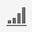

# プロジェクトの概要

Workspace プロジェクトでは、データコンポーネント、テーブル、およびビジュアライゼーションを組み合わせて、分析を作成し、組織内の任意のユーザーと共有できます。最初のプロジェクトを開始する前に、プロジェクトへのアクセス方法、プロジェクト間の移動方法、およびプロジェクトの管理方法について説明します。

以下は、Workspace プロジェクトの構築方法に関するビデオです。

>[!VIDEO](https://video.tv.adobe.com/v/334076/?quality=12)

## プロジェクトリスト {#project-list}

最初に **[!UICONTROL Analytics]**／**[!UICONTROL Workspace]** に移動すると、自分が所有するプロジェクトまたは自分と共有されているプロジェクトがすべて一覧表示されます。これは、以前にカスタムのランディングページを設定した場合を除き、Adobe Analytics のランディングページでもあります。

プロジェクト ページには、次の情報が含まれます。

>[!NOTE]
>
>デフォルトでは表示されない列もあります。 表示される列をカスタマイズするには、 **テーブルをカスタマイズ** アイコン .

| 要素 | 説明 |
|---|---|
| [環境設定を編集](/help/analyze/analysis-workspace/user-preferences.md) | 作成するすべての新規プロジェクトまたはパネルについて、Analysis Workspaceおよびその関連コンポーネントの設定を管理します。 |
| [フォルダーを作成](/help/analyze/analysis-workspace/build-workspace-project/workspace-folders/create-folders.md) | プロジェクトとフォルダーのリストに新しいフォルダーまたはサブフォルダーを追加します。 |
| [プロジェクトの作成](/help/analyze/analysis-workspace/build-workspace-project/create-projects.md) | ゼロから、またはレポートから新しいプロジェクトを開始します。 |
| さらに表示 | 空のプロジェクトまたはモバイルスコアカードを作成するためのオプションが表示されます。 [トレーニングチュートリアルの表示](https://experienceleague.adobe.com/docs/analytics-learn/tutorials/analysis-workspace/analysis-workspace-basics/analysis-workspace-introduction.html?lang=ja)、または [リリースノートの表示](/help/release-notes/latest.md). |
| フォルダーとプロジェクトを表示 | プロジェクトのフォルダー構造を表示するかどうかを選択します。 詳しくは、[Analytics のフォルダーについて](/help/analyze/analysis-workspace/build-workspace-project/workspace-folders/about-folders.md)を参照してください。 |
| テーブルをカスタマイズ （アイコン） | プロジェクト ページで各プロジェクトに表示される情報をカスタマイズできます。 |
| 名前 | Workspace プロジェクトの名前。 |
| タイプ | ワークスペースプロジェクト、フォルダーまたは [モバイルスコアカード](https://experienceleague.adobe.com/docs/analytics/analyze/mobapp/home.html?lang=ja). |
| タグ | プロジェクトに適用されたタグです。 |
| スケジュール済み | プロジェクトがスケジュールに従って受信者にメールで送信されるようにスケジュールされているかどうかを示します。 参照： [プロジェクトのスケジュール](/help/analyze/analysis-workspace/curate-share/t-schedule-report.md). |
| 共有リンク (任意のユーザー) | プロジェクトは、Analysis Workspaceへのアクセス権を持たないユーザーでも、誰とでも共有できます。 この列には、プロジェクトがこのようにして共有されたかどうかが表示されます。 参照： [任意のユーザーとプロジェクトを共有（ログインは不要）](/help/analyze/analysis-workspace/curate-share/share-projects.md#share-public-link) 。対象： [プロジェクトの共有](/help/analyze/analysis-workspace/curate-share/share-projects.md) を参照してください。 |
| レポートスイート | プロジェクトが関連付けられているレポートスイート。 |
| [プロジェクトの役割](https://experienceleague.adobe.com/docs/analytics/analyze/analysis-workspace/curate-share/share-projects.html?lang=ja) | プロジェクトの役割（所有者、編集、重複、表示）を示します。 |
| 所有者 | このプロジェクトを作成したユーザー（ユーザー自身、またはユーザー自身とそのプロジェクトを共有した他のユーザー）。 |
| 共有先 | プロジェクトが共有されているユーザー。 |
| 最終変更日 | プロジェクトが最後に変更された日付。 |
| 前回開いた日時 | プロジェクトが最後に開かれた日時。 |
| プロジェクト ID | プロジェクトの ID。 |
| 最長の日付範囲 | プロジェクトの最長の日付範囲。 |
| クエリ数 | プロジェクトに含まれるクエリの合計数。 |
| 場所 | プロジェクトが存在するフォルダー。 |

## メニューバー {#menu-bar}

プロジェクト内のメニューには、プロジェクトの管理、コンポーネントの追加、ヘルプの検索などを行うためのオプションが表示されます。各メニューオプションには、キーボード[ショートカット](https://experienceleague.adobe.com/docs/analytics/analyze/analysis-workspace/build-workspace-project/fa-shortcut-keys.html?lang=ja)を使用してアクセスできます。

| メニュー項目 | 説明 |
|---|---|
| プロジェクト | プロジェクト管理の一般的なアクション（新規、開く、保存、名前を付けて保存など）が含まれます [会社レポートとして保存](/help/analyze/analysis-workspace/build-workspace-project/starter-projects.md). また、「プロジェクトを更新」をクリックして、プロジェクト全体を更新し、最新のデータと定義を取得することもできます。「[CSV と PDF をダウンロード](https://experienceleague.adobe.com/docs/analytics/analyze/analysis-workspace/curate-share/download-send.html?lang=ja)」オプションを使用すると、Workspace からデータをエクスポートできます。「[プロジェクト情報および設定](https://experienceleague.adobe.com/docs/analytics/analyze/analysis-workspace/build-workspace-project/freeform-overview.html?lang=ja#info-settings)」には、プロジェクトを管理するための多くのオプションが用意されています。 |
| テンプレートを | 前回の操作を元に戻すか、やり直します。「すべてクリア」を選択すると、プロジェクトが最初の空白の状態にリセットされます。 |
| 前に | このメニューから、新しいパネルまたはビジュアライゼーションを挿入します。また、左側のパネルから新しいパネルやビジュアライゼーションを挿入することもできます。 |
| [コンポーネント](https://experienceleague.adobe.com/docs/analytics/analyze/analysis-workspace/components/analysis-workspace-components.html?lang=ja) | プロジェクトから、新しいセグメント、計算指標、日付範囲またはアラートの各コンポーネントを作成します。また、左側のパネルから新しいコンポーネントを作成することもできます。コンポーネント定義が最近変更された場合は、「コンポーネントを更新」を選択すると最新の定義を取得できます。 |
| [共有](https://experienceleague.adobe.com/docs/analytics/analyze/analysis-workspace/curate-share/send-schedule-files.html?lang=ja) | PDF／CSV プロジェクトのキュレーション、共有、および組織内の受信者へのスケジュールを設定します。 |
| ヘルプ | ヘルプドキュメント、ビデオおよび Analytics [Experience League コミュニティ](https://experienceleaguecommunities.adobe.com/t5/adobe-analytics/ct-p/adobe-analytics-community?profile.language=ja)にアクセスします。Workspace のヒントの表示と[デバッガー](https://www.adobe.io/apis/experiencecloud/analytics/docs.html#!AdobeDocs/analytics-2.0-apis/master/reporting-tricks.md)の表示を管理します。Workspace の詳細と、プロジェクトの[パフォーマンス](https://experienceleague.adobe.com/docs/analytics/analyze/analysis-workspace/workspace-faq/optimizing-performance.html?lang=ja)に影響を与える要因を確認します。 |
| 「共有」ボタンまたは「所有者」 | プロジェクトを所有または編集している場合は、右上の「共有」ボタンからワンクリックでアクセスして、プロジェクト受信者を管理できます。プロジェクトを複製または役割を表示している場合は、プロジェクト所有者の名前が表示されます。 |

### プロジェクト情報および設定 {#info-settings}

**[!UICONTROL ワークスペース]** > **[!UICONTROL プロジェクト]** > **[!UICONTROL プロジェクト情報および設定]** 現在アクティブなプロジェクトに関するプロジェクトレベルの情報を提供します。

「設定」には次の項目が含まれます。

| 設定 | 説明 |
|---|---|
| プロジェクト名 | プロジェクトに設定された名前。名前をダブルクリックすると編集できます。 |
| 作成者 | プロジェクト所有者名。 |
| 最終変更日 | プロジェクトの最終変更日。 |
| タグ | 分類を簡単にするためにプロジェクトに適用されたタグのリスト。 |
| 説明 | 説明は、プロジェクトの目的を明確にするのに役立ちます。説明をダブルクリックすると編集できます。 |
| プロジェクトで繰り返しのインスタンスをカウントします | レポート内でレポートインスタンスがカウントされるかどうかを指定します。例えば、この設定（有効にした場合）は、複数の連続するページビューを複数のページビューと同じページに対して処理します。オフの場合、単一ページビューとしてカウントされます（単一ページ訪問数などの特定の指標にのみ影響します）。**メモ**：この設定は、フローまたはフォールアウトのビジュアライゼーションには適用されません。 |
| [プロジェクトカラーパレット](https://experienceleague.adobe.com/docs/analytics/analyze/analysis-workspace/build-workspace-project/color-palettes.html?lang=ja) | Workspace で使用する分類カラーパレットを変更するには、色弱のユーザー向け用に最適化されている既定のパレットを選択するか、カスタムパレットを指定します。この機能は、ほとんどのビジュアライゼーションを含む Workspace の多くの機能に影響します。 |
| [表示密度](https://experienceleague.adobe.com/docs/analytics/analyze/analysis-workspace/build-workspace-project/view-density.html?lang=ja) | 左側のパネル、フリーフォームテーブル、コホートテーブルでの垂直方向のパディングを減らし、1 画面に表示されるデータの量を増やすことができます。 |

## 左側のパネル {#left-rail}

プロジェクト内の左側のパネルでは様々なアイコンを使用でき、それぞれがプロジェクトの重要な部分を表しています。

* [パネル](/help/analyze/analysis-workspace/c-panels/panels.md) 

* [ビジュアライゼーション](/help/analyze/analysis-workspace/visualizations/freeform-analysis-visualizations.md)

* [Components](/help/analyze/analysis-workspace/components/analysis-workspace-components.md)

* [データディクショナリ](/help/analyze/analysis-workspace/components/data-dictionary/data-dictionary-overview.md)

* [目次](/help/analyze/analysis-workspace/build-workspace-project/project-table-of-contents.md) 

左側のパネルのコンポーネント（ディメンション、指標、フィルター、日付範囲）は、アクティブなパネルデータビューに関連しています。アクティブなパネルは、それを囲む青い境界線で識別され、アクティブなデータビューはコンポーネントパネルの上部にリストされます。

## 右クリックメニュー

以下は、Analysis Workspace での右クリックメニューの使用に関するビデオです。

>[!VIDEO](https://video.tv.adobe.com/v/23981/?quality=12)

## プロジェクトキャンバス {#canvas}

プロジェクトキャンバスでは、パネル、テーブル、ビジュアライゼーションおよびコンポーネントをまとめ、分析を作成できます。プロジェクトには多数のパネルを含めることができます。また、各パネルには多数のテーブルやビジュアライゼーションを含めることができます。

パネルは、期間、レポートスイートまたは分析のユースケースに従ってプロジェクトを整理する場合に役立ちます。アクティブパネルの周囲に青い境界線が表示され、左側のパネルから使用できるコンポーネントが決定されます。

プロジェクトの開始時に選択した内容に応じて、キャンバスに[フリーフォームテーブル](https://experienceleague.adobe.com/docs/analytics/analyze/analysis-workspace/visualizations/freeform-table/freeform-table.html?lang=ja)または[空のパネル](https://experienceleague.adobe.com/docs/analytics/analyze/analysis-workspace/panels/blank-panel.html?lang=ja)が表示されます。分析を最も簡単に開始するには、1 つまたは複数のコンポーネントを選択し、それらをプロジェクトキャンバスにドラッグ＆ドロップします。データのテーブルが自動的にレンダリングされます。[こちら](https://experienceleague.adobe.com/docs/analytics/analyze/analysis-workspace/visualizations/freeform-table/freeform-table.html?lang=ja)からテーブルを作成するための様々なオプションについて確認してください。または、アドビの[トレーニングチュートリアル](https://experienceleague.adobe.com/docs/analytics/analyze/analysis-workspace/home.html?lang=ja#training-tutorial)を活用して、初めてプロジェクトを作成する際の手順を確認してください。

## プロジェクトマネージャー {#manager}

Analysis Workspace プロジェクトは、 **[!UICONTROL Analytics]／[!UICONTROL コンポーネント ]／[!UICONTROL プロジェクト]** で管理できます。プロジェクトマネージャーには、特定のユーザーが作成した項目が表示されます。

プロジェクトの所有権は、 [!UICONTROL 管理者]／[!UICONTROL Analytics ユーザーおよびアセット]／[!UICONTROL アセットを譲渡] で新しいユーザーに譲渡できます。

プロジェクトマネージャーでは、追加、タグ付け、共有、複製／コピーなどを行うことができます。検索バーまたは左側のパネルのフィルターオプションを使用して、プロジェクトを検索します。タグ、所有者、プロジェクトのタイプなどでフィルターできます。

以下は、プロジェクトマネージャの一般的な操作です。これらは、1 つまたは複数のプロジェクトに対して一度に実行できます。

| アクション | 説明 |
|---|---|
| 追加 | 新規プロジェクトをゼロから作成またはゼロから開始 [報告書](/help/analyze/analysis-workspace/build-workspace-project/starter-projects.md). |
| タグまたは承認 | 「タグ」または「承認」を選択して、プロジェクトを整理し、検索しやすくします。 |
| [共有](https://experienceleague.adobe.com/docs/analytics/analyze/analysis-workspace/curate-share/share-projects.html?lang=ja) | プロジェクトを組織内の他の Analysis Workspace ユーザーも利用できるようになります。 |
| 削除 | プロジェクトを削除します。 |
| 名前変更 | プロジェクトの名前を編集します。 |
| コピー | プロジェクトの複製を作成します。これで、新しいプロジェクトとプロジェクト ID が作成されます。元のプロジェクトに関連付けられた共有またはスケジュールはコピーされません。 |
| CSV に書き出し | プロジェクトを CSV ファイルとしてダウンロードします。このファイルには、プレーンテキストデータが含まれます。 |
