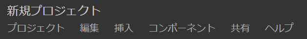
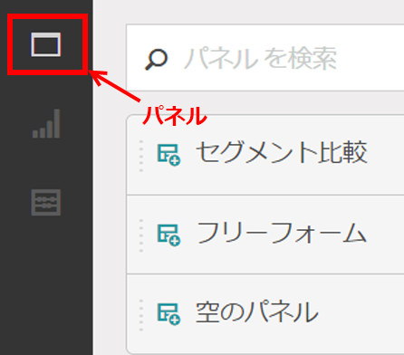
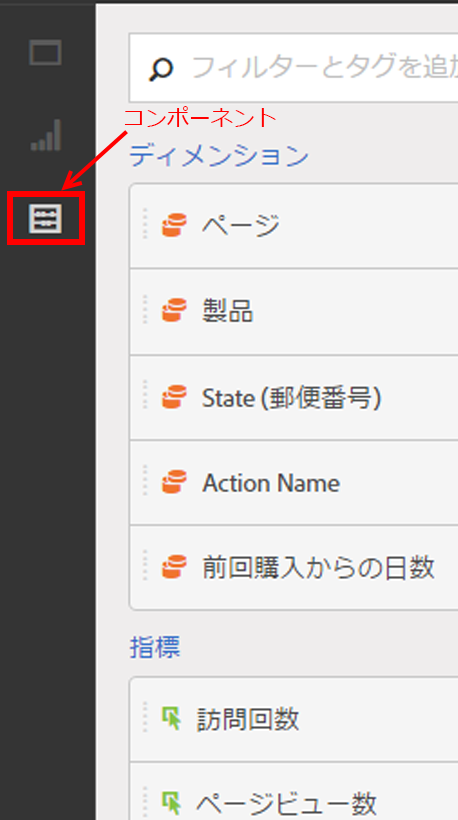

# プロジェクトの作成 - 概要

**[!UICONTROL Analytics]**／**[!UICONTROL Workspace]**

ビジュアライゼーション、レポートコンポーネントおよびデータテーブルを任意に組み合わせて、堅牢な Analytics プロジェクトを作成できます。Analytics で Ad Hoc Analysis の数多くのテーブル作成機能を使用できます。

Analysis Workspace では、新たな方法でデータの比較および詳細分析を実行できます。例えば、ランクレポートを設定して、すぐにデータクエリを繰り返し変更した後、レポート作成レベルで値にアクセスして操作することができます。

クエリは、直接レポーティングエンジンに渡されます。分析を作成するために他のレポートを表示することなく、インラインで変更できます。結果は即座に返され、ブラウザーを更新する必要もありません。

## Workspace のプロジェクト一覧ページ {#section_39AA007D7C384F4E869F842F1C7B11F8}

最初に **[!UICONTROL Analytics]**／**[!UICONTROL Workspace]** に移動すると、自分が所有するプロジェクトまたはアクセスを許可されたプロジェクトがすべて一覧表示されます。「**[!UICONTROL ランディングページとして設定]**」をクリックすると、このページを Adobe Analytics のランディングページに設定できます（下のスクリーンショットのように、このオプションが表示されない場合、既にランディングページに設定されています）。

Workspace のプロジェクト一覧ページには、次の情報が表示されます。

| 要素 | 説明 |
|---|---|
| [新規プロジェクトを作成](/help/analyze/analysis-workspace/home.md) | このリンクをクリックすると、新しいプロジェクトを最初から作成できます。 |
| プロジェクトの管理 | このリンクをクリックすると、プロジェクトコンポーネントマネージャーに移動します（**[!UICONTROL Analytics]**／**[!UICONTROL コンポーネント]**／**[!UICONTROL プロジェクト]**）。ここでは、すべてのプロジェクトが一覧表示され、プロジェクトのタグ付け、共有、削除、名前の変更、承認、コピー、CSV への書き出しをおこなえます。 |
| ランディングページとして設定 | このページをWorkspaceランディングページに変換します。 |
| チュートリアルを表示 | [Analysis Workspaceのビデオチュートリアルに進みます](https://docs.adobe.com/content/help/en/analytics-learn/tutorials/analysis-workspace/analysis-workspace-basics/analysis-workspace-introduction.html)。 |
| 名前 | Workspace プロジェクトの名前。 |
| 所有者 | このプロジェクトを作成したユーザー（ユーザー自身、またはユーザー自身とそのプロジェクトを共有した他のユーザー）。 |
| タイプ | これがWorkspaceプロジェクトか [Mobile Scorecardかを示します](https://docs.adobe.com/content/help/ja-JP/analytics/analyze/mobapp/home.html)。 |
| プロジェクトの役割 | 自分が所有者か、プロジェクトを編集できるか、重複プロジェクトかを示します。 |
| タグ | プロジェクトに適用されたタグ。プロジェクトコンポーネントマネージャー、または **[!UICONTROL Workspace]**／**[!UICONTROL プロジェクト]**／**[!UICONTROL プロジェクト情報および設定]**&#x200B;で適用されます。 |
| 最終変更日 | プロジェクトが最後に変更された日付。 |
| お気に入りのプロジェクト | プロジェクトをお気に入りに登録するには、プロジェクトを開き、名前の横の星をクリックします。 このリストは、次にWorkspaceを開いたときに表示されます。 |
| 頻繁に表示するプロジェクト | 頻繁に開くすべてのプロジェクトをリストし、アクセスしやすくします。 |

## プロジェクト情報および設定 {#section_63773D0B9E4543E88068ECECB9EEB4C6}

**[!UICONTROL Workspace]**／**[!UICONTROL プロジェクト]**／**[!UICONTROL プロジェクト情報および設定]**

**[!UICONTROL プロジェクト情報および設定]**&#x200B;は、現在アクティブなプロジェクトに関するプロジェクトレベルの情報を提供します。

| 設定 | 説明 |
|---|---|
| プロジェクト名 | プロジェクトに設定された名前。名前をダブルクリックすると編集できます。 |
| 作成者 | プロジェクト所有者名。 |
| 最終変更日 | プロジェクトの最終変更日。 |
| タグ | 分類を簡単にするためにプロジェクトに適用されたタグのリスト。プロジェクトは保存する際にもタグ付けできます。Workspace ランディングページの[!UICONTROL タグ]列にプロジェクトのタグが表示されます。 |
| 説明 | 説明は、プロジェクトの目的を明確にするのに役立ちます。説明をダブルクリックすると編集できます。 |
| プロジェクトで繰り返しのインスタンスをカウントします | レポート内でレポートインスタンスがカウントされるかどうかを指定します。同じ変数に対して複数の連続する値が存在する場合に、それらの値を変数の 1 つのインスタンスとしてカウントすることも、複数のインスタンスとしてカウントすることもできます。 |
| ビジュアライゼーションのカラースキーマ | 異なるカラーパレットを選択するか、独自のパレットを指定することにより、Workspace で使用されるカラースキーマを変更できるようになりました。この機能は、ほとんどのビジュアライゼーションを含む Workspace の多くの機能に影響します。 |
| 表示密度 | 左側のパネル、フリーフォームテーブル、コホートテーブルでの垂直方向のパディングを減らし、1 画面に表示されるデータの量を増やすことができます。 |

## プロジェクトメニュー {#section_850CDFCB86A64EB0A0AD5B9E0FCB7013}

トッププロジェクトメニューは、次のように表示されます。

サブメニューには次のオプションが含まれます。

>[!NOTE]
>
>アスタリスク（*）が付いているオプションは、**保存済みプロジェクト**&#x200B;でのみ表示されます。

| プロジェクト | 編集 | 挿入 | コンポーネント | 共有 | ヘルプ |
|---|---|---|---|---|---|
| 新規 | 元に戻す | 新しいパネル | 新しいセグメント | プロジェクトを共有 | ビデオ |
| Open | クリア | 新しいフリーフォームパネル | 新しい指標 | プロジェクトリンクを取得* | ホットキー |
| 保存 | すべてクリア | 新しいセグメント比較パネル | 新しい日付範囲 | ファイルを今すぐ送信* | ヘルプフォーラム |
| 名前を付けて保存* |  | 新しいフリーフォームテーブル | 新しいアラート | ファイルをスケジュールに従って送信* |  |
| ランディングページとして設定* |  | 改行 | コンポーネントを更新 | プロジェクトデータをキュレート |  |
| プロジェクトを更新 |  | 新しいバー |  |  |  |
| CSV をダウンロード |  |  |  |  |  |
| PDF をダウンロード* |  |  |  |  |  |
| プロジェクト情報および設定 |  |  |  |  |  |

## 左側のパネル {#section_271295C26EC840ABB2A8E7EC0498B60E}

左側のパネルに、パネル、[ビジュアライゼーション](/help/analyze/analysis-workspace/visualizations/freeform-analysis-visualizations.md)および[コンポーネント](/help/analyze/analysis-workspace/components/analysis-workspace-components.md)（ディメンション、指標、セグメント、データ範囲）に 1 クリックでアクセスできる 3 つのアイコンがあります。

  

左側のパネルからパネルのリストにアクセスできる&#x200B;**[!UICONTROL 空のパネル]**&#x200B;が追加されました。**新しいコホートパネル**&#x200B;を作成するには、空のパネルにドラッグし、コホートテーブルのビジュアライゼーションにドラッグします。
