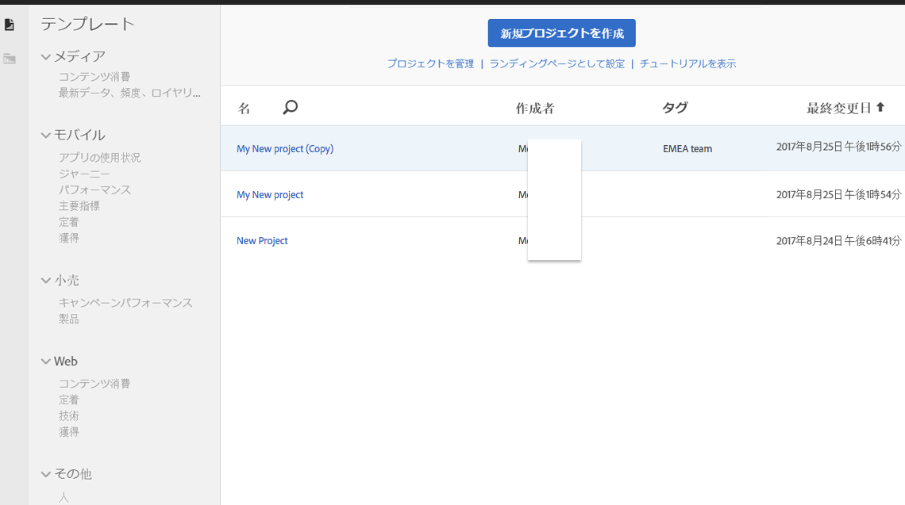
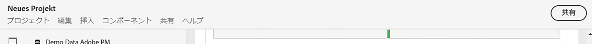
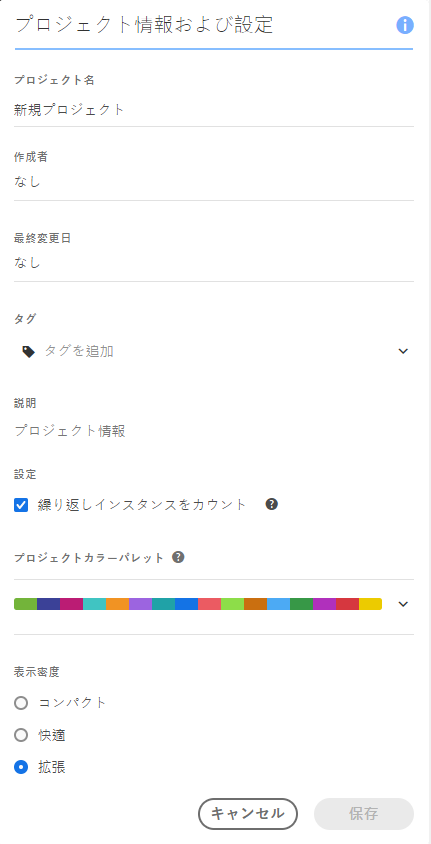
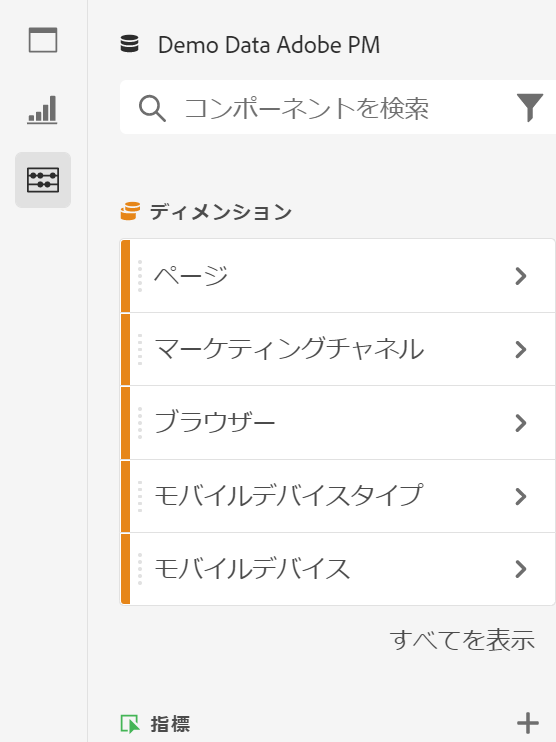
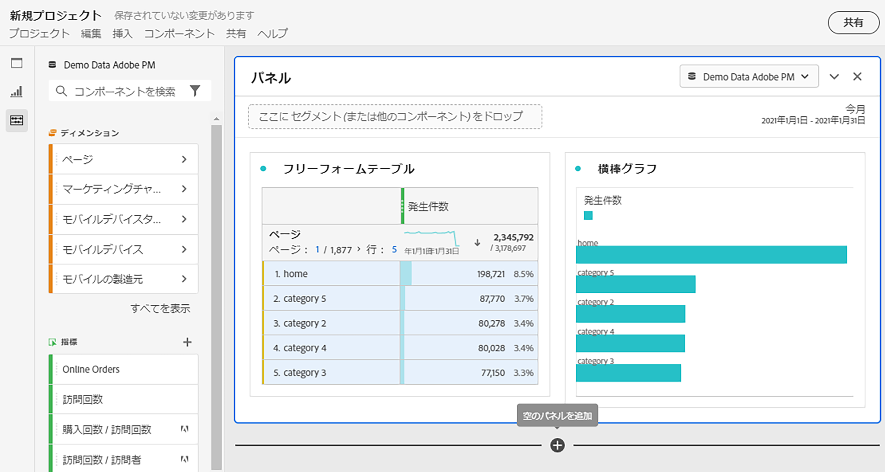
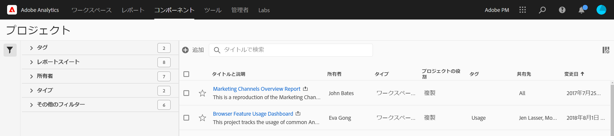

# プロジェクトの概要

Workspaceプロジェクトでは、データコンポーネント、テーブルおよびビジュアライゼーションを組み合わせて、分析を作成し、組織内の任意のユーザーと共有できます。 最初のプロジェクトを開始する前に、プロジェクトにアクセスし、ナビゲートし、管理する方法を学びます。

## プロジェクトリスト {#project-list}

**[!UICONTROL Analytics]**/**[!UICONTROL ワークスペース]**&#x200B;に最初に移動したとき、ページには、自分が所有している、または自分が共有しているすべてのプロジェクトがリストされます。 これは、以前にカスタムランディングページを設定したことがない限り、Adobe Analyticsのランディングページでもあります。

Workspace のプロジェクト一覧ページには、次の情報が表示されます。

| 要素 | 説明 |
|---|---|
| [新規プロジェクトを作成](/help/analyze/analysis-workspace/home.md) | このリンクをクリックすると、新しいプロジェクトを新規に開始するか、作成した[テンプレート](https://experienceleague.adobe.com/docs/analytics/analyze/analysis-workspace/build-workspace-project/starter-projects.html?lang=en#analysis-workspace)からテンプレートを作成できます。 |
| プロジェクトの管理 | このリンクをクリックすると、プロジェクトコンポーネントマネージャーに移動します（**[!UICONTROL Analytics]**／**[!UICONTROL コンポーネント]**／**[!UICONTROL プロジェクト]**）。ここでは、すべてのプロジェクトが一覧表示され、プロジェクトのタグ付け、共有、削除、名前の変更、承認、コピー、CSV への書き出しをおこなえます。 |
| ランディングページとして設定 | このページを Workspace ランディングページにします。 |
| [チュートリアルを表示](https://docs.adobe.com/content/help/en/analytics-learn/tutorials/analysis-workspace/analysis-workspace-basics/analysis-workspace-introduction.html) | Analysis Workspace ビデオチュートリアルに移動します。 |
| 名前 | Workspace プロジェクトの名前。 |
| 所有者 | このプロジェクトを作成したユーザー（ユーザー自身、またはユーザー自身とそのプロジェクトを共有した他のユーザー）。 |
| タイプ | Workspace プロジェクトか[モバイルスコアカード](https://docs.adobe.com/content/help/ja-JP/analytics/analyze/mobapp/home.html)のどちらであるかを示します。 |
| [プロジェクトの役割](https://experienceleague.adobe.com/docs/analytics/analyze/analysis-workspace/curate-share/share-projects.html) | プロジェクトの役割(所有者、編集、重複、表示)を示します。 |
| タグ | プロジェクトに適用されたタグ。 |
| 最終変更日 | プロジェクトが最後に変更された日付。 |
| お気に入りのプロジェクト | プロジェクトをお気に入りに登録するには、プロジェクトを開き、名前の横の星をクリックします。このリストは、次回 Workspace を開いたときに表示されます。 |
| 頻繁に表示するプロジェクト | 頻繁に開くすべてのプロジェクトをリストし、アクセスしやすくします。 |

## メニューバー {#menu-bar}

プロジェクト内では、メニューに、プロジェクトの管理、コンポーネントの追加、ヘルプの検索などを行うためのオプションが表示されます。 各メニューオプションは、キーボード[ショートカット](https://experienceleague.adobe.com/docs/analytics/analyze/analysis-workspace/build-workspace-project/fa-shortcut-keys.html)からもアクセスできます。

| メニュー項目 | 説明 |
|---|---|
| プロジェクト | プロジェクト管理の一般的なアクション（新規、開く、保存、名前を付けて保存、[テンプレートとして保存](https://experienceleague.adobe.com/docs/analytics/analyze/analysis-workspace/build-workspace-project/starter-projects.html)など）が含まれます。 また、「プロジェクトを更新」をクリックして、プロジェクト全体を更新し、最新のデータと定義を取得することもできます。 [「CSVと](https://experienceleague.adobe.com/docs/analytics/analyze/analysis-workspace/curate-share/download-send.html) PDFのダウンロード」オプションを使用すると、Workspaceからデータをエクスポートできます。[プロジェクト情報と](https://experienceleague.adobe.com/docs/analytics/analyze/analysis-workspace/build-workspace-project/freeform-overview.html?#info-settings) 設定には、プロジェクトを管理するための多くのオプションが用意されています。 |
| テンプレートを | 前回の操作を元に戻すか、やり直します。 「すべてをクリア」を選択すると、プロジェクトが空白の開始点にリセットされます。 |
| 前に | このメニューから新しいパネルまたはビジュアライゼーションを挿入します。 左側のレールから、新しいパネルやビジュアライゼーションを挿入することもできます。 |
| [コンポーネント](https://experienceleague.adobe.com/docs/analytics/analyze/analysis-workspace/components/analysis-workspace-components.html) | プロジェクトから、新しいセグメント、計算指標、日付範囲またはアラートコンポーネントを作成します。 左側のレールから新しいコンポーネントを作成することもできます。 コンポーネント定義が最近変更された場合、「コンポーネントを更新」は最新の定義を取得します。 |
| [共有](https://experienceleague.adobe.com/docs/analytics/analyze/analysis-workspace/curate-share/send-schedule-files.html) | PDF/CSVプロジェクトのキュレーション、共有、および組織内の受信者へのスケジュール設定を行います。 |
| ヘルプ | ヘルプドキュメント、ビデオおよびAnalytics [Experience Leagueコミュニティ](https://experienceleaguecommunities.adobe.com/t5/adobe-analytics/ct-p/adobe-analytics-community)にアクセスします。 Workspaceのヒントの表示と[デバッガー](https://www.adobe.io/apis/experiencecloud/analytics/docs.html#!AdobeDocs/analytics-2.0-apis/master/reporting-tricks.md)の表示を管理します。 Workspaceの詳細と、プロジェクト[パフォーマンス](https://experienceleague.adobe.com/docs/analytics/analyze/analysis-workspace/workspace-faq/optimizing-performance.html)に影響する要因を確認します。 |
| 共有ボタンまたは所有者 | プロジェクトの「所有」または「編集」を使用している場合は、右上の「共有」ボタンをクリックすると、プロジェクト受信者を管理できます。 プロジェクトの重複または表示のロールに属している場合は、プロジェクト所有者の名前が表示されます。 |

### プロジェクト情報および設定 {#info-settings}

**[!UICONTROL Workspace]**／**[!UICONTROL プロジェクト]**／**[!UICONTROL プロジェクト情報および設定]**&#x200B;は、現在アクティブなプロジェクトに関するプロジェクトレベルの情報を提供します。

次の設定が含まれます。

| 設定 | 説明 |
|---|---|
| プロジェクト名 | プロジェクトに設定された名前。名前をダブルクリックすると編集できます。 |
| 作成者 | プロジェクト所有者名。 |
| 最終変更日 | プロジェクトの最終変更日。 |
| タグ | 分類を簡単にするためにプロジェクトに適用されたタグのリスト。 |
| 説明 | 説明は、プロジェクトの目的を明確にするのに役立ちます。説明をダブルクリックすると編集できます。 |
| プロジェクトで繰り返しのインスタンスをカウントします | レポート内でレポートインスタンスがカウントされるかどうかを指定します。注意：この設定は、フロービジュアライゼーションまたはフォールアウトビジュアライゼーションには適用されません。 |
| [プロジェクトカラーパレット](https://experienceleague.adobe.com/docs/analytics/analyze/analysis-workspace/build-workspace-project/color-palettes.html) | Workspaceで使用する分類カラーパレットを変更するには、色弱に対応しているパレットを標準搭載から選択するか、カスタムパレットを指定します。 この機能は、ほとんどのビジュアライゼーションを含む Workspace の多くの機能に影響します。 |
| [表示密度](https://experienceleague.adobe.com/docs/analytics/analyze/analysis-workspace/build-workspace-project/view-density.html) | 左側のパネル、フリーフォームテーブル、コホートテーブルでの垂直方向のパディングを減らし、1 画面に表示されるデータの量を増やすことができます。 |

## 左側のレール{#left-rail}

プロジェクト内では、[パネル](https://experienceleague.adobe.com/docs/analytics/analyze/analysis-workspace/panels/panels.html)、テーブル、[ビジュアライゼーション](https://experienceleague.adobe.com/docs/analytics/analyze/analysis-workspace/visualizations/freeform-analysis-visualizations.html)、[コンポーネント](https://experienceleague.adobe.com/docs/analytics/analyze/analysis-workspace/components/analysis-workspace-components.html)に左側のレールからアクセスします。 これらはプロジェクトの構成要素です。

また、[空のパネル](https://experienceleague.adobe.com/docs/analytics/analyze/analysis-workspace/panels/blank-panel.html)からもビジュアライゼーションやパネルにアクセスできます。

左側のレールのコンポーネント(Dimension、指標、セグメント、日付範囲)は、アクティブなパネルレポートスイートに関連付けられています。 アクティブなパネルの周囲に青い境界線が表示され、アクティブなレポートスイートがコンポーネントパネルの上部に表示されます。

## プロジェクトキャンバス{#canvas}

プロジェクトキャンバスでは、パネル、テーブル、ビジュアライゼーションおよびコンポーネントをまとめて分析を構築できます。 プロジェクトには多数のパネルを含めることができ、各パネルには多数のテーブルやビジュアライゼーションを含めることができます。

パネルは、期間、レポートスイート、分析の使用例に従ってプロジェクトを整理する場合に便利です。 アクティブなパネルの周囲に青い境界線が表示され、左側のレールで使用できるコンポーネントが決まります。

プロジェクトの開始点に応じて、キャンバスに[フリーフォームテーブル](https://experienceleague.adobe.com/docs/analytics/analyze/analysis-workspace/visualizations/freeform-table/freeform-table.html)または[空白のパネル](https://experienceleague.adobe.com/docs/analytics/analyze/analysis-workspace/panels/blank-panel.html)が表示されます。 開始分析を最も簡単に行うには、1つまたは複数のコンポーネントを選択し、それらをプロジェクトキャンバスにドラッグ&amp;ドロップします。 データのテーブルが自動的にレンダリングされます。 [テーブルを作成するための様々なオプションに](https://experienceleague.adobe.com/docs/analytics/analyze/analysis-workspace/visualizations/freeform-table/freeform-table.html) ついて詳しく学ぶか、アドビの [トレーニング](https://experienceleague.adobe.com/docs/analytics/analyze/analysis-workspace/home.html?#training-tutorial) チュートリアルを活用して、最初のプロジェクトの作成に関するガイダンスを得てください。

## プロジェクトマネージャー {#manager}

Analysis Workspaceプロジェクトは、**Analytics/コンポーネント/プロジェクト**&#x200B;で管理できます。 プロジェクトマネージャーには、特定のユーザーが作成した項目が表示されます。 プロジェクトの所有権は、管理者/Analyticsユーザーとアセット/アセットを転送で、新しいユーザーに転送できます。

プロジェクトマネージャーでは、追加、タグ付け、共有、重複/コピーなどを行うことができます。 検索バーで、または左側のレールのフィルターオプションを使用して、プロジェクトを検索します。 タグ、所有者、プロジェクトのタイプなどでフィルターできます。

以下はプロジェクトマネージャの一般的な操作で、1つまたは複数のプロジェクトに対して一度に実行できます。

| アクション | 説明 |
|---|---|
| 追加 | 新規プロジェクトを最初から、または[テンプレート](https://experienceleague.adobe.com/docs/analytics/analyze/analysis-workspace/build-workspace-project/starter-projects.html)から開始を作成します。 |
| タグまたは承認 | 「タグ」または「承認」を選択して、プロジェクトを整理し、検索しやすくします。 |
| [共有](https://experienceleague.adobe.com/docs/analytics/analyze/analysis-workspace/curate-share/share-projects.html) | プロジェクトを組織内の他の Analysis Workspace ユーザーも利用できるようになります。 |
| 削除 | プロジェクトを削除します。 |
| 名前変更 | プロジェクトの名前を編集します。 |
| Copy | プロジェクトの重複コピーを作成します。 これにより、新しいプロジェクトとプロジェクトIDが作成されます。 元のプロジェクトに関連付けられた共有またはスケジュールはコピーされません。 |
| CSV に書き出し | プロジェクトをCSVファイルとしてダウンロードします。このファイルにはプレーンテキストデータが含まれます。 |
