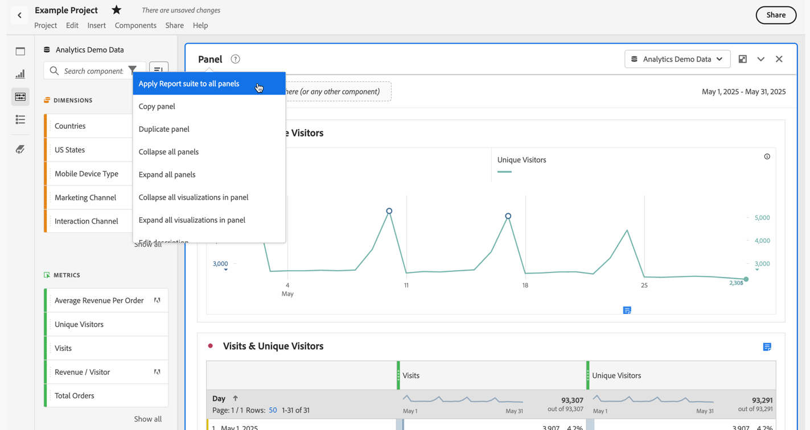

# Workspace の複数のレポートスイート

複数のレポートスイートのデータを使用して、Analysis Workspace でプロジェクトを作成できるようになりました。レポートスイートがパネルレベルで選択され、同じ Workspace プロジェクト内の各パネルに対して異なるレポートスイートを選択できるようになりました。

この機能は、次のような場合に便利です。

* 2 つの異なる地域のデータや、2 つの異なるレポートスイート内のデータを比較する。テーブルとビジュアライゼーションを作成し、データを並べて比較できます。

* 指標とビジュアライゼーションのダッシュボードを作成して、他の組織に報告する。様々なレポートスイートから同じプロジェクト内にデータを取り込めるようになりました。

## すべてのパネルへのレポートスイートの適用

パネルのヘッダーを右クリックし、を選択して、レポートスイートをすべてのパネルに一度に適用できま **[!UICONTROL Apply Report Suite to All Panels]**&#x200B;す。

## アクティブなパネル

この機能を使用して、「アクティブなパネル」と「非アクティブなパネル」の概念を導入しています。アクティブなパネルは、その周りの明るい青の境界線で確認できます。 パネル内をクリックするだけで、パネルがアクティブなパネルに変わります。

>[!IMPORTANT]
>アクティブなパネルと同じレポートスイート内の任意のパネルにドラッグ&amp;ドロップできます。 同じレポートスイートの非アクティブなパネルにドラッグすると、パネルがアクティブになります。

| タスク | アクティブなパネル | 非アクティブなパネル |
|---|---|---|
| レポートスイートの変更 | ○ | × |
| コンポーネントのドラッグ＆ドロップ | ○ | はい。アクティブなパネルと同じレポートスイート内のパネルに対して使用します。 |
| ビジュアライゼーションのドラッグ＆ドロップ | ○ | はい。アクティブなパネルと同じレポートスイート内のパネルに対して使用します。 |

## 複数のレポートスイートの操作

1. 2 つ以上のパネルを含む新しいプロジェクトを Workspace で作成します。

1. コンポーネント（指標、ディメンション、セグメント、日付範囲）をパネルにドラッグ＆ドロップします。レポートスイート固有のデータとビジュアライゼーションがパネルに含まれていることを確認します。

   >[!NOTE]
   >プロジェクトを読み込む（またはレポートスイートに切り替える）ときにバナーが表示され、プロジェクトに含まれるすべてのコンポーネントがレポートスイートに含まれない場合があります。 欠落しているコンポーネントが表示されます。必要な指標／ディメンションに権限を設定するには、[次の手順](/help/admin/admin-console/permissions/product-profile.md)に従います。

   

   この非互換性に対応するオプションは 3 つあります。
   * 必要なディメンション/指標の有効化
   * レポートスイートの変更。
   * 一部のコンポーネントが欠落したままで続行する。これにより、これらのコンポーネントにはデータが生成されず、ビジュアライゼーションが空白になります。

1. パネルを別のレポートスイートに変更し、新しいレポートスイートに基づいてコンポーネントのラベル（現在アクティブなレポートスイート）と一覧表示されるコンポーネントが更新されていることを確認します。

1. Use a keyboard shortcut (`shift` while dragging) to turn an inactive panel to an active panel.

1. （オプション）他の Analytics コンポーネントビルダーに移動して、これらのビルダーが、以下を示すレポートスイートラベルが表示されることを確認します。

   * セグメントの作成場所：[セグメントビルダー](https://docs.adobe.com/content/help/en/analytics/components/segmentation/segmentation-workflow/seg-build.html)。
   * 計算指標が作成される場所：[計算指標ビルダー](https://docs.adobe.com/content/help/en/analytics/components/calculated-metrics/calcmetric-workflow/cm-build-metrics.html)。
   * アラートの作成場所：[アラートビルダー](https://docs.adobe.com/content/help/en/analytics/components/alerts/alert-builder.html)。