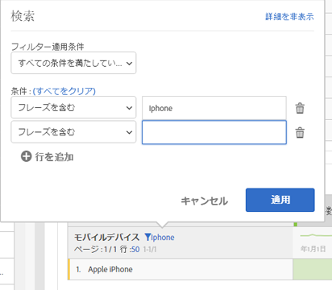

# ページ編集、テーブルのフィルタリングと並べ替え

概要については、YouTube のこのビデオをご覧ください。

[Analysis Workspaceでのページ番号付け、テーブルのフィルタリングと並べ替え](https://www.youtube.com/watch?v=2zxpRPCGspg)

## Advanced filtering options {#section_36E92E31442B4EBCB052073590C1F025}

フリーフォームテーブルのディメンションの隣にあるフィルターアイコンをクリックし、「アドバンスを表示」をクリックすると、次の条件を使用してフィルタリングできます。

* 次を含む
* 次を含まない
* すべての語句を含む
* いずれかの語句を含む
* フレーズを含む
* いずれの語句も含まない
* このフレーズを含まない
* 次と等しい
* 次と等しくない
* 次の語句で始まる
* 次の語句で終わる

