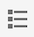

# 目次

Analysis Workspace では、プロジェクトの目次を表示できます。これにより、プロジェクト内に存在するパネルやビジュアライゼーション間をすばやく移動できます。 目次は、多くのパネルやビジュアライゼーションを含む大規模なプロジェクトを表示する際に特に便利です。

>[!BEGINSHADEBOX]

デモビデオについて詳しくは、 [目次の作成](https://experienceleague.adobe.com/ja/docs/analytics-learn/tutorials/analysis-workspace/navigating-workspace-projects/create-a-toc-in-analysis-workspace){target="_blank"}を参照してください。

>[!ENDSHADEBOX]

>[!TIP]
>
>セクションヘッダーのビジュアライゼーションを使用すると、多くのビジュアライゼーションを含むパネル内のセクションを識別して明確にすることができます。 これらのセクションヘッダーは、目次のエントリとしても表示されます。
>

プロジェクトの目次を表示するには：

1. Analysis Workspace で、目次を表示するプロジェクトに移動します。

1. ボタンパネルで  **[!UICONTROL 目次]** を選択します。 詳しくは、[Analysis Workspace の概要](/help/analyze/analysis-workspace/home.md)を参照してください。 

   プロジェクトの&#x200B;**[!UICONTROL 目次]**&#x200B;が表示され、各パネルはデフォルトで展開されます。

1. **[!UICONTROL 目次]**&#x200B;で、ビジュアライゼーションを選択します。 

   選択されたビジュアライゼーションは自動的にスクロールされ、一時的にハイライト表示されます。

   

>[!MORELIKETHIS]
>
>* [Adobe Analytics の新しい目次機能を使用したダッシュボードナビゲーションの簡素化](https://experienceleaguecommunities.adobe.com/t5/adobe-analytics-blogs/simplify-dashboard-navigation-with-the-new-table-of-contents/ba-p/731284)

<!--
# Project table of contents

You can view a table of contents within each project in Analysis Workspace, allowing you to quickly move between any panels and visualizations that exist in the project. This is especially useful when viewing larger projects that contain many panels and visualizations.

>[!BEGINSHADEBOX]

See  [Table of contents](https://experienceleague.adobe.com/en/docs/analytics-learn/tutorials/analysis-workspace/navigating-workspace-projects/create-a-toc-in-analysis-workspace){target="_blank"} for a demo video.

>[!ENDSHADEBOX]

To view the table of contents on a project:

1. In Analysis Workspace, go to the project where you want to view the table of contents.

1. In the left nav, select the table of contents icon . 

   The table of contents for the project is displayed, and each panel is expanded by default.

   

1. In the table of contents, select a visualization to go to it within the project.
-->