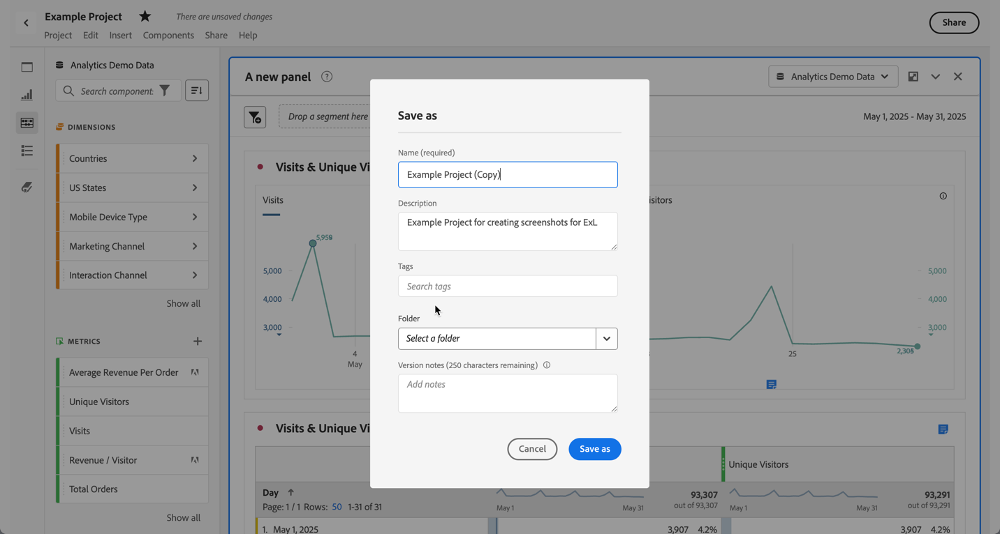

# プロジェクトの保存 {#save-projects}

<!-- markdownlint-disable MD034 -->

>[!CONTEXTUALHELP]
>id="workspace_project_addnotes"
>title="メモを追加"
>abstract="保存するプロジェクトバージョンに関するメモを追加します。これらのメモはバージョンと共に保存され、**[!UICONTROL プロジェクト]**／**[!UICONTROL 以前のバージョンを開く]**&#x200B;メニューからアクセスできます。"

<!-- markdownlint-enable MD034 -->

Analysis Workspace のプロジェクトは、2 分ごとに自動で保存されます。また、自分でプロジェクトを保存したり、プロジェクトを複製として保存したり、プロジェクトをバージョンメモと共に保存したりすることもできます。

## 保存

プロジェクトを手動で保存するには、プロジェクトを Analysis Workspace で開き、**[!UICONTROL プロジェクト]**&#x200B;を選択してから、次のオプションから選択します。

* **[!UICONTROL 保存]**

  プロジェクトに対する変更を保存します。プロジェクトが共有されている場合は、プロジェクトの受信者にも変更が表示されます。

  プロジェクトを最初に保存すると、**[!UICONTROL 保存]**&#x200B;ダイアログが表示されます。

  

   1. 次の情報を指定します。

      * **[!UICONTROL 名前]**（必須）プロジェクトの名前。
      * **[!UICONTROL 説明]**&#x200B;プロジェクトの説明。
      * **[!UICONTROL タグ]**「[!UICONTROL *タグを検索*]」フィールドでタグを検索するか、**[!UICONTROL Enter]** キーを使用して新しいタグを追加します。
      * **[!UICONTROL フォルダー]**&#x200B;[!UICONTROL *フォルダーを選択*] ドロップダウンメニューからフォルダーを選択します。 フォルダーを指定しない場合、プロジェクトは、新しいプロジェクトを作成した現在のフォルダーに保存されます。
      * **[!UICONTROL バージョンメモ]***メモを追加*&#x200B;テキスト領域にバージョンメモを追加します。

   1. 「**[!UICONTROL 保存]**」を選択しプロジェクトを保存します。

  プロジェクトを保存すると、実際には 90 日間保存されたプロジェクトのバージョンが保存されます。

  共有したプロジェクトを保存すると、**[!UICONTROL 共有プロジェクトへの変更を保存]**&#x200B;という警告ダイアログが表示され、確認を求められます。

  

   * 「**[!UICONTROL 保存]**」を選択してプロジェクトを保存します。
   * 「**[!UICONTROL 名前を付けて保存]**」を選択して、プロジェクトを複製プロジェクトとして新しい名前で保存します。

* **[!UICONTROL メモと共に保存]**

  

  プロジェクトを保存する際に、プロジェクトで変更した内容に関するメモを追加します。バージョンメモを保存ダイアログで、次の手順を実行します。

   1. **[!UICONTROL メモを追加]**&#x200B;テキスト領域に&#x200B;**[!UICONTROL バージョンメモ]**&#x200B;を入力します。
   1. 「**[!UICONTROL 保存]**」を選択します。

  メモはプロジェクトのバージョンと共に保存され、プロジェクトの[以前のバージョンを開く](open-projects.md#open-previous-version)ときに使用できます。メモと共に保存されたバージョンは、1 年間自動的に保存されます。

* **[!UICONTROL 名前を付けて保存]**

  

  プロジェクトの複製を新しい名前で作成します。名前を付けて保存ダイアログが表示されます。

   1. 次の情報を指定します。

      * **[!UICONTROL 名前]**（必須）プロジェクトの名前。
      * **[!UICONTROL 説明]**&#x200B;プロジェクトの説明。
      * **[!UICONTROL タグ]**「[!UICONTROL *タグを検索*]」フィールドでタグを検索するか、**[!UICONTROL Enter]** キーを使用して新しいタグを追加します。
      * **[!UICONTROL フォルダー]**&#x200B;[!UICONTROL *フォルダーを選択*] ドロップダウンメニューからフォルダーを選択します。 フォルダーを指定しない場合、プロジェクトは、新しいプロジェクトを作成した現在のフォルダーに保存されます。
      * **[!UICONTROL バージョンメモ]***メモを追加*&#x200B;テキスト領域にバージョンメモを追加します。

   1. 「**[!UICONTROL 保存]**」を選択してプロジェクトを保存します。

  プロジェクトを別のフォルダーに保存できます。元のプロジェクトは影響を受けません。

<!-- Cannot find this option in CJA 
| **[!UICONTROL Save as template]** | Save your project as a [custom template](https://experienceleague.adobe.com/docs/analytics/analyze/analysis-workspace/build-workspace-project/starter-projects.html) that becomes available to your organization under **[!UICONTROL Project > New]** | 
-->

## 自動保存

>[!IMPORTANT]
>
>新しいプロジェクトは自動的に保存されますが、**初**&#x200B;回は新しいプロジェクトごとに手動で保存する必要があります。
>

Analysis Workspace のすべてのプロジェクトは、2 分ごとにローカルマシンに自動で保存されます。この自動保存には、まだ手動で保存されていない、新しく作成されたプロジェクトが含まれます。

### 新規プロジェクト

Analysis Workspace では、別のプロジェクトに切り替えたり、ブラウザータブを閉じたりする際に、新しいプロジェクトを手動で保存するように求められます。

何らかの理由で、手動で保存する前に新しく作成したプロジェクトへのアクセス権が予期せず失われた場合、プロジェクトの復元バージョンが Analysis Workspace ランディングページの&#x200B;**[!UICONTROL 復元されたプロジェクト（過去 7 日間）]**&#x200B;というフォルダーに保存されます。復元したプロジェクトを復元し、目的の場所に手動で保存します。

復元したプロジェクトを復元するには：

1. Analysis Workspace ランディングページの&#x200B;**[!UICONTROL 復元されたプロジェクト（過去 7 日間）]**&#x200B;フォルダーに移動します。

<!-- 
     
  -->

1. プロジェクトを開き、目的の場所に保存します。

### 既存のプロジェクト

何らかの理由で、まだ自動保存されていない変更がプロジェクトに残っている場合、Analysis Workspace では変更を保存するプロンプトが表示されるか、警告メッセージが表示されます。

いくつかの一般的なシナリオ：

#### 別のプロジェクトを開く

まだ自動保存されていない変更を含むプロジェクトで作業している際に別のプロジェクトを開くと、Analysis Workspace では現在のプロジェクトを保存するプロンプトが表示されます。

次のオプションがあります。

* **[!UICONTROL 保存]**：プロジェクトの自動保存された最新のローカルコピーを、最新の変更に置き換えます。
* **[!UICONTROL 変更を破棄]**：最新の変更を破棄します。プロジェクトには、自動保存された最新のローカルコピーが保持されます。
* **[!UICONTROL キャンセル]**：別のプロジェクトを開くアクションをキャンセルし、既存のプロジェクトを開いたままにします。

<!--  -->

#### タブから移動するかタブを閉じる

まだ自動保存されていない変更を含むプロジェクトを表示している際に、ページから移動したり、ブラウザータブを閉じたりすると、保存されていない変更が失われるという警告がブラウザーに表示されます。終了またはキャンセルを選択できます。ブラウザーによる警告方法は、使用するブラウザーによって異なります。

### ブラウザーがクラッシュしたか、セッションがタイムアウトする

ブラウザーがクラッシュした場合や、セッションがタイムアウトした場合は、次回 Analysis Workspace にアクセスしたする際に、まだ自動保存されていないプロジェクトの変更を復元するプロンプトが表示されます。

* 自動保存された最新のコピーからプロジェクトを復元するには、「**[!UICONTROL はい]**」を選択します。

* 自動保存されたコピーを削除し、ユーザーが最後に保存したバージョンのプロジェクトを開くには、「**[!UICONTROL いいえ]**」を選択します。

<!---->

一度も保存されていない&#x200B;**新規**&#x200B;プロジェクトの場合、未保存の変更は復元できません。

<!-- Shouldn't this belong to another page?  Moved it to a new open projects page

## Open previously saved version

To open a previously saved version of a project:

1. Select **[!UICONTROL Open previous version]** from the **[!UICONTROL Project]** menu.

   

1. Review the list of previous versions available. You can switch between **[!UICONTROL All versions]** and **[!UICONTROL Only versions with notes]**.

   For each version, the list shows a timestamp
   [!UICONTROL Timestamp] and [!UICONTROL Editor] are shown, in addition to [!UICONTROL Notes] if they were added when the [!UICONTROL Editor] saved. Versions without notes are stored for 90 days; versions with notes are stored for 1 year.
1. Select a previous version and click **[!UICONTROL Load]**.
   The previous version then loads with a notification. The previous version does not become the current saved version of your project until you click **[!UICONTROL Save]**. If you navigate away from the loaded version, when you return, you will see the last saved version of the project.

-->

<!--
# Save projects {#save-projects}

>[!CONTEXTUALHELP]
>id="workspace_project_addnotes"
>title="Add notes"
>abstract="Add notes about the project version being saved. These notes will be stored with the version and accessible under the **[!UICONTROL Project]** > **[!UICONTROL Open previous version]** menu."

Projects in Analysis Workspace are automatically saved every 2 minutes. 

You can also manually save projects. Additional options such as adding tags or notes are available when you manually save a project.

## Save projects manually {#Save} 

Various options are available when manually saving a project in Analysis Workspace.

To manually save a project:

1. With your project open in Analysis Workspace, select **[!UICONTROL Project]**, then choose from the following options: 

   | Action | Description | 
   |---|---| 
   | **[!UICONTROL Save]** | Save changes to your project. If the project is shared, recipients of the project will also see the changes. When you first save your project, you are prompted to give the project a name, (optional) description and add (optional) tags. | 
   | **[!UICONTROL Save with notes]** | Before your project saves, add notes about what changed in the project. Notes are stored with the project version and are available to all editors under [!UICONTROL Project] > [!UICONTROL Open previous version]. | 
   | **[!UICONTROL Save as]** | Create a duplicate of your project. The original project will not be affected. | 
   | **[!UICONTROL Save as template]** | Save your project as a [template](/help/analyze/analysis-workspace/templates/create-templates.md) that becomes available to your organization under **[!UICONTROL Project > New]** | 

## Auto-save {#Autosave} 

All projects in Analysis Workspace are automatically saved every 2 minutes to your local machine. This includes newly created projects that are not yet saved manually. 

* **New projects:** Even though new projects are auto-saved, you must save each new project manually the first time. Analysis Workspace prompts you to save new projects manually when switching to another project, closing the browser tab, and so forth. 

  If for any reason you unexpectedly lose access to a newly created project before manually saving it, a recovery version of your project is saved on the Analysis Workspace landing page in a folder called `Recovered Projects (Last 7 Days)`. You must restore the recovered project and manually save it to a desired location. 

  To restore a recovered project:
  
  1. Go to the [!UICONTROL **Recovered Projects**] folder on the Analysis Workspace landing page.

     

  1. Open your project and save it to a desired location. 

* **Existing projects:** If for any reason you leave a project with changes that are not yet auto-saved, Analysis Workspace either prompts you to save your changes or provides a warning message. 

  Following are some common scenarios:

### Open another project 

If you open an additional project while working on a project that contains changes that are not yet auto-saved, Analysis Workspace prompts you to save the current project before leaving.

The following options are available:

* **Save:** Replaces the most recent auto-saved local copy of your project with your latest changes.
* **Save As:** Saves your latest changes as a new project. The original project is saved only with the most recent auto-saved changes.
* **Discard Changes:** Discards your latest changes. The project retains the most recent auto-saved changes.

### Navigate away or close a tab 

If you navigate away from the page or close the browser tab while viewing a project with changes that are not yet auto-saved, the browser warns that your unsaved changes will be lost. You can choose to leave or cancel. 

### Browser crashes or session times out 

If your browser crashes or if your session times out, then the next time you access Analysis Workspace you're prompted to recover any changes to your project that are not yet auto-saved.

Following is the Project Recovery dialog box that displays the first time you access Analysis Workspace after a crash or a timeout.

Select **Yes** to restore the project from the most recent auto-saved copy.

Select **No** to delete the auto-saved copy and open the last user-saved version of the project.

For **new** projects that have never been saved, unsaved changes are not recoverable.

## Open a previous version {#previous-version}

To open a previous version of a project:

1. Go to **[!UICONTROL Project]** > **[!UICONTROL Open previous version]**

   
   
1. Review the list of prior versions available. 
   [!UICONTROL Timestamp] and [!UICONTROL Editor] are shown, in addition to [!UICONTROL Notes] if they were added when the [!UICONTROL Editor] saved. Versions without notes are stored for 90 days; versions with notes are stored for 1 year.
1. Select a previous version and click **[!UICONTROL Load]**.
   The previous version then loads with a notification. The previous version does not become the current saved version of your project until you click **[!UICONTROL Save]**. If you navigate away from the loaded version, when you return, you will see the last saved version of the project. 

-->