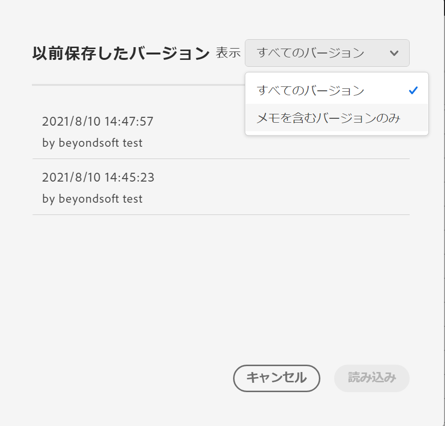

# プロジェクトの保存

プロジェクトに対する変更を保存するには、Workspace の&#x200B;**[!UICONTROL プロジェクト]**&#x200B;メニューに移動します。Workspace は、特定の場合にプロジェクトを自動保存します。

## プロジェクト保存オプション {#Save}

**[!UICONTROL プロジェクト]**&#x200B;メニューで実行できる保存操作は、今後分析にアクセスする方法に応じて異なります。

| アクション | 説明 |
|---|---| 
| **[!UICONTROL 保存]** | プロジェクトに対する変更を保存します。プロジェクトが共有されている場合は、プロジェクトの受信者にも変更が表示されます。プロジェクトを最初に保存すると、プロンプトが表示され、プロジェクトの名前、説明（オプション）、タグ（オプション）を付けるように求められます。 |
| **[!UICONTROL メモと共に保存]** | プロジェクトを保存する前に、プロジェクトで変更した内容に関するメモを追加します。 メモはプロジェクトのバージョンと共に保存され、[!UICONTROL プロジェクト]／[!UICONTROL 以前のバージョンを開く]から、すべてのエディターが使用できます。 |
| **[!UICONTROL 名前を付けて保存]** | プロジェクトの複製を作成します。元のプロジェクトは影響を受けません。 |
| **[!UICONTROL テンプレートとして保存]** | プロジェクトを[カスタムテンプレート](https://experienceleague.adobe.com/docs/analytics/analyze/analysis-workspace/build-workspace-project/starter-projects.html?lang=ja)として保存し、 **[!UICONTROL プロジェクト／新規]**&#x200B;で組織が使用できるようにします。 |

## 自動保存 {#Autosave}

既存のプロジェクト（少なくとも 1 回前に保存されたプロジェクト）は、2 分ごとにローカルマシンに自動保存されます。一度も保存されていない新しいプロジェクトは、現在、自動保存されません。

プロジェクトに対する変更が保存されていない場合、いくつかのシナリオが原因で、使用可能なアクションが異なる場合があります。

### 別の Workspace プロジェクトを開く

アドビは、ページを離れる前に保存するオプションを提供します。既存のプロジェクトを終了すると、自動保存されたローカルコピーは削除されます。

### タブから移動するかタブを閉じる

保存されていない変更が失われることをブラウザーが警告します。終了またはキャンセルを選択できます。

### ブラウザーがクラッシュしたか、セッションがタイムアウトする

**既存**&#x200B;のプロジェクトの場合 、Workspace に戻ると、**プロジェクトの回復**&#x200B;モーダルが表示されます。 「はい」を選択すると、自動保存されたローカルコピーからプロジェクトが復元されます。 「いいえ」を指定すると、自動保存されたローカルコピーが削除され、最後に保存したバージョンのプロジェクトが開きます。

一度も保存されていない&#x200B;**新規**&#x200B;プロジェクトの場合、未保存の変更は復元できません。

## 以前のバージョンを開く {#previous-version}

>[!NOTE]
>
>以前のバージョンのプロジェクトは、現在、限定的なリリースになっています。

以前のバージョンのプロジェクトを開くには：

1. **[!UICONTROL プロジェクト]**／**[!UICONTROL 以前のバージョンを開く]**&#x200B;に移動します。

   

1. 使用可能な以前のバージョンのリストを確認します。
   [!UICONTROL タイムスタンプ]と[!UICONTROL エディター]は、[!UICONTROL エディター]が保存されたときに[!UICONTROL メモ]が追加された場合、メモに加えて表示されます。 メモのないバージョンは90日間保存され、メモ付きのバージョンは1年間保存されます。
1. 以前のバージョンを選択し、「**[!UICONTROL 読み込み]**」をクリックします。
その後、以前のバージョンが通知と共に読み込まれます。 「**[!UICONTROL 保存]**」をクリックするまで、以前のバージョンはプロジェクトの現在の保存バージョンになりません。 読み込まれたバージョンから移動すると、戻ったときに最後に保存されたバージョンのプロジェクトが表示されます。
