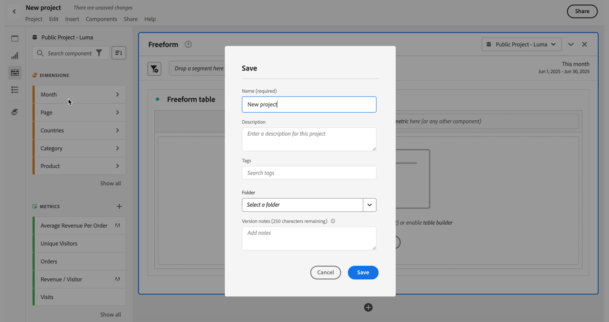

# プロジェクトの保存

プロジェクトに対する変更を保存するには、Workspace の&#x200B;**[!UICONTROL プロジェクト]**&#x200B;メニューに移動します。Workspaceでは、場合によってはプロジェクトも自動保存されます。

## プロジェクト保存オプション {#Save}

**[!UICONTROL プロジェクト]**&#x200B;メニューで実行できる保存操作は、今後分析にアクセスする方法に応じて異なります。

| アクション | 説明 |
|---|---| 
| **[!UICONTROL 保存]** | プロジェクトに対する変更を保存します。プロジェクトが共有されている場合は、プロジェクトの受信者にも変更が表示されます。プロジェクトを最初に保存すると、名前と（オプション）説明を付け、（オプション）タグを追加するように求められます。 |
| **[!UICONTROL メモと共に保存]** | プロジェクトを保存する前に、プロジェクト内の変更点に関するメモを追加します。 メモはプロジェクトバージョンと共に保存され、[!UICONTROL プロジェクト] > [!UICONTROL 前のバージョン]を開くので、すべてのエディターが使用できます。 |
| **[!UICONTROL 名前を付けて保存]** | プロジェクトの複製を作成します。元のプロジェクトは影響を受けません。 |
| **[!UICONTROL テンプレートとして保存]** | プロジェクトを[カスタムテンプレート](https://docs.adobe.com/content/help/ja-JP/analytics/analyze/analysis-workspace/build-workspace-project/starter-projects.html)として保存し、 **[!UICONTROL プロジェクト／新規]**&#x200B;で組織が使用できるようにします。 |

## 自動保存 {#Autosave}

既存のプロジェクト（少なくとも 1 回前に保存されたプロジェクト）は、2 分ごとにローカルマシンに自動保存されます。一度も保存されていない新しいプロジェクトは、現在、自動保存されません。

プロジェクトに対する変更が保存されていない場合、いくつかのシナリオが原因で、使用可能なアクションが異なる場合があります。

### 別の Workspace プロジェクトを開く

アドビは、ページを離れる前に保存するオプションを提供します。既存のプロジェクトを終了すると、自動保存されたローカルコピーは削除されます。

### タブから移動するかタブを閉じる

保存されていない変更が失われることをブラウザーが警告します。終了またはキャンセルを選択できます。

### ブラウザーがクラッシュしたか、セッションがタイムアウトする

**既存の**&#x200B;プロジェクトの場合、Workspaceに戻ると、**プロジェクトの回復**&#x200B;モーダルが表示されます。 「はい」を選択すると、自動保存されたローカルコピーからプロジェクトが復元されます。 「いいえ」を指定すると、自動保存されたローカルコピーが削除され、最後に保存したバージョンのプロジェクトが開きます。

一度も保存されていない&#x200B;**新規**&#x200B;プロジェクトの場合、未保存の変更は復元できません。

## 以前のバージョンを開く {#previous-version}

>[!NOTE]
>
>以前のプロジェクトバージョンは、現在、限定的なリリースになっています。

以前のバージョンのプロジェクトを開くには：

1. **[!UICONTROL プロジェクト]**&#x200B;に移動し、**[!UICONTROL 前のバージョンを開く]**
1. 利用可能な以前のバージョンのリストを確認します。
    タイムスタンプと  エディタは、エディタが  保存されたときに追加された  メモに加えて表示されます。メモのないバージョンは90日間保存されます。メモ付きのバージョンは1年間保存されます。
1. 以前のバージョンを選択し、「**[!UICONTROL 読み込み]**」をクリックします。
その後、前のバージョンが通知と共に読み込まれます。 「**[!UICONTROL 保存]**」をクリックするまで、以前のバージョンはプロジェクトの現在の保存済みバージョンになりません。 ロードされたバージョンから移動して戻ると、最後に保存されたプロジェクトが表示されます。
