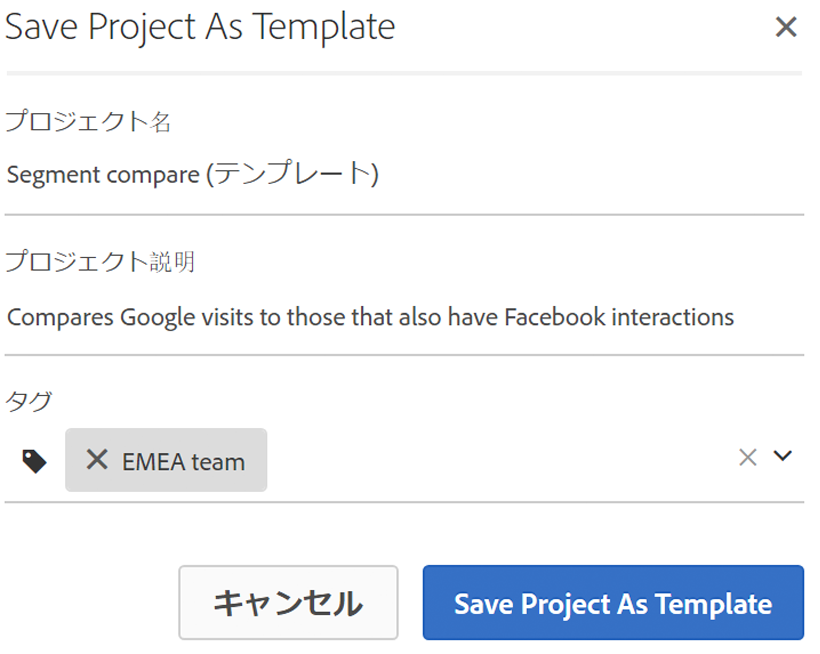
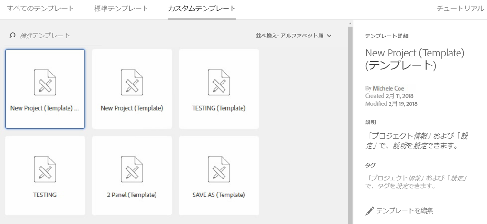

# テンプレート

## テンプレート {#topic_40932F09E18A467983AFBB29908E1CB8}

プロジェクトを作成するかどうかを選択できます。

* 空白のプロジェクト（デフォルト）。For instructions, see [Create an Analysis Workspace Project](../../../analyze/analysis-workspace/build-workspace-project/t-freeform-project.md#task_C2C698ACC7954062A28E4784911E6CF2).
* 標準テンプレート。これらのテンプレートは、アドビによって作成され、標準で提供されます。
* カスタムテンプレート。これらのテンプレートは、「テンプレートとして保存」権限が与えられている場合に、管理者権限を持つユーザーまたは管理者以外のユーザーが作成できます(See [Manage product permissions](https://helpx.adobe.com/enterprise/using/manage-permissions-and-roles.html) in the Admin Console documentation for more information.

* [カスタムテンプレートの作成](../../../analyze/analysis-workspace/build-workspace-project/starter-projects.md#task_279637F56CFD4B6094D7CBDB82FA4835)
* [標準テンプレート](../../../analyze/analysis-workspace/build-workspace-project/starter-projects.md#concept_4FE900FEEC894E849CB6C6A0E0ADA524)

## Create a custom template {#task_279637F56CFD4B6094D7CBDB82FA4835}

管理者権限を持つユーザーは、作成した任意のプロジェクトをカスタムテンプレートに変換できます。その方法を次に示します。

1. そのプロジェクトを開きます。
1. **[!UICONTROL プロジェクト]** /テンプレートとして **[!UICONTROL 保存に移動]**&#x200B;します。

   

   プロジェクトは、現在のプロジェクト名の下に、括弧に囲まれた単語（テンプレート）が続く名前で保存されます。管理者は、テンプレートを編集することで、この名前を変更できます。

   >[!NOTE]
   >
   >デフォルトでは、プロジェクトテンプレートは組織内のすべてのユーザーに表示されます。タグを適用することで、これを整理できます&#x200B;**[!UICONTROL （プロジェクト]** / **[!UICONTROL プロジェクト情報および設定]** に移動して、タグと説明を編集します）。

### カスタムテンプレートで実行できるアクション

<table id="table_D7C7B0CA1EE64E108484C03426800EBC"> 
 <thead> 
  <tr> 
   <th colname="col1" class="entry"> アクション </th> 
   <th colname="col2" class="entry"> 説明 </th> 
  </tr>
 </thead>
 <tbody> 
  <tr> 
   <td colname="col1"> 
テンプレートを編集   template 
 </td> 
   <td colname="col2"> 
管理者は、そのデータソースを変更したり、コンポーネント、ビジュアライゼーション、日付範囲などを変更したりすることで、テンプレートを編集できます。 
 
カスタムテンプレートを編集するには、次のいずれかを実行します。 
 
    <ul id="ul_2B3A371F83334E14806385753A360903"> 
     <li id="li_EE75E0281B764BA9B56FF1DB1B12D2CC">Analysis Workspace でカスタムテンプレートのリストを表示し、カスタムテンプレートを選択して、「テンプレートを編集」をクリックする。 </li> 
     <li id="li_4934DAAA46204990A295E22A97F81EDA">Analytics で、コンポーネント／プロジェクトに移動し、テンプレートをフィルターして、編集するテンプレートの名前をクリックする。 </li> 
    </ul> 
 
 
注意：テンプレートを編集した後、状況に応じて、「保存」と「名前を付けて保存」の 2 つのオプションがあります。その違いを次に示します。 
     <ul id="ul_87E2842C8AA442399585B1C6189F5E16"> 
      <li id="li_AB7B189729E14E40A0141ECE2A24C113"><b>保存</b>：すべてのユーザーのカスタムテンプレートを更新します。他のユーザーがこのカスタムテンプレートからプロジェクトを作成すると、加えた変更が表示されます。 </li> 
      <li id="li_C85B0B9873A3404D8B443BBD30B37CEB"><b>名前を付けて保存</b>：変更を加えたカスタムテンプレートのコピーを作成します。 </li> 
     </ul> 
 
（共有／プロジェクトを共有メニュー項目が無効になっている場合は、編集モードです。） 
 </td> 
  </tr> 
  <tr> 
   <td colname="col1"> 
テンプレートを検索 
 </td> 
   <td colname="col2"> 
カスタムテンプレートダイアログで、「テンプレートを検索」をクリックします。 
 </td> 
  </tr> 
  <tr> 
   <td colname="col1"> 
テンプレートを並べ替え 
 </td> 
   <td colname="col2"> 
テンプレートをアルファベット順、関連性順および作成日順で並べ替えることができます。 
 
カスタムテンプレートダイアログで、「並べ替え」をクリックします。 
 </td> 
  </tr> 
  <tr> 
   <td colname="col1"> 
テンプレートにタグを適用 
 </td> 
   <td colname="col2"> 
テンプレートを開いて、プロジェクト／プロジェクト情報および設定に移動します。「タグを追加」をクリックします。 
 </td> 
  </tr> 
  <tr> 
   <td colname="col1"> 
テンプレートの説明を変更 
 </td> 
   <td colname="col2"> 
テンプレートを開いて、プロジェクト／プロジェクト情報および設定に移動します。説明をダブルクリックして編集します。 
 </td> 
  </tr> 
 </tbody> 
</table>

## Standard templates {#concept_4FE900FEEC894E849CB6C6A0E0ADA524}

ワークスペースを初めて開くと、テンプレートは左側のナビゲーションバーに表示されます。Analysis Workspace のテンプレートは、一般的な使用例に対応しています。それらは、所属する部門ごとにグループ化され、選択したレポートスイートに応じて、異なるディメンション、セグメント、指標およびビジュアライゼーションで設定されます。

これらの事前設定されたテンプレートをそのまま、またはニーズに応じて変更して（例えば指標やビジュアライゼーションを追加または置き換えることで）使用して、新しい名前で保存できます。

[YouTube上のAnalysis Workspaceの標準テンプレート](https://www.youtube.com/watch?v=aRgYwPneVXg&list=PL2tCx83mn7GuNnQdYGOtlyCu0V5mEZ8sS&index=6) （2:46）

以下に、テンプレートと各テンプレートの回答に役立つ質問を示します。

### メディア

* **コンテンツ消費**:どのコンテンツが最も消費され、ユーザーが関与しているか。
* **最新性-頻度-忠誠度**:常連読者は誰ですか。

### モバイル

>[!IMPORTANT]
>
>モバイルテンプレートは、レポートスイートがモバイル用に有効になっている場合にのみ使用できます。

* **メッセージング:** アプリ内およびプッシュメッセージングのパフォーマンスに重点を置きます。
* **場所:** マップショーの場所データが含まれます。
* **主要指標:** アプリの主要指標の傾向を把握。
* **アプリケーションの使用状況:** アプリのユーザー数、起動回数、初回起動数、セッションの長さはどれだけでしたか。
* **獲得:** モバイル獲得リンクのパフォーマンスを確認します。
* **パフォーマンス:** アプリはどのように動作し、ユーザーはどこに問題を抱えているか。
* **リテンション:** 常連ユーザーは誰で、何を行うか。
* **ジャーニー:** アプリの主な使用パターンはどれか。

### 小売

* **キャンペーンのパフォーマンス:** 最も売上高をもたらしているキャンペーンは何か。
* **製品:** どの製品が最高のパフォーマンスを発揮しているか。

### Web

* **獲得:** Webサイトへのトラフィックの最上位のドライバーは何ですか。
* **コンテンツ消費:** サイトで人々が最もよく行く場所は何か。
* **リテンション:** サイトの常連ユーザーになる可能性の高いユーザーはどのタイプか。
* **技術:** サイトにアクセスするために人々が使用しているテクノロジーは何か。

### People

>[!NOTE]
>
>The People template and its associated People metric is available for use only as part of the [Adobe Experience Cloud Device Co-op](https://marketing.adobe.com/resources/help/en_US/mcdc/mcdc-people.html).

このテンプレートは、実訪問者指標の重複を排除したバージョンである人の指標に基づいています。人の指標は、消費者がブランドと関わる際にどのくらいの頻度で複数のデバイスを使用しているかを測定します。このテンプレートでは次の操作が可能です。

* 米国／カナダとそれ以外でデータをセグメント化する。現在、Device Co-op を使用できるのは北米のみです。
* 人の指標と実訪問者数指標を並べて比較する。
* 「圧縮率」（実訪問者に対して人の指標がどれくらい小さいかを計算する計算指標）を表示する。
* 顧客が使用するデバイスタイプの合計を比較する。
* 1 人あたりの平均使用デバイス数を表示する。
* 人の指標でセグメントのスタックを使用する方法を発見する。
* 環境での Experience Cloud ID の使用が、人の指標の効果をどのように高めているかを調べる。

