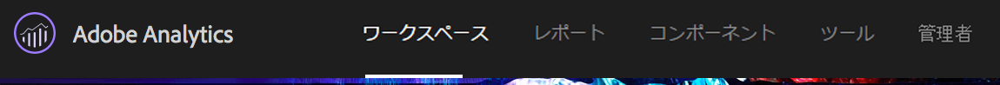
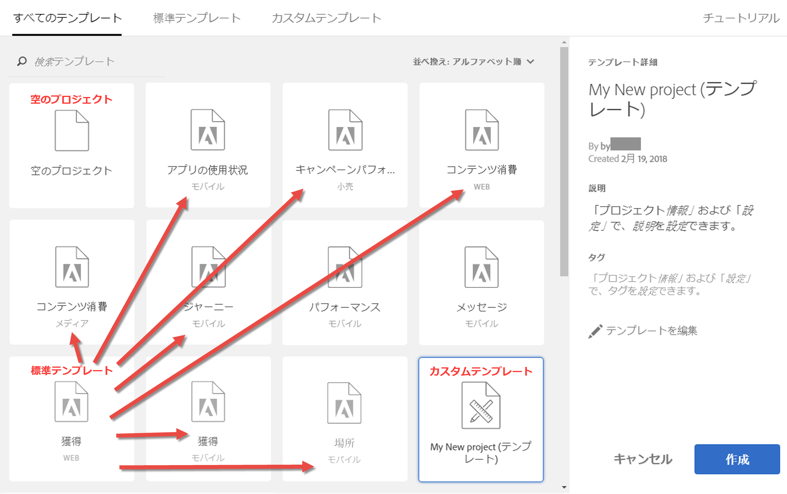
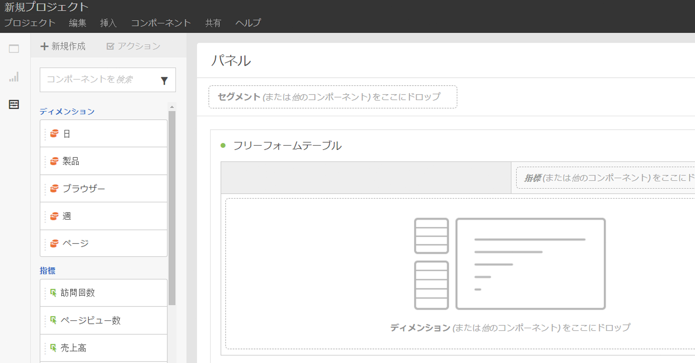
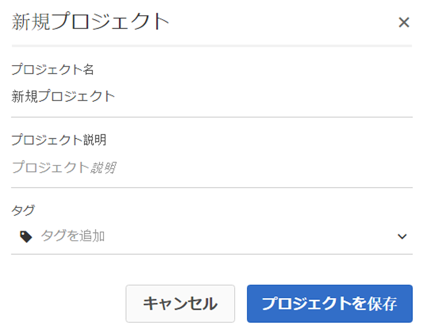
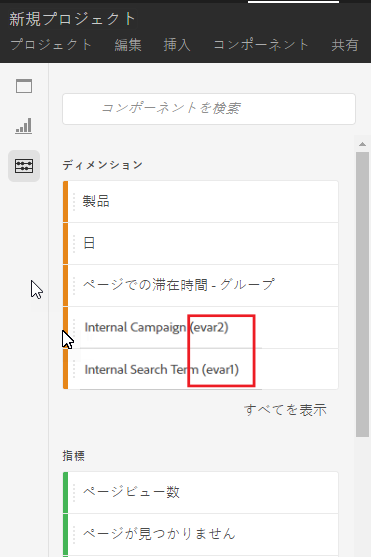
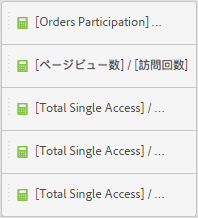
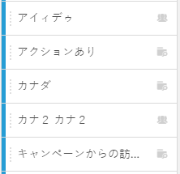
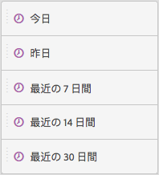
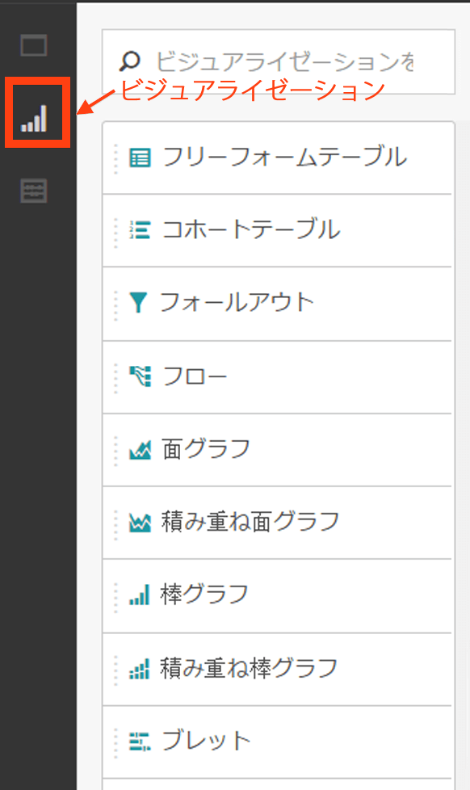
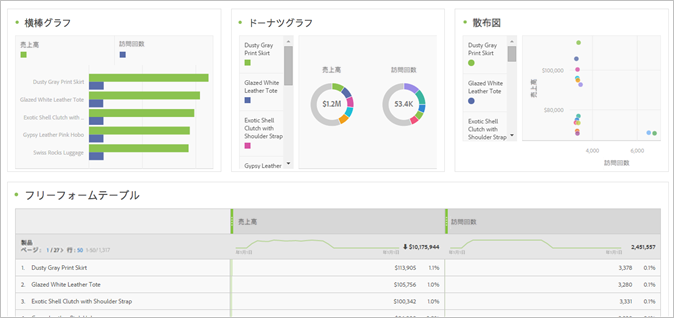

# Workspace プロジェクトの作成

プロジェクトを作成して、コンポーネント（ディメンション、指標、セグメントおよびデータ範囲）をフリーフォームパネルに追加します。

この記事では、Analysis Workspace インターフェイス要素について説明し、プロジェクトの作成方法を示します。具体的な使用例については、 [Analysis Workspace の使用例](../../../analyze/analysis-workspace/freeform-analysis-examples-use-cases.md#concept_173D1EB783F24EA89E754628BA30FF4B).

## プロジェクトの作成

1. プロジェクトを作成およびキュレーションするためのユーザー権限を指定します。

   Analysis Workspace プロジェクトを作成またはキュレーションするユーザーは、先に、管理者に **[!UICONTROL Analysis Workspace のプロジェクトを作成 / キュレーション]**&#x200B;権限を有効にしたグループか、**全レポートアクセス]ユーザーグループに追加してもらう必要があります[!UICONTROL **( **[!UICONTROL Admin]** &gt; **[!UICONTROL User Management]** &gt; [Groups](https://marketing.adobe.com/resources/help/en_US/reference/groups.html)).

1. In the [!DNL Experience Cloud], click **[!UICONTROL Analytics]** &gt; **[!UICONTROL Workspace]**.

   

   Alternatively, enter a forward slash (/) to open the report search bar, then type *`workspace`*.

   

1. Click **[!UICONTROL Create New Project]**.

   以下からプロジェクトを作成するかどうかを選択できます。

* 空白のプロジェクト（デフォルト）。手順については、以下を参照してください。
* 標準テンプレート。これらのテンプレートは、アドビによって作成され、標準で提供されます。手順については、[テンプレート](../../../analyze/analysis-workspace/build-workspace-project/starter-projects.md#concept_49B9A327C5004DB0A4BE6291435625C5)を参照してください。
* カスタムテンプレート。これらのテンプレートは、管理者権限を持つユーザーによって作成されます。手順については、[テンプレート](../../../analyze/analysis-workspace/build-workspace-project/starter-projects.md#concept_49B9A327C5004DB0A4BE6291435625C5)を参照してください。

   

1. To create a project from a blank project, click **[!UICONTROL Blank Project]**.

   * Then click **[!UICONTROL Create]**, or
   * Simply click **[!UICONTROL Enter]**.
   空のプロジェクトが表示され、フリーフォームパネルとデータテーブルビジュアライゼーションが表示されます。

   

   >[!NOTE]
   >
   >プロジェクトを読み込む（またはレポートスイートに切り替える）際に「互換性のないレポートスイート」というメッセージが表示され、プロジェクトに含まれていないコンポーネント（指標/ディメンション）がレポートスイートに含まれる場合があります。 互換性のないコンポーネントのリストを表示できるので、このメッセージが表示される理由を把握できます。

<table id="table_3989E45D9D4241CBB2E58B29DA257B2F"> 
 <thead> 
  <tr> 
   <th colname="col1" class="entry"> 要素 </th> 
   <th colname="col2" class="entry"> 説明 </th> 
  </tr> 
 </thead>
 <tbody> 
  <tr> 
   <td colname="col1"><a href="../../../analyze/analysis-workspace/components/analysis-workspace-components.md#concept_BEBE3A75E072495D9E2F895567BBD462" format="dita" scope="local"> コンポーネント</a> </td> 
   <td colname="col2"> 
プロジェクトにドラッグできるディメンション、指標、セグメントおよび日付範囲。 
 </td> 
  </tr> 
  <tr> 
   <td colname="col1"><a href="../../../analyze/analysis-workspace/visualizations/freeform-analysis-visualizations.md#concept_09242627629147A88A68F1506954C276" format="dita" scope="local"> ビジュアライゼーション</a> </td> 
   <td colname="col2"> 
インターフェイスのパネルまたはプロジェクト領域にドラッグできる項目。 
 </td> 
  </tr> 
  <tr> 
   <td colname="col1"><a href="../../../analyze/analysis-workspace/visualizations/freeform-table.md#concept_0D2E24FCCBAF4194AA941448860E422F" format="dita" scope="local">フリーフォームパネル</a> </td> 
   <td colname="col2"> 
Analysis Workspace で操作するキャンバスまたはワークスペース。 
 </td> 
  </tr> 
 </tbody> 
</table>

1. プロジェクトを保存します。Name the project, provide a description (optional, but useful) and tag the project (optional), then click **[!UICONTROL Save Project]**.

   

1. ビジュアライゼーションまたはパネルを右クリックしてコピーし、コピーした要素をプロジェクト内の別の場所、または別のプロジェクトに貼り付ける（「挿入する」）ことができるようになりました。

   この機能を使用すると、ビジネスに固有のデータで「構築ブロック」（定義済みのビジュアライゼーション／パネル）を作成し、他のプロジェクトにコピーして作業を迅速化できます。

   >[!NOTE]
   >
   >コピー/名前を付けて保存した後、イントラリンクは、コピー元のプロジェクトではなく、そのプロジェクト内に存在するプロジェクトに対する相対リンクになります。

## コンポーネントとビジュアライゼーションの追加 {#task_CDAC9B3007BE4A3790AFAD3746D669B1}

1. プロジェクトを作成するには、プロジ *`components`* ェクトに *`visualizations`* ドラッグ&amp;ドラッグします。

   **コンポーネント**

   コンポーネントツールバーには、最もよく使用する、検索可能なディメンション、指標、セグメントおよび日付範囲が表示されます。

<table id="table_4626163E26DE46CB86391868BBA3AD32"> 
 <thead> 
  <tr> 
   <th colname="col1" class="entry"> コンポーネント </th> 
   <th colname="col2" class="entry"> 説明 </th> 
  </tr> 
 </thead>
 <tbody> 
  <tr> 
   <td colname="col1"> ディメンション（オレンジ） </td> 
   <td colname="col2"> 
プロジェクトレベルに適用します 
 
 
 
Prop の番号、eVar の番号およびイベントの番号がディメンション名に追加され、これらの番号を検索できます。例：「内部キャンペーン」は、左側のレールに「内部キャンペーン (evar2)」と表示されます。 
 
 表示文字数を短くするために、prop、eVar、イベントの番号はテーブルに表示されません。 
 
一部の事前設定済みディメンションには、フリーフォームテーブルにドラッグする場合または左側のレールに表示される場合のデフォルトの並べ替え順があります。例えば、「時間帯」がテーブルにドロップされる場合または左側のレールに表示される場合、午前 12 時～午後 11 時の順に並べ替えられます。指標列で並べ替えるオプションは現在も使用できます。 
 </td> 
  </tr> 
  <tr> 
   <td colname="col1"> 指標（緑） </td> 
   <td colname="col2"> 
プロジェクトレベルに適用します。 
 
 
 
  回数は 、データテーブルのデフォルト指標です。 
 </td> 
  </tr> 
  <tr> 
   <td colname="col1"> セグメント（青） </td> 
   <td colname="col2"> 
パネルレベルにのみドラッグできますが、データテーブルにインラインセグメントを作成できます。 
 
 
 
詳しく <a href="../../../analyze/analysis-workspace/freeform-analysis-examples-use-cases.md#concept_173D1EB783F24EA89E754628BA30FF4B" format="dita" scope="local"> は、「Analysis Workspaceの使用例</a> 」を参照してください。 
 </td> 
  </tr> 
  <tr> 
   <td colname="col1"> 日付範囲および精度（紫） </td> 
   <td colname="col2"> 
パネルレベルにのみドラッグできます。日付範囲を設定する際に、カレンダーからプロジェクトを作成できます。 
 
 
 </td> 
  </tr> 
 </tbody> 
</table>

**[ビジュアライゼーション](../../../analyze/analysis-workspace/visualizations/freeform-analysis-visualizations.md#concept_09242627629147A88A68F1506954C276)**

[!UICONTROL ビジュアライゼーション]パネルには、標準の Analytics グラフ、チャート、ドーナツ、データテーブル、[コホート](../../../analyze/analysis-workspace/visualizations/cohort-table/cohort-analysis.md#concept_9D240A490265427DA694D18D14EACC0E)テーブル、ベン図などが用意されています。複数のビジュアライゼーションをプロジェクトにドラッグ＆ドロップできます。

1. 手順

## 右クリックメニューを使用したデータのカスタマイズ {#concept_8117C300F21843B99F4E1B9AB7B11B6F}

右クリックメニューを使用すると、右クリックしたテーブルのセルに応じて、次のアクションを実行できます。

<table id="table_0F84CC5B604D4D41BD0C9668DF525929"> 
 <thead> 
  <tr> 
   <th colname="col1" class="entry"> アクション </th> 
   <th colname="col2" class="entry"> 説明 </th> 
  </tr>
 </thead>
 <tbody> 
  <tr> 
   <td colname="col1"><a href="../../../analyze/analysis-workspace/components/calendar-date-ranges/time-comparison.md#concept_93BCAD81B7A54ABBBA5CD9E419F6F764" format="dita" scope="local"> 期間列を追加</a> </td> 
   <td colname="col2"> </td> 
  </tr> 
  <tr> 
   <td colname="col1"><a href="../../../analyze/analysis-workspace/components/calendar-date-ranges/time-comparison.md#concept_93BCAD81B7A54ABBBA5CD9E419F6F764" format="dita" scope="local"> 期間を比較</a> </td> 
   <td colname="col2"> </td> 
  </tr> 
  <tr> 
   <td colname="col1"> 
クリップボードにコピー 
 </td> 
   <td colname="col2"> </td> 
  </tr> 
  <tr> 
   <td colname="col1"> 
選択したアイテムの削除 
 </td> 
   <td colname="col2"> </td> 
  </tr> 
  <tr> 
   <td colname="col1"><a href="/help/components/c-alerts/intellligent-alerts.md" format="dita" scope="local"> 選択からアラートを作成</a> </td> 
   <td colname="col2"> </td> 
  </tr> 
  <tr> 
   <td colname="col1"><a href="../../../analyze/analysis-workspace/components/dimensions/t-breakdown-fa.md#task_B594DA2476E84DFDA8279E831F0BD9C4" format="dita" scope="local"> 分類</a> 
    <ul id="ul_18C83B8514AD4C1C86C071AA8402CB5C"> 
     <li id="li_6CA84ED293EA4940A7495DA9D9121264">ディメンション </li> 
     <li id="li_EA16EE017B2E4A6998918706938A21BF">指標 </li> 
     <li id="li_0405D339CD01405DB508A7D8D1A976B4">セグメント </li> 
     <li id="li_819CE81C552F49BB9C1B83ED3B42C5F7">時間 </li> 
    </ul> </td> 
   <td colname="col2"> </td> 
  </tr> 
  <tr> 
   <td colname="col1"><a href="../../../analyze/analysis-workspace/visualizations/freeform-analysis-visualizations.md#concept_09242627629147A88A68F1506954C276" format="dita" scope="local"> 視覚化</a> </td> 
   <td colname="col2"> </td> 
  </tr> 
  <tr> 
   <td colname="col1"><a href="../../../analyze/analysis-workspace/curate-share/download-send.md#concept_BB548979F47F45739679B830428C3025" format="dita" scope="local"> CSV としてダウンロード</a> </td> 
   <td colname="col2"> </td> 
  </tr> 
  <tr> 
   <td colname="col1"><a href="../../../analyze/analysis-workspace/analysis-workspace-features.md#concept_4D69EE46E3C24EEB97C935A8789364F9" format="dita" scope="local"> トレンド選択</a> </td> 
   <td colname="col2"> </td> 
  </tr> 
  <tr> 
   <td colname="col1"><a href="../../../analyze/analysis-workspace/components/t-freeform-project-segment.md#task_11C6A2C7717B48049E5750B9D20FEC80" format="dita" scope="local"> 選択からセグメントを作成</a> </td> 
   <td colname="col2"> </td> 
  </tr> 
  <tr> 
   <td colname="col1"><a href="../../../analyze/analysis-workspace/c-panels/c-segment-comparison/segment-comparison.md#concept_74FAC1C6D0204F9190A110B0D9005793" format="dita" scope="local"> セグメント比較で実行</a> </td> 
   <td colname="col2"> </td> 
  </tr> 
  <tr> 
   <td colname="col1"> 選択した行のみを表示 </td> 
   <td colname="col2"> </td> 
  </tr> 
  <tr> 
   <td colname="col1"> すべての行を表示 </td> 
   <td colname="col2"> </td> 
  </tr> 
 </tbody> 
</table>

行のコピーおよび選択について詳しくは、[Analysis Workspace で使用できるキーボードおよびマウスの操作](../../../analyze/analysis-workspace/build-workspace-project/fa-shortcut-keys.md#concept_9A6356084DBC4D468E265E7A65B3E051)を参照してください。
