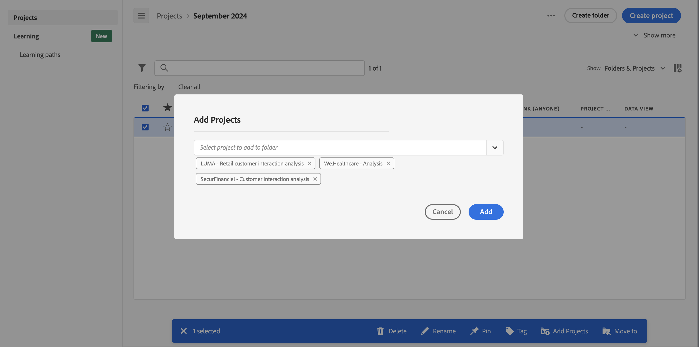

# フォルダーへのプロジェクトの追加または移動

[プロジェクトリスト](/help/analyze/analysis-workspace/build-workspace-project/freeform-overview.md#project-list)から直接フォルダーにプロジェクトを追加または移動できます。

## フォルダーへのプロジェクトの移動

>[!NOTE]
>
>管理者が会社フォルダーにプロジェクトを移動すると、既存の共有権限が制限されている場合でも、フォルダーは全員と共有されます。管理者が会社フォルダーからプロジェクトを移動すると、既存の共有権限に従います。
>

[プロジェクトリスト](/help/analyze/analysis-workspace/build-workspace-project/freeform-overview.md#project-list)からフォルダーにプロジェクトを移動するには：

1.  で、フォルダーに移動するプロジェクトを 1 つ以上選択します。

1. 可能な[アクション](/help/analyze/analysis-workspace/build-workspace-project/freeform-overview.md#actions)のリストから、 **移動先**&#x200B;を選択します。**[!UICONTROL フォルダーを選択]**&#x200B;ダイアログが表示されます。

1. **[!UICONTROL フォルダー]**&#x200B;ドロップダウンメニューからフォルダー名を選択します。ドロップダウンメニューを使用すると、フォルダー階層をトラバースして、任意のレベルのサブフォルダーを選択できます。

   

1. 「**[!UICONTROL 移動]**」を選択します。

   選択したプロジェクトがフォルダーに追加されます。

## フォルダーへのプロジェクトの追加

[プロジェクトリスト](/help/analyze/analysis-workspace/build-workspace-project/freeform-overview.md#project-list)からフォルダーにプロジェクトを追加するには：

1.  で、プロジェクトを追加するフォルダーを選択します。

1. 使用可能な[アクション](/help/analyze/analysis-workspace/build-workspace-project/freeform-overview.md#actions)のリストから、 **プロジェクトの追加**&#x200B;を選択します。**[!UICONTROL フォルダーを選択]**&#x200B;ダイアログが表示されます。

1. 「[!UICONTROL *フォルダーに追加するプロジェクトを選択*]」から 1 つ以上のプロジェクトを選択します。

   

1. 「**[!UICONTROL 追加]**」を選択します。

>[!NOTE]
>
>会社フォルダーにプロジェクトを追加したり、新しいプロジェクトを作成して会社フォルダーに保存したりできるのは管理者のみです。

<!--
# Add Projects to Folders

You can add projects to a folder in the table view or from within a folder.

>[!NOTE]
>
>Only Analytics administrators can add projects to the Company Folder or create a new project and save it to the Company Folder

## From the table view {#table-view}

Add projects to a folder from the table view on the home page.

1.  Select one or more projects that you want to add to a folder.

    

1.  Select **Move to**. 

    The Select Folder dialogue is displayed.

1.  In the drop-down menu, select the folder where you want to move the selected projects.

    

1.  Select **Move**.

    

    The selected projects are added to the folder.

    

    The Workspace landing page now shows the folder contains (3) projects.

    

## From inside a folder {#inside-folder}

You can also add projects from inside a folder using the ellipses link.

1.  Select and open a folder from the table view.

    

1.  Select the **...** ellipsis icon in the upper-right.
   
    

1.  Select **Add projects** and select the project that you want to add from the drop-down list.

    

    
1.  (Optional) Select additional projects from the drop-down list to add multiple projects.

    

1.  Select **Add** to add the projects to the folder.

    

-->